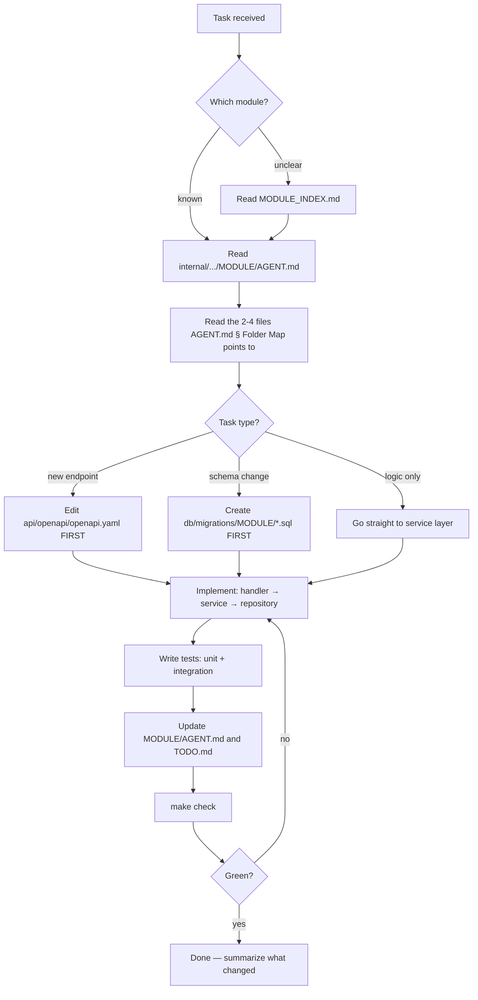

# AGENT.md — Root Entry Point for AI Assistants

> **READ THIS FILE FIRST. READ NOTHING ELSE UNTIL YOU HAVE.**
> This file is the single entry point for every AI coding assistant working on Fluentra.
> `CLAUDE.md`, `AGENTS.md`, `GEMINI.md`, `.github/copilot-instructions.md` all point here.

---

## 1. What is Fluentra?

Fluentra is an **English Learning Platform** built as a **Modular Monolith** in Go, with a
React + TypeScript SPA. It teaches the six English competencies (vocabulary, grammar, reading,
listening, speaking, writing) through lessons, spaced repetition, and AI-graded practice.

**There are exactly two roles: `admin` and `user`.**
This is **not** a SaaS product. There is **no multi-tenancy**. Never introduce
`tenant_id`, `organization_id`, or workspace concepts.

| Fact | Value |
|---|---|
| Backend | Go 1.25+, `net/http` + chi, sqlc + pgx |
| Frontend | React 19, TypeScript, Vite, TanStack Query |
| Database | PostgreSQL 17 |
| Cache | Redis 7 |
| Object storage | MinIO (S3 API) |
| Deployment | Docker Compose |
| CI/CD | GitHub Actions |
| Observability | OpenTelemetry → Collector → Prometheus / Loki / Tempo / Grafana |
| Go module path | `github.com/fluentra/fluentra` |

---

## 2. The 60-Second Orientation

```
fluentra/
├── AGENT.md              ← you are here
├── MODULE_INDEX.md       ← map of all 30 modules; find yours here
├── ARCHITECTURE.md       ← how the system fits together
├── cmd/                  ← binaries: api, worker, migrate, seed, docgen
├── internal/
│   ├── modules/<name>/   ← business modules (bounded contexts)
│   ├── platform/<name>/  ← technical capabilities (ai, cache, storage, job…)
│   └── shared/           ← cross-cutting primitives (errors, outbox, eventbus…)
├── api/openapi/          ← OpenAPI 3.1 spec — THE API CONTRACT
├── db/migrations/        ← goose migrations, one folder per module
├── web/                  ← React SPA
├── docs/                 ← the AI knowledge base (see §7)
└── deploy/               ← Docker Compose + observability configs
```

---

## 3. Your Workflow — Follow This Exactly



**Never** start by grepping the whole repository. Every answer you need about a module
is in that module's `AGENT.md`. If it is not, the `AGENT.md` is wrong — fix it as part of your task.

---

## 4. Context Budget Rules

| Situation | Read this | Do NOT read |
|---|---|---|
| Any task | This file + `MODULE_INDEX.md` | Anything else, yet |
| Working on module X | `internal/*/X/AGENT.md` | Other modules' internals |
| Need X's public API | `internal/*/X/contract/` + `X/API.md` | X's `service/`, `repository/` |
| Adding an endpoint | `api/openapi/openapi.yaml`, `API_GUIDELINE.md` | Handlers of unrelated modules |
| Adding a table | `DATABASE_GUIDELINE.md`, `db/migrations/X/` | Other modules' migrations |
| Frontend feature | `web/AGENT.md`, `docs/frontend/` | Go code (use the generated client) |
| Writing tests | `TESTING_GUIDELINE.md`, `X/TESTING.md` | — |
| AI/LLM feature | `internal/platform/ai/AGENT.md`, `docs/ai/` | Provider SDK internals |

**Hard limit: if you have read more than 6 files and still do not know what to do, stop and
ask the human.** Do not keep scanning.

---

## 5. Non-Negotiable Rules

These are enforced by CI. Violating them fails the build.

| # | Rule |
|---|---|
| **L1** | A module MUST NOT import another module's internals. Only `internal/modules/<other>/contract`. |
| **L2** | A module MUST NOT query or JOIN another module's tables. Cross-module reads go through `contract` interfaces. |
| **L3** | Every table is owned by exactly one module and lives in `db/migrations/<module>/`. |
| **L4** | No database transaction may span two modules. Use `shared/outbox` + events. |
| **L5** | All errors returned to HTTP are `shared/apperr` types, rendered as RFC 9457 Problem Details. |
| **L6** | No `panic` in request paths. No `log.Fatal` outside `cmd/`. |
| **L7** | Every exported function that does I/O takes `ctx context.Context` as its first parameter. |
| **L8** | No secrets in code, tests, fixtures, or docs. Config comes from env only. |
| **L9** | SQL is written in `db/queries/<module>/*.sql` and compiled by `sqlc`. No string-concatenated SQL. |
| **L10** | Public API changes require editing `api/openapi/openapi.yaml` in the same commit. |
| **L11** | Every prompt sent to an LLM lives in `docs/prompts/` as a versioned template. No inline prompt strings. |
| **L12** | New dependency ⇒ add a row to `DEPENDENCIES.md` with rationale + alternatives considered. |

---

## 6. Layering — Where Code Goes

```
HTTP request
   ↓
transport/http/     handler: decode, validate DTO, call service, render response
   ↓                NO business logic. NO SQL. NO direct repo access.
service/            business rules, orchestration, transactions, events
   ↓                NO HTTP types. NO SQL strings. Depends on repo INTERFACES.
repository/         data access via sqlc; maps DB rows ↔ domain structs
   ↓                NO business rules.
domain/             entities, value objects, pure functions, invariants
                    NO imports of infrastructure. Testable with zero setup.
contract/           what OTHER modules may use: interfaces + DTOs + events
```

Dependency direction is always **inward**: transport → service → repository → domain.
`domain` imports nothing from the layers above it.

---

## 7. The Knowledge Base — `docs/`

| Folder | Use it when you need to… |
|---|---|
| `docs/architecture/` | Understand system-wide structure, boundaries, migration strategy |
| `docs/backend/` | Learn Go conventions, layering, concurrency, transactions |
| `docs/frontend/` | Learn React structure, state, routing, forms, data fetching |
| `docs/database/` | Learn schema conventions, indexing, migrations, ER diagrams |
| `docs/api/` | Learn REST standards, versioning, pagination, errors, auth |
| `docs/deployment/` | Run it locally, or deploy it |
| `docs/security/` | Threat model, authn/authz, data protection, OWASP mapping |
| `docs/testing/` | Test pyramid, fixtures, testcontainers, coverage targets |
| `docs/modules/` | The module manifest + per-module deep dives |
| `docs/prompts/` | The versioned prompt library (for generating code AND for runtime LLM calls) |
| `docs/adr/` | Why a decision was made. Read before proposing a different approach. |
| `docs/development/` | Local setup, workflows, code review, docs-as-code |
| `docs/guides/` | Task-oriented how-tos ("add a new module", "add an endpoint") |
| `docs/knowledge/` | Domain knowledge: CEFR, SRS/FSRS, pronunciation scoring, IELTS/TOEIC formats |
| `docs/ai/` | AI context engineering, agent playbooks, eval harness |
| `docs/examples/` | Canonical reference implementations to copy patterns from |
| `docs/diagrams/` | C4, sequence, ER, state diagrams (Mermaid source) |
| `docs/templates/` | Templates for new modules, ADRs, PRs, docs |
| `docs/operations/` | Runbooks, SLOs, incident response, on-call |
| `docs/product/` | Personas, user journeys, feature specs, glossary of business terms |

---

## 8. Common Tasks → Start Here

| Task | Playbook |
|---|---|
| **Implement the current phase** | **`docs/development/phase-1-plan.md` — find your task ID, then follow its card** |
| Add a new business module | `docs/guides/add-a-module.md` |
| Add an API endpoint | `docs/guides/add-an-endpoint.md` |
| Add a database table | `docs/guides/add-a-table.md` |
| Add a background job | `docs/guides/add-a-job.md` |
| Add an AI-powered feature | `docs/guides/add-an-ai-feature.md` |
| Add a React page | `docs/guides/add-a-page.md` |
| Write an integration test | `docs/guides/write-an-integration-test.md` |
| Add a metric / span / log field | `OBSERVABILITY_GUIDELINE.md` |
| Debug a failing CI job | `GITHUB_ACTIONS.md` |
| Cut a release | `RELEASE_GUIDE.md` |

---

## 9. Commands You May Run

```
make help          # list everything
make dev           # docker compose up (full stack + observability)
make check         # fmt + vet + lint + arch-lint + unit tests  ← run before finishing
make test          # unit tests
make test-int      # integration tests (testcontainers)
make test-e2e      # Playwright
make gen           # sqlc + oapi-codegen + mocks + openapi-typescript
make migrate-up    # apply migrations
make seed          # the two demo accounts getting-started.md names
make promote-admin EMAIL=you@example.com   # grant the admin role to an existing account
make due-reviews EMAIL=you@example.com     # bring that account's review cards forward so they are due
make audit-logs    # prove no OTP code or personal data is searchable in Loki
make docs          # regenerate module doc scaffolding
make docs-check    # docs lint + drift check
```

**Never** run `docker compose down -v`, `make db-reset`, or anything that deletes volumes
without explicit human approval — it destroys local learning data.

### Which compose file to run

Neither `compose.yaml` nor `compose.dev.yaml` is run on its own. **Use `make dev`.**

- `deploy/compose/compose.yaml` — the base. Data services only, on an `internal: true`
  network with **no published ports**, so nothing on your host can reach them. Running
  this alone looks like it worked and then every connection is refused.
- `deploy/compose/compose.dev.yaml` — the overlay that makes it usable locally: publishes
  5432, 6379, 9000/9001 and 8025, flips the network to `internal: false`, and adds `api`,
  `worker`, `web` with hot reload plus mailpit.
- `compose.observability.yaml` / `.observability.dev.yaml` — Grafana, Tempo, Loki,
  Prometheus, the collector.

`make dev` combines all four in the right order. Do not hand-assemble `-f` chains;
the ordering and the observability split are load-bearing (see the comment at the top
of `compose.dev.yaml`).

**Only need the data services** — running the integration suite, or `go run ./cmd/api`
on the host?

```
make dev-infra     # postgres, redis, minio, mailpit — ports published, buckets created
```

Mailpit is in there because an API with nowhere to deliver writes the OTP challenge and
never produces a code; the failure then shows up as a timeout somewhere unrelated. The
MinIO buckets are provisioned by the same target, because nothing in the application
creates them and the first avatar upload otherwise fails against a stack that looks
healthy.

### When a port is already taken

Another project's container is often already on 5432 or 6379. That is not a reason to
change ports or to remove anything.

**Stop it, do the work, start it again.** `docker stop <name>` and `docker start <name>`
preserve the container and its volumes — data survives.

```
docker ps --format "{{.Names}} {{.Ports}}"   # find what holds the port
docker stop <name>                             # borrow it
...                                            # your work
docker start <name>                            # give it back — do not skip this
```

**Never** `docker rm` a container you did not create, and never `docker volume rm`
anything to free a port. And note `docker compose down` acts on the whole project: it has
stopped unrelated containers that happened to carry matching labels. Prefer naming the
services you started — `docker compose ... stop postgres redis minio`.

### Testing against the real stack

**Bring the stack up and test against it. Do not mock the API, and do not stand up a
second one.**

This is the rule most often broken here, and it has been expensive. Every one of the ten
E2E journeys was once written against browser-level `page.route` stubs; they passed while
proving that fixtures agreed with each other, and when the stack was finally put behind
them, all ten failed — on endpoints the application does not have, on fields the schema
does not carry, on a form field that was never built. A mocked journey is a test of the
mock.

```
make dev                      # the whole stack, first
cd web && pnpm exec playwright test
```

- **The stack is described once**, in `deploy/compose/`. CI drives it through
  `make dev-infra`. If you find yourself writing `docker run` lines or a services block
  in a workflow, stop: that is a second description of the same stack, and the two drift
  until a test passes in one and not the other.
- **Integration tests take the DSN of the running stack**, they do not start their own:
  `TEST_DATABASE_URL`, `TEST_REDIS_ADDR`, `TEST_S3_*`. Run them with `-tags integration`.
- **Mocking is legitimate in exactly one place**: a spec that measures rendered geometry
  rather than behaviour, such as `web/e2e/responsive/`. Even there the payloads are typed
  against the generated schema (`web/e2e/helpers/stubs.ts`), so a stub that drifts fails
  `pnpm run typecheck` instead of silently matching nothing.
- **`make audit-logs`** is the same idea for privacy: it registers a real account, reads
  the real code out of Mailpit and asks Loki whether any of it is searchable, ending with
  a control query so that a row of zeros cannot come from a query that never matches.

---

## 10. What You Must NOT Do

- ❌ Do not add multi-tenancy, organizations, workspaces, or roles beyond `admin`/`user`.
- ❌ Do not introduce a new framework, ORM, or state-management library without an ADR.
- ❌ Do not extract a module into a separate service. Read `docs/architecture/microservice-migration.md` first — the trigger conditions are explicit and none are met yet.
- ❌ Do not write business logic in HTTP handlers or React components.
- ❌ Do not call an LLM provider SDK directly. Go through `internal/platform/ai`.
- ❌ Do not commit generated files that `make gen` produces, unless the repo already tracks them (check `.gitignore` first).
- ❌ Do not "fix" a failing test by weakening the assertion.
- ❌ Do not invent API endpoints, table names, or config keys. If it is not in `openapi.yaml`, a migration, or `docs/deployment/configuration.md`, it does not exist — add it deliberately.

---

## 11. Definition of Done

A change is done when **all** of these are true:

- [ ] Code compiles; `make check` is green
- [ ] Unit tests cover the new branches; integration test if it touches DB/cache/storage
- [ ] `api/openapi/openapi.yaml` updated if the HTTP surface changed
- [ ] Migration added if the schema changed, and it is reversible
- [ ] The module's `AGENT.md` §Database Schema / §Public APIs reflects reality; `last_verified` bumped
- [ ] The module's `TODO.md` updated (item checked off, or new item added)
- [ ] Errors use `shared/apperr`; logs are structured; spans cover the new I/O
- [ ] No secret, no TODO-without-issue, no commented-out code
- [ ] `CHANGELOG.md` has an entry under `Unreleased` if user-visible

---

## 12. Escalate to a Human When

- The task requires a decision recorded in an ADR that does not exist yet.
- Two modules seem to need the same table.
- A rule in §5 blocks the obvious solution.
- The task implies multi-tenancy, a new role, or a new external vendor.
- You would need to change more than 5 files across more than 2 modules.
- Cost, privacy, or legal implications (storing voice recordings, minors' data, payment data).

State clearly what you need decided, present 2–3 options with trade-offs, and stop.
