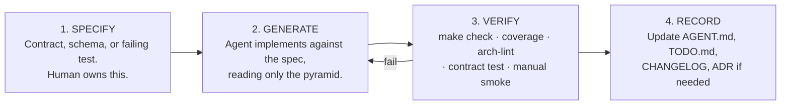
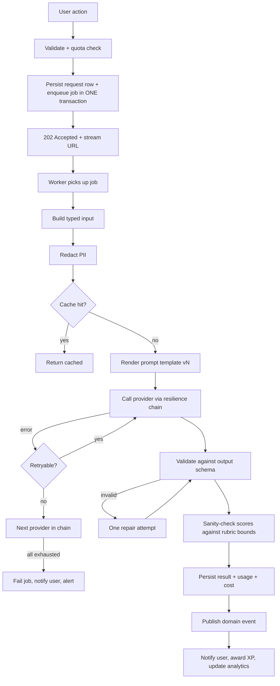

# AI_GUIDE.md — Working With and Building On LLMs

This document covers **both** senses of "AI" in this project:

- **Part A** — AI as a *tool for building* Fluentra (coding assistants).
- **Part B** — AI as a *component of* Fluentra (grading, explanation, generation).

Related: [AI_CONTEXT.md](AI_CONTEXT.md) (context strategy) ·
[PROMPT_LIBRARY.md](PROMPT_LIBRARY.md) (prompts) ·
[internal/platform/ai/AGENT.md](internal/platform/ai/AGENT.md) (implementation).

---

# Part A — AI-assisted development

## A1. The working agreement

| Principle | Meaning |
|---|---|
| The agent is a fast junior with perfect recall and no judgement | Give it the rules; review the judgement calls |
| Specification precedes generation | Spec, schema, or test first — then code |
| The repository teaches the agent | If the agent got it wrong, the docs were wrong; fix the docs |
| Small, reviewable changes | One module, one concern, one PR |
| Verify, never trust | `make check` is the arbiter, not the agent's confidence |

## A2. Task suitability

| Green — delegate freely | Yellow — delegate with a spec and review closely | Red — human first |
|---|---|---|
| CRUD from an existing pattern | New module scaffolding | Architecture and boundary decisions |
| DTOs, mappers, adapters | Cache invalidation strategy | Security-sensitive code (auth, tokens, payments) |
| Table-driven unit tests from a spec | Complex SQL and index design | Data migrations that can lose data |
| Doc updates and diagram refreshes | Refactors across a module | Anything touching money |
| Grafana dashboards, alert rules | Prompt templates | Pedagogical logic (scoring rubrics, FSRS parameters) |
| Frontend components from a design | Async job orchestration | Anything that changes an ADR |
| Migration boilerplate | Error taxonomy extensions | Privacy/PII handling |

## A3. The four-step loop

Skipping step 1 is the single biggest cause of wasted agent output. Skipping step 4 is the
single biggest cause of the next task going badly.

## A4. Prompting patterns that work here

| Pattern | Example |
|---|---|
| **Point at the context, don't paste it** | "Read `internal/modules/srs/AGENT.md`, then add…" |
| **Name the rule** | "Obey L4 — no cross-module transactions." |
| **State the artefact list** | "Produce exactly: a migration, a query file, a repo method, and a test." |
| **Give the acceptance criteria upfront** | "Done when `make check` passes and coverage on `service/` ≥ 80 %." |
| **Ask for the plan before the code on anything non-trivial** | "Outline the approach in 5 bullets; wait for my go-ahead." |
| **Constrain the blast radius** | "Touch only `internal/modules/vocabulary/`. If you need another module, stop and tell me." |

Anti-patterns: "make it better", "fix all the bugs", "refactor the codebase", pasting 2000
lines of code into the prompt, asking for 5 unrelated changes at once.

## A5. Reviewing AI-authored code

Beyond normal review, check specifically for:

- [ ] **Invented surface** — an endpoint, table, config key, or metric that exists nowhere else
- [ ] **Boundary violation** — an import of another module's internals (arch-lint catches it; look anyway)
- [ ] **Silent error swallowing** — `if err != nil { return nil }`
- [ ] **Missing context propagation** — a call without `ctx`
- [ ] **Weakened assertions** — a test changed to match the implementation
- [ ] **Plausible-but-wrong SQL** — especially joins, `LEFT JOIN` + `WHERE` mistakes, missing `LIMIT`
- [ ] **Hallucinated library APIs** — a method that does not exist in that version
- [ ] **N+1 queries** in loops
- [ ] **Cache without invalidation**
- [ ] **Timezone and locale handling** — `time.Now()` instead of the injected clock
- [ ] **Ownership filter missing** on user-owned data (IDOR)

---

# Part B — Building AI features

## B1. Design principles

| # | Principle | Consequence |
|---|---|---|
| B1.1 | Business code names a **task**, never a model | Model changes are config + eval, not code |
| B1.2 | Every LLM call is potentially slow and potentially wrong | It runs in a job, its output is schema-validated, and it has a fallback |
| B1.3 | The user must never be blocked by a provider outage | Async + queue + retry + degraded messaging |
| B1.4 | Cost is a first-class design constraint | Routing tiers, caching, quotas, budgets, dashboards |
| B1.5 | Quality is measurable or it is not managed | Every task has an eval suite before it ships |
| B1.6 | Learner text is untrusted input | Wrapped, delimited, and never treated as instruction |
| B1.7 | The learner is told when AI is involved and can opt out | Transparency in the UI; opt-out disables AI grading only |
| B1.8 | AI never has final authority over a consequential outcome | A disputed grade is reviewable by an admin |

## B2. When *not* to use an LLM

| Problem | Better solution |
|---|---|
| Multiple-choice grading | Deterministic comparison |
| Spaced repetition scheduling | FSRS — a real algorithm with published parameters |
| Text similarity / dedup | Embeddings + cosine, or trigram similarity in Postgres |
| Readability level | Flesch-Kincaid, CEFR word lists |
| Word timings in audio | Forced alignment from the ASR service |
| Detecting a blank submission | `len(strings.TrimSpace(s)) == 0` |
| Search | Postgres FTS |

Using an LLM where an algorithm exists is slower, costlier, less reliable, and harder to test.
It is also the most common way AI features become embarrassing.

## B3. Anatomy of an AI feature

## B4. Checklist for shipping a new AI task

- [ ] Task name registered in the routing config with tier, timeout, budget, cache policy
- [ ] Prompt `v1` written in `docs/prompts/runtime/<task>/`
- [ ] `input.schema.json` and `output.schema.json` defined
- [ ] Golden set of ≥ 30 examples with human labels
- [ ] `thresholds.yaml` with justified numbers
- [ ] `mock` provider fixtures so tests are deterministic and free
- [ ] Fallback chain defined and tested (kill the primary provider in a test)
- [ ] Per-user quota and global budget rows added
- [ ] Metrics and a Grafana panel
- [ ] User-facing copy for the degraded case ("we're still grading this")
- [ ] Red-team examples in the eval suite (injection, abuse, off-topic, empty, 10k words)
- [ ] Privacy review if the input contains personal content
- [ ] Documented in the module's `AGENT.md` §Common tasks and in `PROMPTS.md`

## B5. Safety for a learning product

| Concern | Control |
|---|---|
| Harmful or inappropriate learner content | Moderation pass before grading; flagged content routed to an admin queue, not graded |
| Hallucinated corrections | Grammar explanations cite a rule ID from our own taxonomy; unciteable claims are dropped |
| Score inflation/deflation drift | Weekly calibration against the golden set; drift > threshold pages the learning team |
| Feedback tone | System preamble mandates constructive, specific, non-demeaning feedback; tone checked in evals |
| Minors | No open-ended chat surface in v1; all AI output is scoped to a task and a rubric |
| Over-reliance | UI shows AI feedback as guidance, with rule links; disputed grades escalate to a human |
| Provider data use | Only providers with no-training-on-API-data terms are used for learner content; recorded in `THIRD_PARTY.md` |

## B6. Common failure modes and their fixes

| Symptom | Likely cause | Fix |
|---|---|---|
| Grades drift after a model update | Provider silently changed the model behind an alias | Pin exact model IDs; nightly eval catches it |
| JSON parse failures spike | Prompt change loosened the output instruction | Schema validation + repair; revert prompt version |
| Cost doubles overnight | Cache key changed, or a retry storm | Cache-hit-ratio panel; retry budget metric |
| Latency p95 explodes | Provider degradation | Circuit breaker + fallback; check `ai_fallback_total` |
| Identical feedback for different essays | Cache key too coarse | Key must include the full normalised input hash |
| A learner gets a 9.0 for gibberish | Prompt injection or scoring not bounded | Wrapper + bounds check + red-team suite |
| Feedback in the wrong language | Locale not passed into the template | Locale is a required template input |
