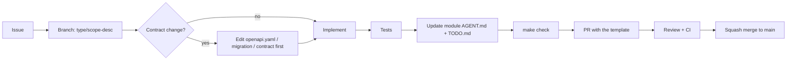

# CONTRIBUTING.md

Applies to humans **and** AI agents. Agents: read [AGENT.md](AGENT.md) first — it is the
operational version of this document.

---

## 1. Before you start

| Step | Why |
|---|---|
| Read `AGENT.md` and `MODULE_INDEX.md` | Know the rules and where things live |
| Find the module you are changing and read its `AGENT.md` | Know the local rules and the "do not" list |
| Check `docs/adr/` for a relevant decision | Do not re-litigate a settled question silently |
| Check `docs/guides/` for a recipe | Do not invent a procedure that already exists |
| Open or claim an issue | Work without an issue is invisible work |

## 2. Local setup

```bash
git clone <repo> && cd fluentra
cp .env.example .env
make setup     # installs tool binaries, git hooks, pnpm deps
make dev       # brings up the full stack
make check     # confirm a green baseline before changing anything
```

Prerequisites: Go 1.25+, Node 24+, Docker with Compose v2, `make`.

## 3. Workflow



## 4. Branches and commits

| Item | Convention |
|---|---|
| Branch | `feat/srs-fsrs-scheduler`, `fix/auth-refresh-loop`, `docs/adr-0021` |
| Commit | Conventional Commits: `feat(srs): add FSRS scheduler` |
| Scope | The module name |
| Body | Explain **why**; reference the issue |
| Size | One module, one concern. Over ~400 changed lines needs justification |

## 5. Pull requests

The PR template requires:

- [ ] What changed and why (2–5 sentences)
- [ ] Modules touched — and confirmation that no boundary was crossed
- [ ] Spec/migration updated if the contract changed
- [ ] Tests added, and what they prove
- [ ] Module `AGENT.md` and `TODO.md` updated
- [ ] Observability: spans, metrics, logs for the new path
- [ ] Security checklist (see `SECURITY_GUIDELINE.md` §10)
- [ ] Rollback plan if the change is risky
- [ ] Screenshots for UI changes
- [ ] If AI-assisted: which prompt was used, and what you verified by hand

## 6. Review standards

Reviewers check, in order:

1. **Boundaries** — did this cross a module line? (arch-lint catches imports; humans catch design)
2. **Correctness** — do the tests actually prove the claim?
3. **Contracts** — spec, migration, and events consistent with the code
4. **Security** — the §10 checklist
5. **Observability** — can we debug this at 3 a.m.?
6. **Docs** — will the next agent find what it needs?
7. **Style** — last, and mostly automated

Two reviewers required for: `auth`, `rbac`, `payment`, anything handling uploads, anything
changing a migration that already shipped, and any ADR.

Response time expectation: first review within one working day.

## 7. Working with AI assistants

| Do | Don't |
|---|---|
| Give the agent the module `AGENT.md` and a precise task | Say "improve the codebase" |
| Ask for a plan first on anything non-trivial | Accept a 20-file diff unread |
| Constrain the blast radius explicitly | Let it wander into other modules |
| Verify with `make check` and read the diff | Trust "all tests pass" without looking |
| Fix the docs when the agent got lost | Blame the model for missing context |
| Disclose AI assistance in the PR | Hide it — reviewers calibrate differently |

You are responsible for every line you submit, regardless of who or what wrote it.

## 8. Adding things

| Adding | Read first |
|---|---|
| A module | `docs/guides/add-a-module.md` — includes manifest, arch-lint, docs, migrations |
| An endpoint | `docs/guides/add-an-endpoint.md` — spec first |
| A table | `docs/guides/add-a-table.md` — ownership, naming, indexes, reversibility |
| A job | `docs/guides/add-a-job.md` — transactional enqueue, idempotency |
| An AI feature | `docs/guides/add-an-ai-feature.md` — task, prompt, eval, budget |
| A dependency | `DEPENDENCIES.md` — a row with alternatives considered is mandatory |
| A decision | `docs/templates/adr.md` — at least two rejected alternatives |
| A glossary term | `GLOSSARY.md` — before the term appears in code |

## 9. Documentation duties

Documentation is not a follow-up task; it is part of the change.

| Change | Doc to update |
|---|---|
| Any module change | That module's `AGENT.md` (§Database, §Endpoints, §Business rules) + `last_verified` |
| New endpoint | `openapi.yaml` + the module's `API.md` |
| New table | Module `AGENT.md` front-matter `tables:` + `docs/database/er/` |
| New flow | Module `FLOW.md` |
| New decision | `docs/adr/` + `DECISIONS.md` index |
| User-visible change | `CHANGELOG.md` under `Unreleased` |
| New term | `GLOSSARY.md` |

CI enforces most of this. What it cannot enforce — accuracy — is what review is for.

## 10. Getting unstuck

| Situation | Do this |
|---|---|
| Two modules seem to need the same table | Stop. Post the question. It is a boundary design issue |
| A rule blocks the obvious solution | Stop. Propose an ADR rather than working around it |
| The module `AGENT.md` is wrong | Fix it in your PR and say so |
| A test is flaky | Quarantine it with an issue the same day |
| CI fails for a reason you cannot reproduce | `make ci` locally; if it still passes, that discrepancy is a bug worth reporting |
| You have read six files and are still unsure | Ask. That is the rule for agents and it is good advice for humans |

## 11. Code of conduct

Be direct about code and kind about people. Review the change, not the author. Disagreements
are resolved with an ADR, not with volume.
