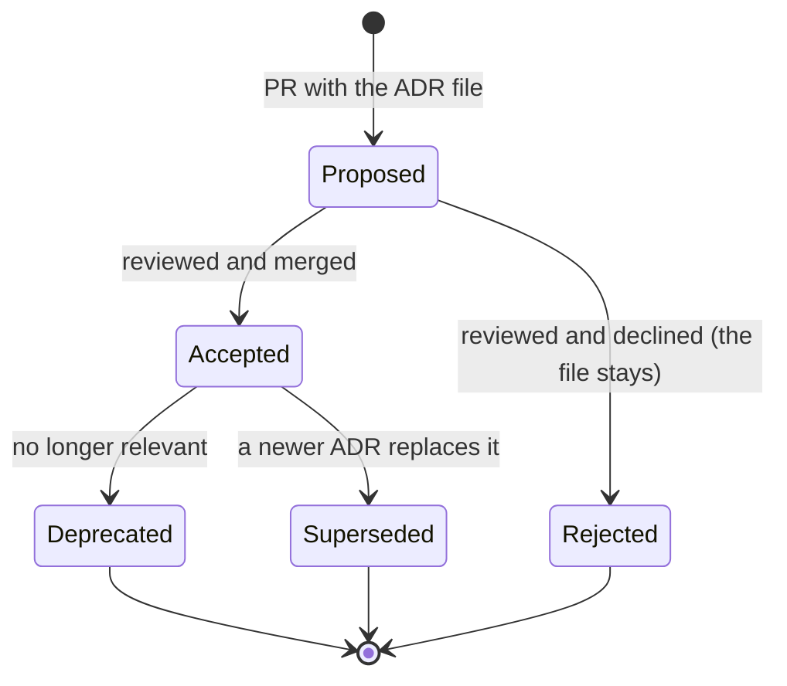

# DECISIONS.md — ADR Index

The records themselves live in [`docs/adr/`](docs/adr/). This file is the index and the
process.

> **AI agents: read the relevant ADR before proposing an alternative approach.** If a decision
> is recorded here, it has already been argued. To change it, write a superseding ADR — do not
> silently deviate.

---

## 1. Index

| ADR | Title | Status | Date | Supersedes |
|---|---|---|---|---|
| [0001](docs/adr/ADR-0001-modular-monolith.md) | Modular monolith over microservices | Accepted | 2026-08-06 | — |
| [0002](docs/adr/ADR-0002-go-http-stack.md) | chi + stdlib `net/http` | Accepted | 2026-08-06 | — |
| [0003](docs/adr/ADR-0003-sqlc-over-orm.md) | sqlc + pgx instead of an ORM | Accepted | 2026-08-06 | — |
| [0004](docs/adr/ADR-0004-schema-per-module.md) | One Postgres schema per module | Accepted | 2026-08-06 | — |
| [0005](docs/adr/ADR-0005-openapi-spec-first.md) | OpenAPI 3.1, spec-first | Accepted | 2026-08-06 | — |
| [0006](docs/adr/ADR-0006-dependency-injection.md) | Manual constructor injection | Accepted | 2026-08-06 | — |
| [0007](docs/adr/ADR-0007-auth-jwt-refresh-rotation.md) | JWT access + rotating refresh | Accepted | 2026-08-06 | — |
| [0008](docs/adr/ADR-0008-rbac-simple-policy.md) | Table-driven permissions, no Casbin/OPA | Accepted | 2026-08-06 | — |
| [0009](docs/adr/ADR-0009-event-bus-in-process.md) | In-process event bus + transactional outbox | Accepted | 2026-08-06 | — |
| [0010](docs/adr/ADR-0010-job-queue-river.md) | River (Postgres) for background jobs | Accepted | 2026-08-06 | — |
| [0011](docs/adr/ADR-0011-ai-provider-abstraction.md) | Task-based AI provider abstraction | Accepted | 2026-08-06 | — |
| [0012](docs/adr/ADR-0012-prompt-versioning.md) | Prompts as versioned, evaluated artefacts | Accepted | 2026-08-06 | — |
| [0013](docs/adr/ADR-0013-observability-otel.md) | OTel SDK + Collector; Tempo over Jaeger | Accepted | 2026-08-06 | — |
| [0014](docs/adr/ADR-0014-frontend-stack.md) | React + Vite + TanStack + shadcn/ui | Accepted | 2026-08-06 | — |
| [0015](docs/adr/ADR-0015-content-exercise-core.md) | Shared content + exercise engine | Accepted | 2026-08-06 | — |
| [0016](docs/adr/ADR-0016-srs-fsrs.md) | FSRS instead of SM-2 | Accepted | 2026-08-06 | — |
| [0017](docs/adr/ADR-0017-error-problem-details.md) | RFC 9457 Problem Details | Accepted | 2026-08-06 | — |
| [0018](docs/adr/ADR-0018-media-presigned-upload.md) | Presigned direct-to-storage uploads | Accepted | 2026-08-06 | — |
| [0019](docs/adr/ADR-0019-testing-strategy.md) | Testcontainers over mocked infrastructure | Accepted | 2026-08-06 | — |
| [0020](docs/adr/ADR-0020-agent-md-convention.md) | `AGENT.md` per module as the AI context unit | Accepted | 2026-08-06 | — |

## 2. Decisions deliberately deferred

Recording a *non-decision* is as valuable as recording a decision — it stops the same debate
recurring.

| Question | Deferred until | Default in the meantime |
|---|---|---|
| Kubernetes | The single host is genuinely the constraint | Docker Compose |
| Message broker (NATS/Kafka) | A module is extracted, or cross-service eventing is needed | In-process bus + outbox |
| Dedicated search engine | Postgres FTS p95 > 300 ms, or relevance tuning is required | Postgres FTS |
| Vector database | Semantic caching or content similarity outgrows `pgvector` | `pgvector` in the existing Postgres |
| Payment provider | Target market confirmed (plan review Q1) | Adapter interface, no implementation |
| Speech/ASR provider | Pronunciation-scoring quality benchmarked (plan review Q2) | Adapter interface, two candidates |
| Mobile app | Web retention validated | Web-first, strict API versioning |
| Multi-tenancy | Never, unless the product pivots to B2B | Single-tenant, two roles |
| Microservice extraction | A trigger in ARCHITECTURE §20.1 fires | Modular monolith |

## 3. When an ADR is required

Write one if the change:

- introduces or removes a runtime dependency or an external vendor
- changes a module boundary, or adds a dependency arrow between modules
- changes the data model in a way other modules can observe
- changes the authentication, authorization, or error contract
- changes how AI providers, prompts, or evaluation work
- costs money at a scale someone would notice
- is something you would want a future engineer to understand the reasoning for
- reverses an existing ADR

You do **not** need one for: a normal feature, a bug fix, a refactor inside a module, a
dependency patch bump, or a documentation change.

## 4. Process



Rules:

1. Numbers are sequential and never reused.
2. An accepted ADR is **immutable** except for its status field and a link to a superseding ADR.
3. Rejected ADRs are kept — knowing what was rejected and why is half the value.
4. Every ADR names at least **two** alternatives that were considered and why they lost.
5. Every ADR states its **consequences**, including the bad ones.

## 5. Template

`docs/templates/adr.md`:

```markdown
# ADR-NNNN: <Title>

| | |
|---|---|
| Status | Proposed / Accepted / Rejected / Deprecated / Superseded by ADR-XXXX |
| Date | YYYY-MM-DD |
| Deciders | … |
| Tags | backend, data, ai, security |

## Context
What forces are at play? What is the problem? What constraints apply?

## Decision
What we will do, stated in the active voice.

## Alternatives considered
### A: <name>
Pros / Cons / Why rejected
### B: <name>
Pros / Cons / Why rejected

## Consequences
### Positive
### Negative
### Risks and mitigations
### What this makes harder later

## Compliance
How we will know this decision is being followed (a lint rule, a CI check, a review item).

## Revisit when
The concrete condition under which this decision should be reconsidered.
```
