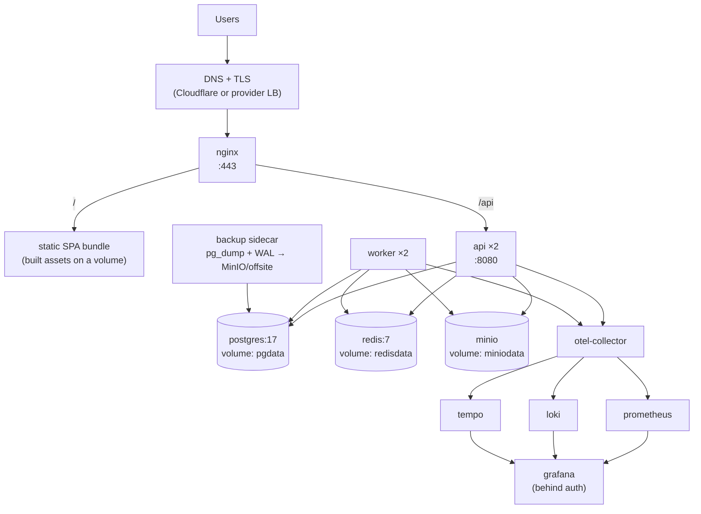
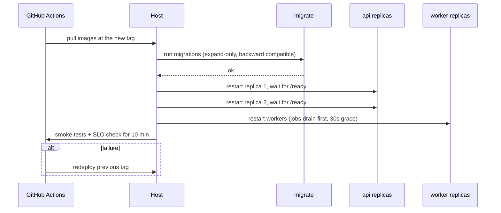

# DEPLOYMENT_GUIDE.md

---

## 1. Environments

| Env | Host | Data | Deploys on | Who can deploy |
|---|---|---|---|---|
| `local` | developer machine | seeded | `make dev` | anyone |
| `ci` | GitHub runner | ephemeral | every push | automation |
| `staging` | single VM | anonymised copy of production | merge to `main` | automation |
| `production` | single VM (year 1) | live | tag `v*.*.*` + approval | release manager |

## 2. Topology (production)



Two API replicas and two workers on one host give rolling restarts without downtime. That is
the ceiling of this topology; beyond it, move to two hosts or a container platform (§9).

## 3. Configuration

Every key is documented in `docs/deployment/configuration.md` and mirrored in `.env.example`.
The application **fails to start** if a required key is missing or invalid.

| Group | Keys (abridged) |
|---|---|
| App | `APP_ENV`, `APP_VERSION`, `APP_BASE_URL`, `HTTP_PORT`, `HTTP_READ_TIMEOUT`, `SHUTDOWN_GRACE` |
| Database | `DB_DSN`, `DB_MAX_CONNS`, `DB_MAX_IDLE`, `DB_CONN_LIFETIME` |
| Redis | `REDIS_URL`, `REDIS_POOL_SIZE`, `REDIS_TLS` |
| Storage | `S3_ENDPOINT`, `S3_ACCESS_KEY`, `S3_SECRET_KEY`, `S3_REGION`, `S3_BUCKET_*`, `S3_PRESIGN_TTL` |
| Auth | `JWT_SIGNING_KEY`, `JWT_PREVIOUS_KEY`, `ACCESS_TTL`, `REFRESH_TTL`, `ARGON2_*` |
| Mail | `SMTP_*` or `MAIL_PROVIDER_*`, `MAIL_FROM` |
| AI | `AI_ENABLED`, `AI_DEFAULT_CHAIN`, `AI_TASK_ROUTES` (file path), `AI_DAILY_BUDGET_USD`, `ANTHROPIC_API_KEY`, `OPENAI_API_KEY`, `GEMINI_API_KEY`, `OPENROUTER_API_KEY` |
| Speech | `SPEECH_PROVIDER`, `SPEECH_API_KEY`, `SPEECH_REGION` |
| Jobs | `WORKER_QUEUES`, `WORKER_CONCURRENCY`, `JOB_MAX_ATTEMPTS` |
| Telemetry | `OTEL_EXPORTER_OTLP_ENDPOINT`, `OTEL_SERVICE_NAME`, `OTEL_TRACES_SAMPLER_ARG`, `LOG_LEVEL` |
| Limits | `RATE_LIMIT_*`, `UPLOAD_MAX_MB`, `AUDIO_MAX_SECONDS` |
| Payments | `PAYMENT_PROVIDER`, `PAYMENT_*_KEY`, `PAYMENT_WEBHOOK_SECRET` |

Secrets are injected as Docker secrets or from the host's secret store — never baked into an
image, never committed.

## 4. First-time production setup

```bash
# 1. Host prep: docker engine + compose v2, firewall (80/443 only), unattended security updates
# 2. Clone the repo at the release tag
# 3. Create the secrets files under /etc/fluentra/secrets/ (0600, root-owned)
# 4. Configure DNS + obtain certificates
# 5. Bring up data services first, then run migrations, then the app
docker compose -f deploy/compose/compose.yaml -f deploy/compose/compose.prod.yaml up -d postgres redis minio
docker compose -f deploy/compose/compose.yaml -f deploy/compose/compose.prod.yaml run --rm migrate
docker compose -f deploy/compose/compose.yaml -f deploy/compose/compose.prod.yaml up -d
```

Then verify with the checklist in §6.

## 5. Rolling deployment



Rules:
- **Migrations run before the new code and must be backward compatible** with the previous
  release (expand → migrate → contract). This is what makes rollback safe.
- Old and new code run simultaneously during the rollout. Design every change for that.
- Workers finish in-flight jobs during the 30-second grace period; River re-queues anything unfinished.

## 6. Post-deploy verification

- [ ] `/health` and `/ready` return 200 on both replicas
- [ ] Version endpoint reports the expected tag
- [ ] A synthetic login journey passes
- [ ] Error rate and p95 latency unchanged after 10 minutes
- [ ] Job queues draining; `job_oldest_pending_seconds` normal
- [ ] No new `error` log signatures
- [ ] AI spend rate normal
- [ ] Grafana annotations record the deploy

## 7. Rollback

| Trigger | Action |
|---|---|
| Smoke tests fail | Automatic redeploy of the previous tag |
| SLO burn after deploy | Manual `rollback.yml` dispatch |
| Bad migration | Restore from the pre-deploy snapshot (taken automatically before migrations) |

Because migrations are expand-only, rolling back code alone is almost always sufficient.
A down-migration is only run when the release notes explicitly declare it safe.

## 8. Backup and restore

| What | How | Frequency | Retention | Verified |
|---|---|---|---|---|
| Postgres | `pg_dump` (custom format) + continuous WAL archiving | nightly / continuous | 30 days | monthly restore drill |
| MinIO | `mc mirror` to offsite | nightly | 30 days | quarterly |
| Secrets | Encrypted export to the password manager | on change | — | on change |
| Grafana dashboards | In git | — | — | — |

RPO 15 minutes, RTO 1 hour. The restore procedure is in
`docs/operations/runbooks/restore.md` and is **timed** during each drill; if the drill exceeds
the RTO, that is an incident in itself.

## 9. Scaling path

| Stage | Trigger | Action |
|---|---|---|
| 1 | Baseline | 2 api + 2 worker on one host |
| 2 | CPU > 60 % sustained | Vertical: bigger host |
| 3 | DB read-bound | Add a read replica; route reads through the repository interface |
| 4 | Worker-bound | Split workers by queue onto a second host |
| 5 | Host is the limit | Move to two hosts + external load balancer, or a container platform |
| 6 | A module is resource-asymmetric | Extract it — see ARCHITECTURE §20; **not before** |

## 10. Operational runbooks

`docs/operations/runbooks/` — one per alert:
`api-down.md` · `high-latency.md` · `db-pool-exhausted.md` · `queue-stalled.md` ·
`ai-provider-outage.md` · `ai-budget-exceeded.md` · `disk-full.md` · `restore.md` ·
`rollback.md` · `security-incident.md` · `payment-reconciliation.md`

Each follows: **Symptom → Impact → Diagnosis (with the exact query/command) → Mitigation →
Root-cause follow-up → Escalation**.
