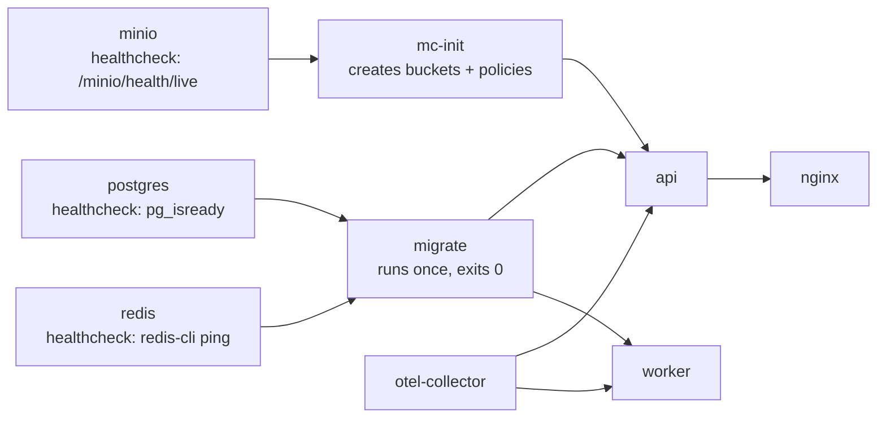

# DOCKER_GUIDE.md

---

## 1. Images

| Image | Base (build → runtime) | Size target | Contains |
|---|---|---|---|
| `fluentra-api` | `golang:1.25-alpine` → `gcr.io/distroless/static-debian12:nonroot` | < 40 MB | the `api` binary, CA certs, timezone data |
| `fluentra-worker` | `golang:1.25-alpine` → `debian:12-slim` | < 220 MB | the `worker` binary + `ffmpeg` + `audiowaveform` |
| `fluentra-migrate` | `golang:1.25-alpine` → distroless | < 25 MB | the `migrate` binary + embedded migrations |
| `fluentra-web` | `node:24-alpine` → `nginx:1.27-alpine` | < 60 MB | built SPA assets + nginx config |

The worker cannot be distroless because it shells out to `ffmpeg`; it is the one image where we
accept a fuller base, and it is scanned accordingly.

## 2. Dockerfile rules

| # | Rule | Why |
|---|---|---|
| D1 | Multi-stage always | Compilers and toolchains never ship |
| D2 | Order layers by change frequency: base → deps → source | Cache hits on the common case |
| D3 | `go mod download` in its own layer before copying source | Dependency layer survives source edits |
| D4 | Cache mounts: `--mount=type=cache,target=/go/pkg/mod` and `/root/.cache/go-build` | 3–5× faster rebuilds |
| D5 | `CGO_ENABLED=0`, `-trimpath`, `-ldflags "-s -w -X main.version=…"` | Static, reproducible, smaller |
| D6 | Non-root user; read-only root filesystem; `no-new-privileges` | Least privilege |
| D7 | Pin base images by digest | Reproducible and tamper-evident |
| D8 | `HEALTHCHECK` on every long-running service | Compose can gate dependents |
| D9 | No secrets in `ARG`/`ENV`/layers | They persist in the image history |
| D10 | `.dockerignore` excludes `.git`, `node_modules`, `web/dist`, `docs`, test data | Smaller, faster context |
| D11 | Exactly one process per container | No supervisors, no bundled cron |
| D12 | `STOPSIGNAL SIGTERM` + graceful shutdown in the app | Clean drains |

## 3. Compose layout

```
deploy/compose/
├── compose.yaml                  # base: api, worker, postgres, redis, minio, migrate
├── compose.dev.yaml              # air, vite, mailpit, jaeger, adminer, seed, exposed ports
├── compose.observability.yaml    # otel-collector, prometheus, loki, tempo, grafana
├── compose.prod.yaml             # nginx, limits, restart policies, log rotation, no exposed DB ports
└── .env.example
```

```bash
make dev     # base + dev + observability
make prod-up # base + prod + observability
```

## 4. Service definitions — required properties

| Property | Rule |
|---|---|
| `restart` | `unless-stopped` in prod |
| `healthcheck` | Every service; `depends_on: condition: service_healthy` |
| `deploy.resources.limits` | CPU and memory set for every service in prod |
| `logging` | `json-file` with `max-size: 10m`, `max-file: 3` |
| `volumes` | Named volumes for state; bind mounts only in dev |
| `networks` | `frontend` (nginx ↔ api) and `backend` (api ↔ data); data services are **not** on `frontend` |
| `ports` | In prod only nginx publishes ports; Postgres/Redis/MinIO stay internal |
| `env_file` / `secrets` | Secrets via Docker secrets, not environment literals |
| `user` | Non-root everywhere it is supported |

## 5. Startup order



`migrate` is a one-shot service with `restart: "no"`. The API refuses to start if the schema
version is older than the binary expects — a mismatch is a loud failure, not a subtle one.

## 6. Resource allocation (single production host, 8 vCPU / 16 GB baseline)

| Service | CPU limit | Memory limit | Replicas |
|---|---|---|---|
| api | 1.5 | 768 MB | 2 |
| worker | 2.0 | 1.5 GB | 2 |
| postgres | 2.0 | 4 GB | 1 |
| redis | 0.5 | 512 MB | 1 |
| minio | 0.5 | 512 MB | 1 |
| nginx | 0.5 | 128 MB | 1 |
| otel-collector | 0.5 | 512 MB | 1 |
| prometheus | 0.5 | 1 GB | 1 |
| loki | 0.5 | 768 MB | 1 |
| tempo | 0.5 | 768 MB | 1 |
| grafana | 0.25 | 256 MB | 1 |

The worker gets the largest allocation because `ffmpeg` and ASR pre-processing are the CPU-heavy
parts of the system. Tune from the dashboards, not from these guesses.

## 7. Volumes and data

| Volume | Contents | Backed up |
|---|---|---|
| `pgdata` | PostgreSQL | ✅ dump + WAL |
| `redisdata` | Redis AOF | ❌ (rebuildable — nothing authoritative lives only in Redis) |
| `miniodata` | Objects | ✅ mirrored offsite |
| `promdata`, `lokidata`, `tempodata` | Telemetry | ❌ (retention-bounded) |
| `grafanadata` | Grafana state | dashboards are in git; only user prefs live here |

**Never** run `docker compose down -v` without an explicit decision. It deletes learner data.
The Makefile target that does this is named `db-reset-DANGEROUS` and prompts for confirmation.

## 8. Security posture

| Control | Setting |
|---|---|
| User | `nonroot` / explicit `user:` |
| Filesystem | `read_only: true` + `tmpfs` for `/tmp` |
| Capabilities | `cap_drop: [ALL]`, add back only what a service needs |
| Privileges | `security_opt: [no-new-privileges:true]` |
| Networking | Internal networks; no data service published |
| Images | Digest-pinned, Trivy-scanned, cosign-verified before deploy |
| Secrets | Docker secrets mounted at `/run/secrets`, `0400` |
| Updates | Base images rebuilt weekly even without code changes |

## 9. Local development

`compose.dev.yaml` adds:

| Service | Purpose |
|---|---|
| `air` | Go hot reload for `api` and `worker` |
| `vite` | Frontend dev server with HMR at :5173 |
| `mailpit` | Catches all outbound email at :8025 |
| `jaeger` | Convenient local trace UI at :16686 (dev only — production uses Tempo) |
| `adminer` | DB browsing at :8081 |
| `seed` | Loads the demo dataset on first run |
| `river-ui` | Job queue inspection |

Dev exposes Postgres (5432), Redis (6379) and MinIO (9000/9001) on localhost for tooling.
Production does not.

## 10. Troubleshooting

| Symptom | Check |
|---|---|
| `api` restarts in a loop | `docker compose logs api` — usually a missing required config key |
| Migration fails | Check for a lock held by a previous crashed run; `goose status` |
| Worker idle while jobs pile up | `WORKER_QUEUES` does not include the queue the jobs were enqueued to |
| Uploads fail with 403 | MinIO bucket policy or clock skew breaking presigned signatures |
| No traces in Grafana | Collector endpoint wrong, or tail sampling dropping them; check the Collector's own logs |
| Slow rebuilds | Cache mounts not used, or `.dockerignore` missing an entry |
| Out of disk | Telemetry retention, or orphaned MinIO objects — run the GC job |
