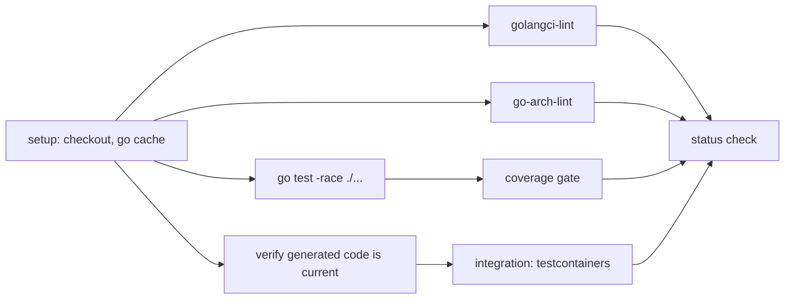

# GITHUB_ACTIONS.md

---

## 1. Workflow inventory

| Workflow | Trigger | Duration target | Blocking |
|---|---|---|---|
| `ci-backend.yml` | push/PR touching `**.go`, `db/**`, `api/**` | < 8 min | ✅ |
| `ci-frontend.yml` | push/PR touching `web/**` | < 6 min | ✅ |
| `ci-e2e.yml` | PR to `main`, nightly | < 15 min | ✅ on PR to main |
| `security.yml` | push, weekly schedule | < 10 min | ✅ (high/critical only) |
| `docs.yml` | push touching `docs/**`, `**/AGENT.md`, `*.md` | < 3 min | ✅ |
| `ai-eval.yml` | PR touching `docs/prompts/runtime/**`, nightly | < 20 min | ✅ on prompt change |
| `build.yml` | push to `main`, tag `v*` | < 10 min | — |
| `release.yml` | tag `v*` | < 15 min | — |
| `deploy-staging.yml` | after `build.yml` on `main` | < 5 min | — |
| `deploy-production.yml` | tag `v*` + environment approval | < 10 min | — |
| `rollback.yml` | manual dispatch | < 5 min | — |
| `deps.yml` | weekly (Renovate) | — | — |

## 2. Shared conventions

| Convention | Detail |
|---|---|
| Concurrency | `group: ${{ github.workflow }}-${{ github.ref }}`, `cancel-in-progress: true` for PRs |
| Permissions | `permissions: {contents: read}` at the top; elevated only on the job that needs it |
| Action pinning | Third-party actions pinned to a commit SHA, not a tag |
| Caching | Go build + module cache keyed on `go.sum`; pnpm store keyed on the lockfile; Docker buildx cache to GHA |
| Matrix | Only where it buys something (e.g. Postgres 17 now, 18 when it lands) |
| Secrets | Repository/environment secrets; OIDC for registry auth — no long-lived tokens |
| Timeouts | Every job sets `timeout-minutes`; no job may hang the queue |
| Artefacts | Coverage reports, Playwright traces, SBOMs, eval reports uploaded on failure or release |
| Annotations | Failures annotated inline on the PR diff |

## 3. `ci-backend.yml` — job graph



| Step | Fails when |
|---|---|
| `verify generated code` | `make gen` produces a diff — someone edited generated code or forgot to regenerate |
| `golangci-lint` | Any enabled linter reports an issue |
| `go-arch-lint` | **A module imported another module's internals** — the boundary guard |
| `go test -race` | Any test fails or a data race is detected |
| coverage gate | Below the thresholds in `TESTING_GUIDELINE.md` §2 |
| integration | testcontainers tests fail against real Postgres/Redis/MinIO |
| `spectral` on the OpenAPI spec | Spec lint violations |
| migration check | A migration lacks a `Down`, or is not in a module folder |

## 4. `ci-frontend.yml`

`tsc --noEmit` → `eslint` (including the feature-boundary rule) → `vitest --coverage` →
`vite build` → bundle-size budget check → `vitest-axe` accessibility assertions.

The bundle budget fails the build if the initial chunk exceeds 200 KB gzip or any route chunk
exceeds 120 KB.

## 5. `ci-e2e.yml`

Spins up the full compose stack (with the `mock` AI provider and a local SMTP sink), seeds the
demo dataset, runs Playwright sharded across 3 runners, uploads traces on failure.

Rules: no external network calls; deterministic seed data; each shard has its own stack;
a flaky test is quarantined by label and must be fixed or deleted within 24 hours.

## 6. `security.yml`

| Check | Tool | Fails on |
|---|---|---|
| Secrets | gitleaks | any finding |
| Go vulnerabilities | govulncheck | any reachable vulnerability |
| npm vulnerabilities | `pnpm audit` | high/critical |
| SAST | CodeQL (go, javascript) | high/critical |
| Image scan | Trivy | high/critical with a fix available |
| Licence check | `go-licenses` + `license-checker` | a copyleft licence in a distributed artefact |
| SBOM | Syft → CycloneDX | — (artefact only) |

## 7. `docs.yml`

| Check | What it catches |
|---|---|
| markdownlint | Formatting drift |
| lychee link check | Broken internal and external links |
| front-matter schema | Missing `module`, `status`, `last_verified`, … |
| section presence | A module `AGENT.md` missing one of the 14 required sections |
| `docs-drift` | `tables:` front-matter ≠ actual migrations |
| `api-drift` | An endpoint in `API.md` not present in `openapi.yaml` (and vice versa) |
| `dep-drift` | `depends_on` front-matter ≠ `.go-arch-lint.yml` |
| staleness | `last_verified` older than 90 days on a module changed since (warning, weekly report) |

## 8. `ai-eval.yml`

Runs each changed task's eval suite against the `mock` provider (deterministic, free) and one
cheap real model, then posts a comparison table as a PR comment:

| Task | Metric | Current active (v3) | This PR (v4) | Threshold | Verdict |
|---|---|---|---|---|---|
| `writing.grade_essay` | band MAE | 0.38 | 0.31 | ≤ 0.40 | ✅ improved |
| `writing.grade_essay` | schema valid | 0.995 | 0.999 | ≥ 0.99 | ✅ |
| `writing.grade_essay` | injection resisted | 1.00 | 1.00 | = 1.00 | ✅ |

A regression below threshold blocks the merge. Promotion of a prompt to `active` additionally
requires a human approval from the learning team.

## 9. `build.yml` and `release.yml`

| Step | Detail |
|---|---|
| Build | Buildx, multi-stage, `linux/amd64` (+`arm64` when a runner is available) |
| Tag | `ghcr.io/<org>/fluentra-api:{sha}` and `:{semver}`; `:latest` only on a release tag |
| Sign | cosign keyless with OIDC |
| Attest | SBOM + provenance attached |
| Changelog | `git-cliff` from Conventional Commits |
| Release | GitHub Release with notes, SBOM, and image digests |
| Deploy | Triggers `deploy-production.yml`, gated by the `production` environment's required reviewers |

## 10. Pipeline metrics

Each workflow pushes to the Collector:
`ci_pipeline_duration_seconds{workflow}` · `ci_job_result_total{job,result}` ·
`deploy_total{env,result}` · `rollback_total{env}`.

Recording rules derive the DORA four keys, shown on the CI/CD dashboard. If lead time or
change-failure rate degrades for two consecutive weeks, it goes on the retro agenda.

## 11. Local parity

```bash
make ci          # runs the same checks CI runs, in the same order
make ci-fast     # lint + unit only, for the inner loop
```

`make ci` passing locally should mean CI passes. When it does not, that discrepancy is a bug in
the tooling and gets fixed — developers must be able to trust the local command.

## 12. Cost and speed hygiene

| Practice | Effect |
|---|---|
| Path filters on every workflow | Frontend changes do not run backend integration tests |
| `cancel-in-progress` on PRs | No wasted runners on superseded pushes |
| Aggressive caching (Go, pnpm, Docker layers, Playwright browsers) | 3–5× faster warm runs |
| Integration tests only on backend changes | Keeps the median PR under 8 minutes |
| Nightly for expensive suites (E2E full, load, real-provider evals) | Fast PRs, thorough nights |
| Self-hosted runner (optional, later) | Considered only if queue time becomes the bottleneck |
