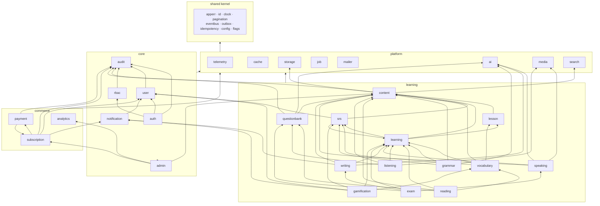

# MODULE_INDEX.md — The Map

> **AI assistants: this is your second read, after [AGENT.md](AGENT.md).**
> Find your module here, then open only that module's `AGENT.md`. Nothing else.

Legend — **Status**: `PLANNED` (spec only) · `IN_PROGRESS` · `DONE` · `DEPRECATED`.
**Tier**: `platform` = technical capability, no business rules · `core` · `learning` · `commerce`.

---

## 1. Quick lookup — "I need to change X, which module?"

| I need to… | Module |
|---|---|
| Change login, tokens, sessions, password reset | [`auth`](internal/modules/auth/AGENT.md) |
| Change a user's profile, preferences, deletion | [`user`](internal/modules/user/AGENT.md) |
| Change who can do what | [`rbac`](internal/modules/rbac/AGENT.md) |
| Record who did what | [`audit`](internal/modules/audit/AGENT.md) |
| Build an admin screen or back-office action | [`admin`](internal/modules/admin/AGENT.md) |
| Send an in-app / push notification | [`notification`](internal/modules/notification/AGENT.md) |
| Change how learning material is modelled, versioned, published | [`content`](internal/modules/content/AGENT.md) |
| Change courses, lesson structure, activity sequencing | [`lesson`](internal/modules/lesson/AGENT.md) |
| Change progress, enrolment, learning paths, placement | [`learning`](internal/modules/learning/AGENT.md) |
| Change review scheduling / FSRS | [`srs`](internal/modules/srs/AGENT.md) |
| Change word decks, definitions, collocations | [`vocabulary`](internal/modules/vocabulary/AGENT.md) |
| Change grammar points, error tagging, gap-fill | [`grammar`](internal/modules/grammar/AGENT.md) |
| Change passages, comprehension questions, WPM | [`reading`](internal/modules/reading/AGENT.md) |
| Change audio exercises, play limits, transcripts | [`listening`](internal/modules/listening/AGENT.md) |
| Change recording, ASR, pronunciation scoring | [`speaking`](internal/modules/speaking/AGENT.md) |
| Change essay tasks, AI rubric grading, drafts | [`writing`](internal/modules/writing/AGENT.md) |
| Change mock exams, timing, scoring, reports | [`exam`](internal/modules/exam/AGENT.md) |
| Change question authoring, item bank, difficulty | [`questionbank`](internal/modules/questionbank/AGENT.md) |
| Change XP, streaks, badges, leaderboards | [`gamification`](internal/modules/gamification/AGENT.md) |
| Change reporting, KPIs, funnels, cohorts | [`analytics`](internal/modules/analytics/AGENT.md) |
| Change checkout, gateway, webhooks, refunds | [`payment`](internal/modules/payment/AGENT.md) |
| Change plans, entitlements, trials, renewals | [`subscription`](internal/modules/subscription/AGENT.md) |
| Call an LLM, add a provider, change a prompt | [`platform/ai`](internal/platform/ai/AGENT.md) |
| Cache something | [`platform/cache`](internal/platform/cache/AGENT.md) |
| Store or serve a file | [`platform/storage`](internal/platform/storage/AGENT.md) |
| Make something searchable | [`platform/search`](internal/platform/search/AGENT.md) |
| Run work in the background or on a schedule | [`platform/job`](internal/platform/job/AGENT.md) |
| Transcode audio, run ASR/TTS, build waveforms | [`platform/media`](internal/platform/media/AGENT.md) |
| Add a metric, span, or log field | [`platform/telemetry`](internal/platform/telemetry/AGENT.md) |
| Send an email | [`platform/mailer`](internal/platform/mailer/AGENT.md) |

---

## 2. Full module register

### 2.1 Platform tier — `internal/platform/`

| # | Module | Purpose | Schema | Depends on | Phase | Status |
|---|---|---|---|---|---|---|
| P1 | `telemetry` | OTel setup, tracer/meter/logger providers, middleware, correlation IDs | — | — | 1 | PLANNED |
| P2 | `cache` | Typed Redis cache facade, key builder, single-flight, rate limiting, locks | — | telemetry | 1 | PLANNED |
| P3 | `storage` | MinIO/S3 facade, presigned URLs, bucket policy, lifecycle, GC | — | telemetry | 1 | PLANNED |
| P4 | `job` | River wiring, queue registry, cron scheduler, job middleware, DLQ | `ops` | telemetry | 1 | PLANNED |
| P5 | `mailer` | Template rendering, SMTP/API sending, bounce handling, dev mailbox | `comm` | job, storage | 1 | PLANNED |
| P6 | `ai` | Provider registry, prompt registry, routing, cache, budget, usage tracking | `ai` | cache, telemetry, job | 2 | PLANNED |
| P7 | `media` | ffmpeg transcode, waveform, ASR, TTS, pronunciation scoring adapters | `content` (read) | storage, job, ai | 2 | PLANNED |
| P8 | `search` | Postgres FTS abstraction, indexers, query builder; pluggable engine later | per-owner | cache | 3 | PLANNED |

### 2.2 Core tier — `internal/modules/`

| # | Module | Purpose | Schema | Owns tables | Depends on | Phase | Status |
|---|---|---|---|---|---|---|---|
| C1 | `auth` | Registration, login, tokens, sessions, MFA, password reset, OAuth | `core` | `credentials`, `sessions`, `refresh_tokens`, `mfa_secrets`, `verification_tokens`, `login_attempts` | user, rbac, mailer, cache, audit | 1 | PLANNED |
| C2 | `user` | Profile, preferences, locale, level, avatar, export, deletion | `core` | `users`, `profiles`, `user_preferences`, `user_deletion_requests`, `user_exports` | storage, mailer, audit, job, auth, rbac | 1 | PLANNED |
| C3 | `rbac` | Roles, permissions, policy evaluation, guards | `core` | `roles`, `permissions`, `role_permissions`, `user_roles` | cache, audit | 1 | PLANNED |
| C4 | `audit` | Immutable action log, security events, admin trail, retention | `audit` | `audit_logs`, `security_events` | job | 1 | PLANNED |
| C5 | `admin` | Back-office surface: dashboards, user management, moderation, feature flags | — (reads others via contract) | `feature_flags`, `admin_notes` | all core + learning contracts | 2 | PLANNED |
| C6 | `notification` | In-app + push + email fan-out, preferences, digests, quiet hours | `comm` | `notifications`, `notification_preferences`, `devices` | mailer, job, cache | 2 | PLANNED |

### 2.3 Learning tier — `internal/modules/`

| # | Module | Purpose | Schema | Owns tables | Depends on | Phase | Status |
|---|---|---|---|---|---|---|---|
| L1 | `content` | Canonical content model, versioning, publish workflow, taxonomy, media links, CEFR levelling | `content` | `content_items`, `content_versions`, `media_assets`, `taxonomies`, `content_tags` | storage, search, audit, ai | 2 | DONE |
| L2 | `lesson` | Courses → units → lessons → activities; sequencing, prerequisites, unlocking | `learn` | `courses`, `course_units`, `lessons`, `activities`, `activity_content` | content, cache | 2 | DONE |
| L3 | `learning` | Enrolment, progress, placement test, adaptive path, session tracking, exercise engine | `learn` | `enrollments`, `progress`, `attempts`, `learning_sessions`, `placement_results`, `answer_explanations` | lesson, content, srs, ai, all skill modules (contract) | 2 | DONE |
| L4 | `srs` | FSRS scheduling, review cards, due queues, review logs, retention forecasting | `learn` | `review_cards`, `review_logs`, `srs_params`, `review_daily_stats` | cache, job, content, user, learning (contract) | 2 | DONE |
| L5 | `vocabulary` | Words, senses, decks, collocations, word families, vocab exercises, practice generation | `skill` | `words`, `word_senses`, `decks`, `deck_items`, `user_word_state` | content, lesson, srs, job, media, ai | 2 | DONE |
| L6 | `grammar` | Grammar point taxonomy, rules, error tagging, gap-fill and transformation drills | `skill` | `grammar_points`, `grammar_rules`, `grammar_exercises`, `error_tags` | content, srs, ai | 3 | PLANNED |
| L7 | `reading` | Passages, comprehension sets, span answers, reading speed, difficulty estimation | `skill` | `passages`, `passage_questions`, `reading_attempts` | content, questionbank | 3 | PLANNED |
| L8 | `listening` | Audio items, transcripts, play-limit policy, dictation, note-taking | `skill` | `audio_items`, `transcripts`, `listening_attempts` | content, media | 3 | PLANNED |
| L9 | `speaking` | Prompts, recording, ASR, pronunciation scoring, fluency feedback | `skill` | `speaking_tasks`, `speaking_attempts`, `pronunciation_scores` | media, ai, storage | 3 | PLANNED |
| L10 | `writing` | Tasks, drafts, submissions, AI rubric grading, revision history, plagiarism | `skill` | `writing_tasks`, `writing_drafts`, `writing_submissions`, `writing_feedback` | ai, job, content | 3 | PLANNED |
| L11 | `questionbank` | Item authoring, item types, tagging, difficulty (IRT-lite), review workflow, AI generation | `assess` | `questions`, `question_options`, `question_sets`, `question_stats` | content, ai, audit | 3 | PLANNED |
| L12 | `exam` | Mock exams (IELTS/TOEIC), sections, timing, auto-submit, scoring, score reports | `assess` | `exams`, `exam_sections`, `exam_attempts`, `attempt_answers`, `score_reports` | questionbank, job, ai | 4 | PLANNED |
| L13 | `gamification` | XP, levels, streaks, badges, quests, leaderboards | `learn` | `xp_events`, `streaks`, `badges`, `badges_earned`, `quests`, `user_quests`, `leaderboard_snapshots` | learning, srs, user, cache, job, notification | 3 | DONE |

### 2.4 Commerce & insight tier — `internal/modules/`

| # | Module | Purpose | Schema | Owns tables | Depends on | Phase | Status |
|---|---|---|---|---|---|---|---|
| B1 | `analytics` | Event ingestion, daily rollups, funnels, cohorts, admin KPI reports | `analytics` | `analytics_events`, `daily_rollups`, `funnels`, `cohorts` | job, cache | 4 | PLANNED |
| B2 | `subscription` | Plans, entitlements, trials, upgrades, renewals, grace periods | `billing` | `plans`, `entitlements`, `subscriptions`, `subscription_events` | payment, user, notification | 4 | PLANNED |
| B3 | `payment` | Gateway adapters, checkout sessions, webhooks, invoices, refunds, reconciliation | `billing` | `payments`, `invoices`, `payment_webhooks`, `refunds` | subscription, audit, job | 4 | PLANNED |

---

## 3. Dependency graph

**Read the arrows as "may import the target's `contract` package".** Any arrow not drawn here
is forbidden. Adding an arrow requires updating this file **and** `.go-arch-lint.yml` in the
same commit.

---

## 4. Per-module documentation set

Every module directory contains exactly these files:

| File | Audience | Content |
|---|---|---|
| `AGENT.md` | **AI agents** | Everything an agent needs: overview, entry points, APIs, schema, folder map, rules, common tasks, limitations, conventions, test instructions |
| `README.md` | Humans | Business purpose, responsibilities, quick orientation |
| `API.md` | Both | Endpoint reference, request/response shapes, error codes, permissions |
| `FLOW.md` | Both | Sequence diagrams, state machines, business processes |
| `TESTING.md` | Both | What to test, fixtures, mocks, coverage target, how to run |
| `DECISIONS.md` | Both | Module-local decisions and their rationale (links to global ADRs) |
| `PROMPTS.md` | AI agents | Prompts for *building* this module and prompts this module *sends* at runtime |
| `TODO.md` | Both | Ordered backlog with acceptance criteria |
| `README_AI.md` | AI agents | Pointer to `AGENT.md` (kept for tool compatibility; never duplicate content here) |

Templates: `docs/templates/module/` — **not written yet**; copy an existing module's document set instead.
Generator: `make docs` (source of truth: [docs/modules/manifest.yaml](docs/modules/manifest.yaml)).

---

## 5. Adding a module

1. Add an entry to [`docs/modules/manifest.yaml`](docs/modules/manifest.yaml).
2. Run `make docs` — the nine Markdown files are scaffolded.
3. Add the dependency arrow to §3 above **and** to `.go-arch-lint.yml`.
4. Write an ADR if the module introduces a new external dependency or crosses an existing boundary.
5. Create `db/migrations/<module>/` and the schema.
6. Follow [docs/guides/add-a-module.md](docs/guides/add-a-module.md).

A module is only "real" when it appears in the manifest, this index, and the arch-lint config.
