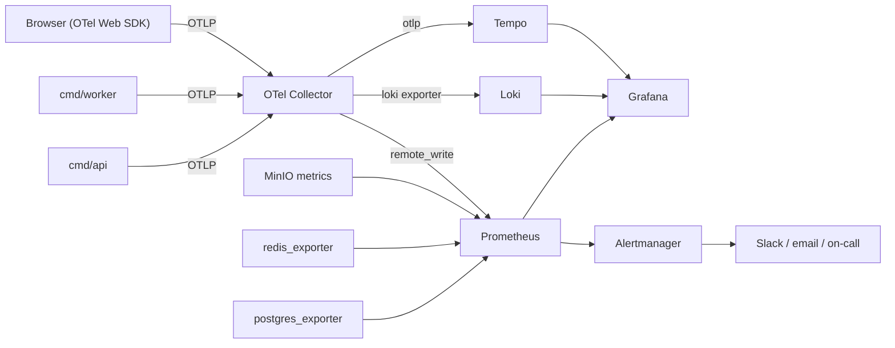

# OBSERVABILITY_GUIDELINE.md

The application emits **only OTLP**, to the OpenTelemetry Collector. Backends are the
Collector's concern, never the code's.

---

## 1. Pipeline



Collector processors: `memory_limiter` → `k8sattributes`(n/a) → `resource` (service.name,
version, env) → `attributes` (PII redaction) → `tail_sampling` → `batch`.

## 2. Resource attributes (every signal)

`service.name` (`fluentra-api` / `fluentra-worker` / `fluentra-web`) · `service.version`
(git tag) · `service.instance.id` · `deployment.environment` (`local|ci|staging|production`) ·
`git.commit.sha`.

## 3. Tracing

### 3.1 What is instrumented

| Automatic | Manual |
|---|---|
| HTTP server (`otelhttp`) | Every service method: `<module>.<Method>` |
| HTTP client | Every AI call: `ai.<task>` |
| pgx (`otelpgx`) | Every media stage: `media.transcode`, `media.asr` |
| go-redis (`redisotel`) | Cache lookups with hit/miss |
| minio-go | Outbox publish, event handling |
| River jobs | Domain-significant decisions (e.g. FSRS scheduling) |

### 3.2 Span naming and attributes

| Rule | Detail |
|---|---|
| Name | Low-cardinality: `GET /api/v1/decks/{id}`, never the concrete ID |
| Required attributes | `module`, `operation` |
| When authenticated | `enduser.id` (the user UUID; never email or name) |
| Errors | `span.RecordError(err)` + `span.SetStatus(codes.Error, code)` — set the `apperr` code, not the raw message |
| IDs | Resource IDs go in attributes (`deck.id`), not the span name |
| Cardinality | An attribute must have < 100 distinct values, unless it is an ID used only for search |

### 3.3 AI span attributes (required)

`ai.task` · `ai.prompt.version` · `ai.provider` · `ai.model` · `ai.tokens.input` ·
`ai.tokens.output` · `ai.cost_usd` · `ai.cache_hit` · `ai.attempt` · `ai.fallback_from` ·
`ai.schema_valid` · `ai.latency_ms`

### 3.4 Sampling

| Traffic | Rate |
|---|---|
| Errors (any span with status Error) | 100 % |
| AI and media operations | 100 % |
| Auth operations | 100 % |
| Everything else | 10 % parent-based |
| Local development | 100 % |

Implemented as tail sampling in the Collector so the decision can see the whole trace.

## 4. Metrics

### 4.1 Conventions

OTel semantic conventions where they exist. Units in the name (`_seconds`, `_bytes`,
`_total`). Histograms for latency, counters for events, gauges for levels.
**Cardinality budget: no metric may exceed 10,000 series.** Never label with a user ID, an
email, a free-text string, or an unbounded ID.

### 4.2 Required metrics

| Domain | Metric | Labels |
|---|---|---|
| HTTP | `http_server_request_duration_seconds` (histogram) | `route`, `method`, `status_class` |
| HTTP | `http_server_active_requests` (gauge) | `route` |
| DB | `db_query_duration_seconds` | `module`, `query_name` |
| DB | `db_pool_connections` | `state` (`acquired`/`idle`/`waiting`) |
| Cache | `cache_operation_duration_seconds` | `op` |
| Cache | `cache_requests_total` | `module`, `result` (`hit`/`miss`/`error`) |
| Storage | `storage_operation_duration_seconds` | `op`, `bucket` |
| Storage | `storage_bytes_total` | `direction`, `bucket` |
| Jobs | `job_duration_seconds` | `kind`, `result` |
| Jobs | `job_queue_depth` (gauge) | `queue` |
| Jobs | `job_oldest_pending_seconds` (gauge) | `queue` |
| Jobs | `job_attempts_total` | `kind`, `outcome` |
| AI | `ai_request_duration_seconds` | `task`, `provider`, `model`, `result` |
| AI | `ai_tokens_total` | `task`, `provider`, `direction` |
| AI | `ai_cost_usd_total` | `task`, `provider`, `model` |
| AI | `ai_requests_total` | `task`, `result`, `cache_hit` |
| AI | `ai_fallback_total` | `from_provider`, `to_provider` |
| AI | `ai_schema_violation_total` | `task`, `prompt_version` |
| Outbox | `outbox_lag_seconds` (gauge) | — |
| Events | `events_published_total` / `events_handled_total` | `event`, `result` |
| Business | `signups_total` | `source` |
| Business | `lessons_completed_total` | `skill`, `cefr_level` |
| Business | `reviews_answered_total` | `grade` |
| Business | `submissions_graded_total` | `skill`, `result` |
| Business | `streak_events_total` | `type` (`started`/`extended`/`broken`) |
| Business | `active_users` (gauge, from a recording rule) | `window` (`dau`/`wau`/`mau`) |
| Runtime | Go runtime metrics | — |

### 4.3 CI/CD metrics

Pushed from GitHub Actions to a Pushgateway (or the Collector's OTLP receiver):

`ci_pipeline_duration_seconds{workflow}` · `ci_job_result_total{job,result}` ·
`deploy_total{env,result}` · `deploy_duration_seconds{env}` · `rollback_total{env}` ·
plus the DORA four keys derived by recording rules: deployment frequency, lead time for
changes, change failure rate, time to restore.

## 5. Logging

### 5.1 Format

JSON to stdout via `log/slog`, bridged to OTLP. Every record carries:

`time` · `level` · `msg` · `trace_id` · `span_id` · `request_id` · `module` · `service` ·
`env` · `version` · plus `user_id` when authenticated.

### 5.2 Levels

| Level | Use | Example |
|---|---|---|
| `debug` | Development detail; disabled in production by default | "cache miss for key …" |
| `info` | Meaningful state change | "submission graded", "user registered" |
| `warn` | Degraded but handled | "provider fell back to openai", "redis unavailable, serving from db" |
| `error` | Needs a human | "outbox publisher failed 5 times", "migration failed" |

There is no `fatal` outside `cmd/` startup.

### 5.3 Rules

| # | Rule |
|---|---|
| LG1 | Structured attributes only — never `fmt.Sprintf` into the message |
| LG2 | Message is a short, constant, lowercase phrase; variables go in attributes |
| LG3 | Never log: passwords, tokens, refresh cookies, API keys, full essay text, audio content, payment details, email addresses (log `user_id` instead) |
| LG4 | Log an error once, at the boundary |
| LG5 | No logging inside tight loops; aggregate and log a summary |
| LG6 | A redaction handler enforces LG3 by allowlist — new fields default to redacted |
| LG7 | Retention: 30 days hot in Loki, 1 year archived to MinIO for `audit` streams |

## 6. Correlation

```
Browser click
  → generates traceparent + X-Request-Id
  → API span (same trace)
  → slog lines carry trace_id
  → job payload carries trace_id + request_id
  → worker span links to the original trace
  → AI call span nested under it
```

In Grafana: a log line's `trace_id` links to the trace; a trace span links back to its logs;
an exemplar on a latency histogram links to a representative trace. Setting this up once, in
Phase 0, is why incident triage takes minutes instead of hours.

## 7. Dashboards (as code, `deploy/grafana/dashboards/`)

| Dashboard | Answers |
|---|---|
| API Overview | Are we up, fast, and error-free? (RED per route) |
| Database | Slow queries, pool saturation, locks, replication lag |
| Cache & Redis | Hit ratio per module, latency, evictions, memory |
| Jobs & Queues | Depth, age, failure rate, retry storms per queue |
| AI Cost & Quality | Spend per task/provider/day, token burn, cache-hit ratio, fallback rate, schema violations, eval scores |
| Storage & Media | Bucket sizes, transcode throughput, ASR latency, failures |
| Business KPIs | Signups, DAU, lessons completed, reviews, streaks, submissions |
| CI/CD & DORA | Pipeline duration, failure rate, deployment frequency, MTTR |
| SLO Overview | Error budget burn per SLO |

## 8. Alerts

| Alert | Condition | Severity |
|---|---|---|
| API error budget burn | 14.4× over 1 h | page |
| API p95 latency | > 400 ms for 10 min | warn |
| 5xx rate | > 2 % for 5 min | page |
| DB pool exhausted | `waiting > 0` for 5 min | page |
| DB replication lag | > 60 s | warn |
| Job queue stalled | `job_oldest_pending_seconds{queue="ai"} > 300` | page |
| Job failure spike | failure rate > 10 % over 15 min | warn |
| Outbox lag | > 60 s | page |
| AI budget | 80 % of daily cap | warn |
| AI budget | 100 % of daily cap | page |
| AI all-providers-down | `ai_requests_total{result="unavailable"}` > 0 for 5 min | page |
| Schema violations | > 5 % for a task over 30 min | warn |
| Disk | > 80 % on any volume | warn |
| Certificate | expires in < 14 days | warn |
| Backup | no successful backup in 26 h | page |

Every alert links to a runbook in `docs/operations/runbooks/`. **An alert without a runbook is
not allowed to page anyone.**

## 9. Adding observability to new code — checklist

- [ ] The operation has a span with `module` and `operation` attributes
- [ ] Errors recorded on the span with the `apperr` code
- [ ] Latency histogram exists, or the operation is covered by an existing one
- [ ] Business-meaningful outcomes emit a counter
- [ ] New labels are bounded (< 100 values)
- [ ] Logs at the right level with no PII
- [ ] A dashboard panel exists if this is a new user-facing capability
- [ ] An alert + runbook exists if this can fail in a way users notice
