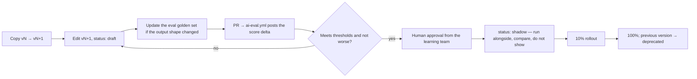

# PROMPTS.md — Quick Reference

The full design is in [PROMPT_LIBRARY.md](PROMPT_LIBRARY.md). This file is the fast path:
*"which prompt do I use, and how?"*

---

## 1. Two libraries — do not confuse them

| | Development prompts | Runtime prompts |
|---|---|---|
| Path | `docs/prompts/dev/` | `docs/prompts/runtime/` |
| Who runs them | You, in an AI coding assistant | The application, at request time |
| Purpose | Generate code, tests, docs | Grade essays, explain grammar, generate items |
| Versioning | Git history | Immutable `vN` files, pinned by config |
| Gate to change | Normal review | Eval suite + human approval |

## 2. Picking a development prompt

| I want to… | Prompt |
|---|---|
| Scaffold a whole module | `dev/backend/generate-module.md` |
| Add CRUD for a resource | `dev/backend/generate-crud.md` |
| Write a service use case | `dev/backend/generate-service.md` |
| Write a repository method | `dev/backend/generate-repository.md` |
| Write an HTTP handler | `dev/backend/generate-handler.md` |
| Add caching to a read path | `dev/backend/generate-cache-layer.md` |
| Add a background job | `dev/backend/generate-job.md` |
| Add a scheduled task | `dev/backend/generate-scheduler.md` |
| Instrument an existing flow | `dev/backend/generate-otel-instrumentation.md` |
| Write a migration | `dev/database/generate-migration.md` |
| Design indexes for a slow query | `dev/database/generate-index-plan.md` |
| Build a React page | `dev/frontend/generate-page.md` |
| Build a form | `dev/frontend/generate-form.md` |
| Build a data table | `dev/frontend/generate-table.md` |
| Write a data-fetching hook | `dev/frontend/generate-hook.md` |
| Write unit tests | `dev/testing/generate-unit-test.md` |
| Write integration tests | `dev/testing/generate-integration-test.md` |
| Write a Playwright journey | `dev/testing/generate-e2e-test.md` |
| Add an AI provider | `dev/ai/generate-ai-provider.md` |
| Write a runtime prompt | `dev/ai/generate-prompt-template.md` |
| Build an eval suite | `dev/ai/generate-eval-suite.md` |
| Add a CI workflow | `dev/devops/generate-github-action.md` |
| Build a Grafana dashboard | `dev/devops/generate-grafana-dashboard.md` |
| Write a runbook | `dev/devops/generate-runbook.md` |
| Write an ADR | `dev/docs/generate-adr.md` |
| Refresh module docs | `dev/docs/generate-module-docs.md` |
| Review the architecture of a change | `dev/docs/review-architecture.md` |

## 3. How to use one

1. Open the prompt file.
2. Fill in the `inputs` listed in its front-matter (module, resource, use case…).
3. Give it to your assistant **as-is** — it already contains the context header, the rules, and
   the acceptance criteria. Do not paraphrase it.
4. Verify the output against the prompt's own acceptance criteria.
5. Run `make check`.

Do not write a new ad-hoc prompt for a task the library already covers. If the library's prompt
produced a poor result, improve the prompt — that fix helps everyone, permanently.

## 4. Runtime prompt tasks

| Task | Used by | Prompt directory |
|---|---|---|
| `writing.grade_essay` | writing | `runtime/writing.grade_essay/` |
| `writing.quick_hint` | writing | `runtime/writing.quick_hint/` |
| `speaking.feedback` | speaking | `runtime/speaking.feedback/` |
| `grammar.explain` | grammar | `runtime/grammar.explain/` |
| `vocabulary.example_sentence` | vocabulary | `runtime/vocabulary.example_sentence/` |
| `vocabulary.definition_simplify` | vocabulary | `runtime/vocabulary.definition_simplify/` |
| `reading.question_generate` | reading, questionbank | `runtime/reading.question_generate/` |
| `listening.transcript_clean` | listening | `runtime/listening.transcript_clean/` |
| `questionbank.generate_items` | questionbank | `runtime/questionbank.generate_items/` |
| `content.translate` | content | `runtime/content.translate/` |
| `content.level_estimate` | content | `runtime/content.level_estimate/` |
| `learning.study_plan_suggest` | learning | `runtime/learning.study_plan_suggest/` |

## 5. Changing a runtime prompt — the short version

**Never edit a published version in place.** Grades produced last month must remain
explainable by the prompt that produced them.

## 6. Prompt hygiene

| Rule | Why |
|---|---|
| No inline prompt strings in Go code | Unreviewable, unversioned, untestable |
| Learner text only inside the untrusted-content wrapper | Prompt injection |
| Every task has a JSON output schema | Validatable, parseable, no free-form drift |
| Every task has an eval suite before it ships | Otherwise quality is a guess |
| Temperature ≤ 0.3 for anything graded | Reproducibility |
| Locale is always an explicit input | Otherwise feedback appears in the wrong language |
| Model IDs pinned exactly | Aliases change behaviour silently |
