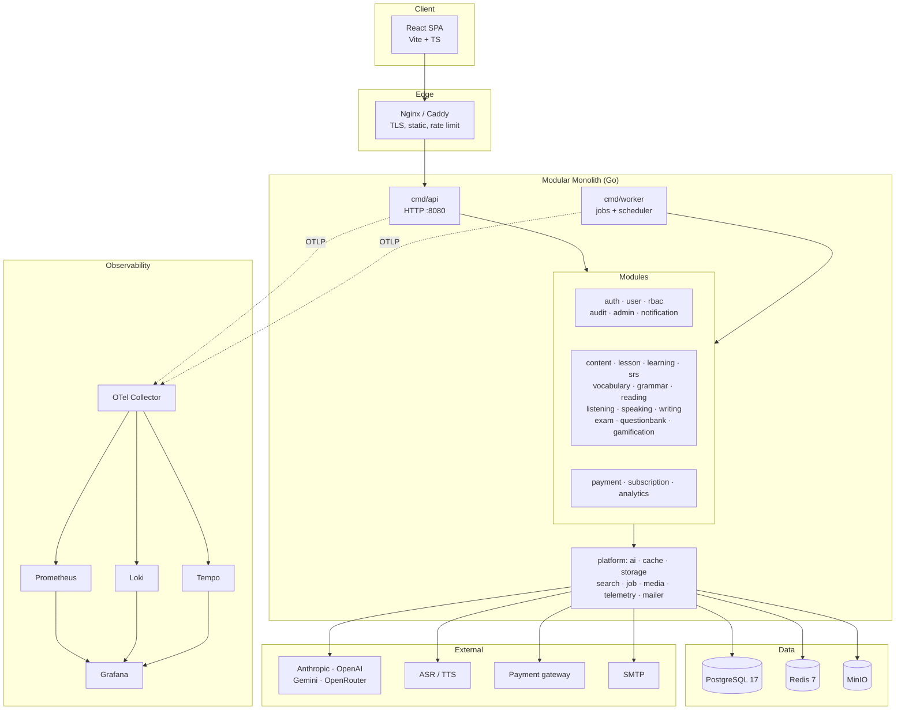

# Fluentra

> **AI-first English Learning Platform.** A Go modular monolith + React SPA that teaches
> vocabulary, grammar, reading, listening, speaking and writing through adaptive lessons,
> spaced repetition, and AI-graded practice.

[](docs/development/phase-1-plan.md)
[](go.mod)
[](web/package.json)
[](DEPENDENCIES.md)

---

## 🤖 If you are an AI assistant

**Read [`AGENT.md`](AGENT.md) first, then [`MODULE_INDEX.md`](MODULE_INDEX.md).**
Do not scan the repository. Everything you need is indexed.

## 👤 If you are a human

Start with [`docs/development/getting-started.md`](docs/development/getting-started.md).

---

## What this repository currently contains

This repository is at the **architecture & blueprint stage**. It contains:

- ✅ The complete Software Architecture Document (`docs/architecture/`)
- ✅ 30 module specifications with AI-agent documentation (`internal/*/*/`)
- ✅ Architecture Decision Records (`docs/adr/`)
- ✅ The AI knowledge base and prompt library (`docs/ai/`, `docs/prompts/`)
- ✅ Repository conventions and guidelines (root `*_GUIDELINE.md`)
- ✅ Development roadmap (`ROADMAP.md`)
- ⬜ Implementation code — **not yet written, by design**

## Table of contents

| Document | What it answers |
|---|---|
| [AGENT.md](AGENT.md) | How AI assistants should work in this repo |
| [ARCHITECTURE.md](ARCHITECTURE.md) | How the system is built and why |
| [PROJECT_STRUCTURE.md](PROJECT_STRUCTURE.md) | What every folder is for |
| [MODULE_INDEX.md](MODULE_INDEX.md) | All 30 modules, owners, status, dependencies |
| [ROADMAP.md](ROADMAP.md) | What gets built, in what order |
| [DEPENDENCIES.md](DEPENDENCIES.md) | Every library, why it was chosen, alternatives |
| [DECISIONS.md](DECISIONS.md) | Index of all ADRs |
| [CONTRIBUTING.md](CONTRIBUTING.md) | How to contribute (human or agent) |
| [GLOSSARY.md](GLOSSARY.md) | Domain vocabulary — read before naming anything |
| [FAQ.md](FAQ.md) | Frequently asked architecture questions |

### Guidelines

[CODING_STANDARD.md](CODING_STANDARD.md) ·
[API_GUIDELINE.md](API_GUIDELINE.md) ·
[DATABASE_GUIDELINE.md](DATABASE_GUIDELINE.md) ·
[ERROR_HANDLING.md](ERROR_HANDLING.md) ·
[LOGGING_GUIDELINE.md](LOGGING_GUIDELINE.md) ·
[TESTING_GUIDELINE.md](TESTING_GUIDELINE.md) ·
[SECURITY_GUIDELINE.md](SECURITY_GUIDELINE.md) ·
[OBSERVABILITY_GUIDELINE.md](OBSERVABILITY_GUIDELINE.md)

### Operations

[DEPLOYMENT_GUIDE.md](DEPLOYMENT_GUIDE.md) ·
[DOCKER_GUIDE.md](DOCKER_GUIDE.md) ·
[GITHUB_ACTIONS.md](GITHUB_ACTIONS.md) ·
[RELEASE_GUIDE.md](RELEASE_GUIDE.md) ·
[CHANGELOG.md](CHANGELOG.md)

### AI

[AI_GUIDE.md](AI_GUIDE.md) ·
[AI_CONTEXT.md](AI_CONTEXT.md) ·
[PROMPTS.md](PROMPTS.md) ·
[PROMPT_LIBRARY.md](PROMPT_LIBRARY.md)

---

## Architecture at a glance



## Quick start (once implementation begins)

```bash
make dev
```

Then open:

| Service | URL |
|---|---|
| Web app | <http://localhost:5173> |
| API | <http://localhost:8080> |
| API docs (Scalar) | <http://localhost:8080/docs> |
| Grafana | <http://localhost:3000> |
| MinIO console | <http://localhost:9001> |
| Mailpit | <http://localhost:8025> |

## License

Proprietary. All rights reserved.
