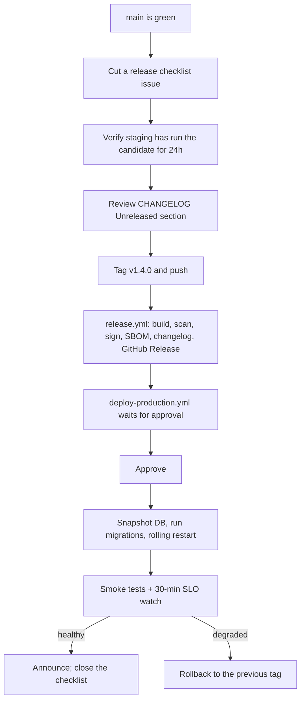

# RELEASE_GUIDE.md

---

## 1. Versioning

Semantic Versioning `MAJOR.MINOR.PATCH`, applied to the **product as a whole** (one version
for API + web + workers — they deploy together).

| Bump | When |
|---|---|
| `MAJOR` | Breaking API change, or a migration that cannot roll back |
| `MINOR` | New feature, new endpoint, new module, backward compatible |
| `PATCH` | Bug fix, performance, docs, dependency bump |

Pre-releases: `v1.4.0-rc.1`. The **API** version (`/api/v1`) is independent and changes far more
slowly — a `MAJOR` product bump does not automatically bump the API path.

## 2. Conventional Commits

```
<type>(<scope>): <subject>

[body: why, not what]

[BREAKING CHANGE: description]
Refs: #123
```

| Type | Bump | Appears in changelog |
|---|---|---|
| `feat` | MINOR | ✅ Added |
| `fix` | PATCH | ✅ Fixed |
| `perf` | PATCH | ✅ Changed |
| `refactor` | PATCH | — |
| `docs` | PATCH | — |
| `test`, `chore`, `ci`, `build`, `style` | PATCH | — |
| any with `BREAKING CHANGE:` | MAJOR | ✅ Breaking |

Scope is the module name (`auth`, `srs`, `platform/ai`, `web`). CI rejects a commit that does
not parse.

## 3. Branching

`main` is always releasable. Short-lived feature branches, squash-merged. No `develop` branch;
no long-running release branches. A hotfix branches from the release tag, is fixed, tagged, and
cherry-picked back to `main`.

## 4. Release process



## 5. Pre-release checklist

- [ ] `main` CI fully green, including nightly E2E and eval suites
- [ ] Candidate has run on staging for ≥ 24 h with production-like data
- [ ] `CHANGELOG.md` `Unreleased` section reviewed and accurate
- [ ] All migrations in this release are backward compatible with the previous release
- [ ] Any destructive step is scheduled for a later release (expand → migrate → contract)
- [ ] New config keys documented in `.env.example` and `docs/deployment/configuration.md`, and set on the target host
- [ ] New feature flags default to **off** in production
- [ ] New alerts and dashboards deployed
- [ ] Runbooks exist for anything new that can page
- [ ] Module `AGENT.md` files updated; `docs.yml` green
- [ ] Security scans clean of high/critical
- [ ] Rollback path confirmed (and, if a migration is not reversible, the plan is written down)

## 6. Migration safety by release

| Change | Release N | Release N+1 | Release N+2 |
|---|---|---|---|
| Add a column | add nullable, backfill lazily | make it `NOT NULL` when fully populated | — |
| Rename a column | add new, write both, read old | read new, still write both | drop old |
| Drop a column | stop writing it | — | drop it |
| Change a type | add a new column, dual-write | migrate reads | drop old |
| Add an index | `CREATE INDEX CONCURRENTLY` | — | — |
| Add a NOT NULL constraint | add as `NOT VALID`, backfill | `VALIDATE CONSTRAINT` | — |

A release containing a destructive step and the code that depends on it in the same tag cannot
be rolled back. That combination requires explicit sign-off and a tested restore plan.

## 7. Feature flags

| Rule | Detail |
|---|---|
| Default | New flags default to `off` in production |
| Rollout | internal → 5 % → 25 % → 100 %, with a metric watched at each step |
| Kill switch | Every AI feature and every external-provider integration has one |
| Lifetime | A flag that has been at 100 % for 30 days is removed; a lingering flag is tech debt |
| Ownership | Each flag has an owner and an expiry date in the flag table |

## 8. Changelog

`CHANGELOG.md` follows Keep a Changelog. It is generated by `git-cliff` from Conventional
Commits and then **edited by a human** before release — generated text describes commits;
release notes should describe user-visible change.

Sections: Added · Changed · Deprecated · Removed · Fixed · Security · Breaking · Migration notes.

## 9. Hotfix

1. Branch from the production tag: `hotfix/v1.4.1-fix-refresh-loop`
2. Minimal fix + a regression test
3. Full CI, plus a targeted manual verification
4. Tag `v1.4.1`, deploy with the normal approval (expedited, not skipped)
5. Cherry-pick to `main` the same day
6. Postmortem if it was a user-visible incident

## 10. Post-release

- [ ] Grafana annotation added at the deploy time
- [ ] 30-minute SLO watch clean
- [ ] Error budget consumption recorded
- [ ] Release notes shared with the team
- [ ] Feature-flag rollout schedule started
- [ ] The release checklist issue closed with actual timings (they feed the DORA metrics)

## 11. Deprecating an API operation

1. Mark `deprecated: true` in `openapi.yaml` with a `Sunset` date at least 6 months out.
2. Emit `Deprecation` and `Sunset` headers; meter usage per client.
3. Announce in `CHANGELOG.md` and the release notes.
4. Provide the replacement and a migration note in `docs/api/`.
5. Remove only after the sunset date **and** 30 consecutive days of zero usage.
