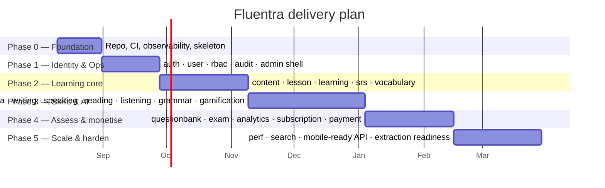

# ROADMAP.md

Assumed team: **2–4 engineers + 1 content designer**, heavily AI-assisted.
Durations are calendar weeks with that team. Every phase ends with something **deployable and
demonstrable** — no phase exists only to build plumbing.

---

## Phase 0 — Foundation (3 weeks)

**Goal:** a running skeleton with one real endpoint, full observability, and green CI.
Nothing after this phase is allowed to be "we'll add tracing later".

| # | Deliverable | Done when |
|---|---|---|
| 0.1 | Repo scaffolding per `PROJECT_STRUCTURE.md` | `make check` green on an empty project |
| 0.2 | `docker compose up` brings up Postgres, Redis, MinIO, Collector, Prometheus, Loki, Tempo, Grafana | All healthchecks pass; Grafana shows the API dashboard |
| 0.3 | `cmd/api` with `/health`, `/ready`, `/api/v1/ping` | `/ping` produces a trace visible in Tempo, a log line in Loki with the same `trace_id`, and a metric in Prometheus |
| 0.4 | `shared/` primitives: apperr, config, id, clock, pagination, httpx, dbx | Unit tested ≥ 90 % |
| 0.5 | Migration + sqlc + oapi-codegen pipelines | `make gen` reproducible; CI fails if generated code is stale |
| 0.6 | `go-arch-lint` config with all 30 modules declared | A deliberate boundary violation fails CI |
| 0.7 | GitHub Actions: backend CI, frontend CI, security, docs | All green on `main` |
| 0.8 | Web app shell: Vite, router, query client, design system, auth-less landing | Lighthouse ≥ 90 on the shell |
| 0.9 | `cmd/worker` with one demo job + River UI | Job runs, is traced, retries on failure |
| 0.10 | Docs generator + drift check | `make docs` regenerates; `make docs-check` green |

**Exit criteria:** a new engineer (or agent) clones, runs `make dev`, and sees a traced request
end-to-end within 15 minutes.

**Risks:** over-investing in scaffolding. Timebox strictly — if 0.x is not done in its week, cut
scope, not quality gates.

---

## Phase 1 — Identity & operations (4 weeks)

**Goal:** real users can sign up and sign in; admins can operate.

| # | Deliverable | Modules |
|---|---|---|
| 1.1 | Registration, email verification, login, logout | auth, mailer |
| 1.2 | Access JWT + rotating refresh with reuse detection; session list & revoke | auth, cache |
| 1.3 | Password reset, change password, breached-password check | auth |
| 1.4 | Profile, preferences, locale, timezone, avatar upload | user, storage |
| 1.5 | Roles and permissions seeded; deny-by-default guards on every route | rbac |
| 1.6 | Audit log for every state change; security events | audit |
| 1.7 | Admin shell: user list, search, suspend, impersonate (audited), feature flags | admin |
| 1.8 | Rate limiting and brute-force lockout | cache |
| 1.9 | Account deletion + data export (async job) | user, job, storage |
| 1.10 | E2E: signup → verify → login → refresh → logout; admin suspends a user | web/e2e |

**Exit criteria:** OWASP ASVS L1 checklist passes; auth module coverage ≥ 85 %; all
authentication flows traced and alarmed.

---

## Phase 2 — Learning core (6 weeks)

**Goal:** a user can actually learn something and come back tomorrow to review it.

| # | Deliverable | Modules |
|---|---|---|
| 2.1 | Content model: items, versions, taxonomy, CEFR levelling, media links | content |
| 2.2 | Authoring workflow draft → review → approved → published → archived | content, admin |
| 2.3 | Course → unit → lesson → activity structure, prerequisites, unlocking | lesson |
| 2.4 | Enrolment, progress tracking, learning sessions | learning |
| 2.5 | **Exercise engine**: `ExerciseGrader` interface, attempt lifecycle, scoring | learning |
| 2.6 | FSRS scheduler, review cards, due queue, review logs | srs |
| 2.7 | Vocabulary: words, senses, decks, first grader implementation | vocabulary |
| 2.8 | Learner web app: dashboard, lesson player, review session, progress | web |
| 2.9 | Content seed: 1 course, 8 lessons, 200 words at A2–B1 | content team |
| 2.10 | E2E: complete a lesson → cards scheduled → review tomorrow → streak | web/e2e |

**Exit criteria:** an internal alpha with 20 real learners running for two weeks; D1 retention
measurable; no manual DB edits needed to operate content.

**This is the phase most likely to slip.** The shared `content` + exercise engine (ADR-0015) is
the highest-leverage work in the project — if it is done well, phase 3 is six thin modules; if it
is done badly, phase 3 is six copies of phase 2.

---

## Phase 3 — Skills & AI (8 weeks)

**Goal:** the product's differentiator — AI-graded productive skills.

| # | Deliverable | Modules |
|---|---|---|
| 3.1 | AI platform: registry, prompt registry, routing, cache, budget, usage, mock provider | platform/ai |
| 3.2 | Eval harness + golden sets for every task; CI gate on regression | docs/ai/evals |
| 3.3 | Media platform: presigned upload, ffmpeg transcode, waveform, TTS | platform/media |
| 3.4 | Writing: tasks, drafts, submission, async AI rubric grading, SSE streaming feedback | writing |
| 3.5 | Speaking: recording, ASR, pronunciation scoring, phoneme feedback | speaking, media |
| 3.6 | Reading: passages, comprehension sets, WPM, span answers | reading |
| 3.7 | Listening: audio items, play-limit policy, dictation, transcript reveal | listening |
| 3.8 | Grammar: points, rules, error tagging, AI explanations | grammar |
| 3.9 | Gamification: XP, streaks, badges, weekly leaderboard | gamification |
| 3.10 | Cost dashboard + per-user quota + global budget alarms | platform/ai |
| 3.11 | E2E: submit essay → streamed feedback → XP; record speech → score |  web/e2e |

**Exit criteria:** AI cost per active learner per month measured and under target; grading
p95 < 25 s; eval scores stable across a prompt version bump; prompt-injection red-team suite
passes.

**Gate before starting:** ADR-0011 and ADR-0012 accepted; speech provider chosen (open
question Q2 in the plan review).

---

## Phase 4 — Assessment & monetisation (6 weeks)

| # | Deliverable | Modules |
|---|---|---|
| 4.1 | Question bank: item types, tagging, difficulty, review workflow, AI-assisted generation | questionbank |
| 4.2 | Mock exams: sections, timing, auto-submit, anti-cheat signals, score reports | exam |
| 4.3 | Placement test on signup → personalised path | learning, exam |
| 4.4 | Analytics: event ingest, daily rollups, funnels, cohorts, admin KPI dashboards | analytics |
| 4.5 | Plans, entitlements, trials, feature gating | subscription |
| 4.6 | Checkout, gateway adapter, webhooks, invoices, refunds, reconciliation runbook | payment |
| 4.7 | Notification system: in-app, email digests, push, quiet hours, preferences | notification |
| 4.8 | Weekly progress report email | analytics, mailer |
| 4.9 | E2E: subscribe → premium unlocks; take a mock exam → score report |  web/e2e |

**Exit criteria:** a payment can be taken, refunded, and reconciled; entitlement changes are
effective within 60 s; PCI scope confirmed to be limited to the gateway's hosted fields.

---

## Phase 5 — Scale & harden (6 weeks)

| # | Deliverable |
|---|---|
| 5.1 | Load test to 3× projected peak; fix the top 5 bottlenecks |
| 5.2 | Table partitioning verified in production-sized data; query budget enforced in CI |
| 5.3 | Postgres read replica + read/write split behind the repository interface |
| 5.4 | Search module: FTS across dictionary, lessons, question bank |
| 5.5 | Backup/restore drill executed and timed; DR runbook validated |
| 5.6 | API hardening for a future mobile client: strict versioning, deprecation policy |
| 5.7 | Extraction readiness review for `platform/media` and `platform/ai` (no extraction yet) |
| 5.8 | Accessibility audit (WCAG 2.2 AA) and remediation |
| 5.9 | Security review: external pentest, ASVS L2 sign-off |
| 5.10 | Cost review: infrastructure + AI unit economics per learner |

---

## Cross-phase continuous work

| Stream | Cadence |
|---|---|
| Content production | Every phase from 2 onward — **the real bottleneck**; staff it early |
| Dependency updates | Weekly (Renovate) |
| ADR review | When a decision is needed; never retro-fitted |
| Docs verification | `last_verified` refreshed with each module change; CI flags > 90 days |
| Eval suite expansion | Every new AI task ships with its golden set |
| Runbook drills | One per month (restore, rollback, provider outage) |

---

## Explicit non-goals for year 1

Native mobile apps · live tutoring / video calls · social feed or user-generated content ·
marketplace · B2B/school accounts (this would introduce multi-tenancy — a separate product
decision) · offline-first mobile sync · white-labelling.

---

## Milestone definition of done

A phase is complete only when **all** hold:

- [ ] Every deliverable is deployed to staging and demonstrated
- [ ] Coverage gates met; E2E journeys for the phase pass
- [ ] Every new module's `AGENT.md` reflects reality (`last_verified` current)
- [ ] Dashboards and alerts exist for the phase's new failure modes
- [ ] Runbook entries written for anything that can page someone
- [ ] `CHANGELOG.md` updated; a release tag cut
- [ ] Retro held; `docs/adr/` updated with anything learned that changes a decision
