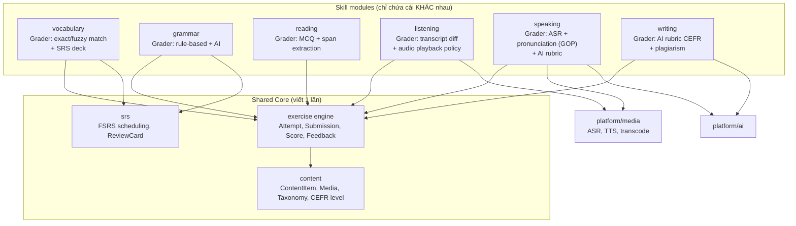

# Đánh giá & Tối ưu Plan gốc (Plan Review)

> Tài liệu này ghi lại việc **review bản yêu cầu kiến trúc ban đầu**, các điểm rủi ro, và các
> quyết định tối ưu đã áp dụng vào repository này. Viết bằng tiếng Việt cho stakeholder;
> toàn bộ tài liệu kỹ thuật còn lại viết bằng tiếng Anh để AI agent và dev quốc tế đọc được.

| | |
|---|---|
| Trạng thái | Accepted |
| Ngày | 2026-08-06 |
| Người review | Principal Architect |
| Áp dụng cho | Fluentra v0.1 → v1.0 |

---

## 1. Tóm tắt đánh giá

Plan gốc **rất tốt về độ bao phủ** (stack, observability, AI context engineering, module docs) nhưng
có **7 rủi ro nghiêm trọng** khiến dự án dễ chết ở tháng thứ 3:

| # | Rủi ro | Mức độ | Xử lý |
|---|---|---|---|
| R1 | 24 module ngang hàng ngay từ ngày 1 → over-engineering, không ai build nổi | 🔴 Cao | Chia tier + phased delivery (§3) |
| R2 | 6 module kỹ năng (vocab/grammar/reading/listening/speaking/writing) trùng lặp ~70% CRUD | 🔴 Cao | Tách `content` + `exercise engine` dùng chung (§4) |
| R3 | Tài liệu bị "chết" — 270 file Markdown viết tay sẽ lệch code sau 2 sprint | 🔴 Cao | Docs-as-code + generator + CI drift check (§5) |
| R4 | Jaeger **và** Tempo cùng lúc → 2 backend trace, tốn RAM, không ai dùng | 🟡 TB | Chỉ Tempo (Jaeger là dev fallback) (§6) |
| R5 | "Codex" bị coi là AI provider riêng — thực chất là model của OpenAI | 🟡 TB | Gộp vào OpenAI provider (§7) |
| R6 | Thiếu các module **bắt buộc** cho English learning: SRS, media pipeline (TTS/ASR), job queue, outbox | 🔴 Cao | Bổ sung (§8) |
| R7 | "Future microservices" dễ bị dùng làm cớ để over-abstract từ đầu | 🟡 TB | Fitness function + rule, không abstraction sớm (§9) |

**Kết luận:** plan được **giữ nguyên 100% phạm vi tài liệu yêu cầu**, nhưng **tổ chức lại**
theo tier và thêm 8 module thiếu. Không cắt bớt yêu cầu nào của bạn.

---

## 2. Những điểm plan gốc làm ĐÚNG (giữ nguyên)

- ✅ **Modular Monolith** — đúng lựa chọn cho team nhỏ, 2 role, domain chưa ổn định.
- ✅ **AGENT.md per module** — đây là điểm mạnh nhất của plan. Giảm context AI agent cần đọc từ
  ~200k token (scan cả repo) xuống ~4k token (1 file AGENT.md).
- ✅ **Provider abstraction cho AI** — bắt buộc, tránh vendor lock-in.
- ✅ **OpenTelemetry ngay từ đầu** — retrofit observability luôn đắt gấp 5 lần.
- ✅ **Prompt library có version** — prompt là *source code*, phải review + version.
- ✅ **Chỉ 2 role, không multi-tenant** — tránh được cái bẫy đắt nhất của EdTech startup.

---

## 3. Tối ưu R1 — Phân tier module thay vì flat 24 module

Plan gốc liệt kê 24 module ngang hàng. Thực tế chúng **không cùng loại**:

```
internal/
├── modules/    ← Bounded context nghiệp vụ (có DB schema riêng, có business rule)
└── platform/   ← Năng lực kỹ thuật dùng chung (không có nghiệp vụ, chỉ có contract)
```

| Tier | Module | Lý do |
|---|---|---|
| **Platform** (8) | `ai`, `storage`, `cache`, `search`, `job`, `media`, `telemetry`, `mailer` | Không có business rule. Là *infrastructure capability*. Nếu để chung `modules/` thì AI agent sẽ nhầm chúng là domain và sinh code sai tầng. |
| **Core Domain** (6) | `auth`, `user`, `rbac`, `audit`, `admin`, `notification` | Nền tảng, mọi module khác phụ thuộc. Phải xong Phase 1. |
| **Learning Domain** (13) | `content`, `vocabulary`, `grammar`, `reading`, `listening`, `speaking`, `writing`, `lesson`, `learning`, `srs`, `exam`, `questionbank`, `gamification` | Giá trị cốt lõi sản phẩm. |
| **Commerce** (3) | `payment`, `subscription`, `analytics` | Hoãn tới Phase 4. Boundary đã định nghĩa sẵn nhưng chưa implement. |

→ Xem [MODULE_INDEX.md](../../MODULE_INDEX.md) cho danh sách đầy đủ 30 module.

**Thay đổi quan trọng:** phase hoá theo [ROADMAP.md](../../ROADMAP.md). Phase 1 chỉ **9 module**.
Các module khác vẫn có đầy đủ tài liệu (`AGENT.md`, `API.md`...) với trạng thái `PLANNED`,
để AI agent biết ranh giới trước khi code chạm vào.

---

## 4. Tối ưu R2 — Tách `content` + `exercise engine` khỏi 6 module kỹ năng

**Vấn đề:** Nếu `vocabulary`, `grammar`, `reading`, `listening`, `speaking`, `writing` mỗi module
tự có bảng `*_items`, `*_attempts`, `*_progress` → 18 bảng gần giống nhau, 6 lần copy-paste
CRUD, và không thể làm bài học trộn nhiều kỹ năng.

**Giải pháp — Hexagonal + Strategy:**



Mỗi skill module chỉ implement interface `ExerciseGrader` + `ItemRenderer`.
**Tiết kiệm ước tính: ~40% code backend và ~55% số bảng DB.**

Điểm khác biệt thực sự giữa các kỹ năng (giữ riêng module):

| Skill | Điểm khác biệt thật sự |
|---|---|
| vocabulary | SRS deck, word family, collocation, ngữ cảnh dùng từ |
| grammar | Rule taxonomy, error tagging, gap-fill generator |
| reading | Passage + question set, đo WPM, span answer |
| listening | Audio segment, số lần nghe tối đa, transcript reveal policy |
| speaking | ASR + chấm phát âm (phoneme-level), realtime streaming |
| writing | Chấm rubric CEFR bằng AI, đạo văn, lịch sử bản nháp |

---

## 5. Tối ưu R3 — Docs không được phép "chết"

270 file Markdown viết tay **sẽ lệch code**. Cơ chế chống trôi:

| Cơ chế | Mô tả | Enforce ở đâu |
|---|---|---|
| Front-matter bắt buộc | Mọi `AGENT.md` có YAML header: `module`, `status`, `owner`, `last_verified`, `spec_version` | CI job `docs-lint` |
| Generator | `cmd/docgen` sinh khung 9 file từ `docs/modules/manifest.yaml` | `make docs` |
| Drift check | CI so `AGENT.md § Database Schema` với migration thật; so `API.md` với `api/openapi/openapi.yaml` | CI job `docs-drift` |
| Stale badge | `last_verified` > 90 ngày → CI cảnh báo | CI job `docs-lint` |
| Single source of truth | API spec = OpenAPI YAML (không phải Markdown). Markdown chỉ *link* tới nó. | Convention |

→ Chi tiết: [docs/development/docs-as-code.md](../development/docs-as-code.md)

**Bỏ file trùng:** plan gốc yêu cầu cả `AGENT.md` **và** `README_AI.md` trong mỗi module.
Hai file này trùng mục đích 100% và chắc chắn sẽ lệch nhau. Giải pháp: giữ `README_AI.md`
nhưng chỉ là **con trỏ 5 dòng** trỏ về `AGENT.md` (giữ tương thích yêu cầu, loại bỏ trùng lặp).
Tương tự `docs/decisions/` và `docs/adr/` — gộp về `docs/adr/`, `docs/decisions/` là index.

---

## 6. Tối ưu R4 — Observability stack: bỏ Jaeger khỏi production

| Thành phần | Quyết định | Lý do |
|---|---|---|
| OTel Collector | ✅ Bắt buộc | Một điểm thu duy nhất, app chỉ nói OTLP |
| Tempo | ✅ Trace backend | Cùng hệ Grafana, dùng chung object storage (MinIO), rẻ |
| Jaeger | ⚠️ Chỉ profile `dev` | Trùng Tempo. Giữ vì UI debug local tiện, **không chạy production** |
| Prometheus | ✅ Metrics | Chuẩn de-facto |
| Loki | ✅ Logs | Rẻ, join được với trace qua `trace_id` |
| Grafana | ✅ UI duy nhất | Metrics + logs + traces một chỗ |

→ Tiết kiệm ~700MB RAM trên máy dev và loại bỏ 1 backend phải vận hành.

---

## 7. Tối ưu R5 — Danh sách AI provider

Plan liệt kê: OpenAI, Claude, Gemini, OpenRouter, **Codex**, future.
**Codex không phải provider** — đó là dòng model code của OpenAI (và là tên CLI agent).
Danh sách chuẩn hoá:

| Provider | Vai trò | Trạng thái |
|---|---|---|
| `anthropic` | Chấm writing/speaking, giải thích ngữ pháp (chất lượng cao nhất cho tiếng Anh) | Primary |
| `openai` | Fallback, embeddings, TTS, Whisper ASR | Primary #2 |
| `gemini` | Rẻ cho tác vụ khối lượng lớn, context dài | Secondary |
| `openrouter` | Meta-router, thử model mới không cần đổi code | Optional |
| `local` | Ollama/vLLM, dùng cho eval offline & CI (không gọi mạng) | Dev/CI |
| `mock` | Deterministic, dùng trong unit/integration test | Test |

Provider `mock` + `local` là bổ sung quan trọng plan gốc thiếu: **không thể test CI ổn định nếu
mỗi lần chạy đều gọi API thật**.

---

## 8. Tối ưu R6 — 8 module bắt buộc mà plan gốc thiếu

| Module thiếu | Vì sao bắt buộc | Không có thì hậu quả |
|---|---|---|
| `srs` | Học từ vựng **là** bài toán spaced repetition. Đây là lõi giá trị. | Sản phẩm chỉ là flashcard app tầm thường |
| `platform/media` | TTS sinh audio, ASR chấm speaking, transcode, waveform | Listening/Speaking không thể build |
| `platform/job` | Chấm AI mất 5–30s → phải async. Cron nhắc ôn tập, gửi email. | Request timeout, không có streak reminder |
| `shared/outbox` | Gửi notification/webhook đúng-một-lần khi DB commit | Mất event, gửi trùng, dữ liệu lệch |
| `platform/search` | Tra từ điển, tìm bài học, tìm câu hỏi | UX tra cứu tệ |
| `gamification` | Streak/XP/badge — yếu tố giữ chân số 1 của EdTech | Retention D7 thấp |
| `content` | Model nội dung chung + workflow duyệt bài (draft→review→published) | 6 module skill copy-paste lẫn nhau |
| `shared/idempotency` | Payment + submit bài thi cần idempotency key | Trừ tiền 2 lần, nộp bài trùng |

---

## 9. Tối ưu R7 — "Future microservices" phải là *fitness function*, không phải abstraction

**Sai lầm phổ biến:** vì "sau này tách microservice" nên ngay từ đầu bọc mọi thứ trong
message bus, gRPC internal, DTO 3 lớp → phức tạp gấp 3, tách vẫn không dễ hơn.

**Cách làm đúng ở đây — 5 luật bất di bất dịch**, kiểm tra tự động trong CI:

| # | Luật | Công cụ enforce |
|---|---|---|
| L1 | Module **không** import package nội bộ của module khác. Chỉ import `modules/x/contract`. | `go-arch-lint` trong CI |
| L2 | Module **không** JOIN sang bảng của module khác. Mỗi bảng có prefix owner. | `sqlc` + review + linter migration |
| L3 | Giao tiếp đồng bộ qua interface trong `contract/`; bất đồng bộ qua `shared/eventbus` (in-process hôm nay, NATS/Kafka ngày mai — cùng interface). | Code review + ADR-0009 |
| L4 | Không có transaction trải qua 2 module. Dùng outbox + eventual consistency. | Review + test |
| L5 | Mỗi module tự sở hữu migration của mình trong `db/migrations/<module>/`. | CI kiểm tra path |

Khi cần tách 1 module thành service: đổi implementation của `contract` interface từ in-process
call sang HTTP/gRPC client. **Business code không đổi một dòng.**

→ Chi tiết: [docs/architecture/microservice-migration.md](microservice-migration.md)

---

## 10. Các bổ sung khác đã đưa vào

| Bổ sung | Lý do |
|---|---|
| RFC 9457 Problem Details | Chuẩn hoá error response, AI agent sinh handler đúng ngay lần đầu |
| OpenAPI 3.1 spec-first + `oapi-codegen` | Spec là contract duy nhất giữa BE/FE/AI |
| `sqlc` thay vì ORM | Type-safe, SQL thật, AI đọc query dễ hơn ORM DSL |
| FSRS thay SM-2 | Thuật toán SRS state-of-the-art 2024+, giảm 20–30% số lần ôn |
| Testcontainers | Integration test chạy Postgres/Redis/MinIO thật, không mock |
| `mock` AI provider + golden files | CI deterministic, không tốn tiền API |
| AI eval harness (`docs/ai/evals/`) | Prompt đổi → phải đo lại chất lượng chấm bài, không đoán |
| Cost budget & rate limit theo user | AI chấm writing dễ cháy ngân sách nếu bị abuse |
| `.claude/`, `AGENTS.md`, `GEMINI.md` | Mỗi AI CLI đọc file khác nhau — tất cả trỏ về `AGENT.md` |

---

## 11. Ma trận quyết định — vì sao Modular Monolith

| Tiêu chí | Trọng số | Monolith thuần | **Modular Monolith** | Microservices |
|---|---|---|---|---|
| Tốc độ ra tính năng | 25% | 5 | **5** | 2 |
| Chi phí vận hành | 20% | 5 | **5** | 2 |
| Độ rõ ranh giới | 15% | 1 | **4** | 5 |
| Khả năng scale từng phần | 10% | 2 | **3** | 5 |
| Dễ debug / trace | 10% | 5 | **4** | 2 |
| Phù hợp team nhỏ (2–6 dev) | 10% | 4 | **5** | 1 |
| Thân thiện AI agent | 10% | 2 | **5** | 3 |
| **Tổng có trọng số** | | 3.85 | **4.55** | 2.60 |

*Thang 1–5, cao hơn = tốt hơn.*

"Thân thiện AI agent" cao vì: ranh giới module rõ → AI chỉ cần đọc 1 `AGENT.md` (~4k token)
thay vì scan repo (~200k token) → ít ảo giác, ít sửa nhầm file, PR nhỏ và review được.

---

## 12. Việc bạn cần quyết (chưa chốt)

| # | Câu hỏi | Gợi ý mặc định |
|---|---|---|
| Q1 | Cổng thanh toán: Stripe (quốc tế) hay VNPay/MoMo/ZaloPay (VN)? | VNPay + MoMo nếu thị trường VN |
| Q2 | ASR cho Speaking: OpenAI Whisper API, Azure Speech (có chấm phát âm sẵn), hay self-host? | Azure Speech — có Pronunciation Assessment API |
| Q3 | Có cần mobile app không? Nếu có thì API phải versioned chặt hơn từ đầu | Web-first, API `/v1` chặt ngay |
| Q4 | Nội dung học: tự biên soạn, mua bản quyền, hay AI sinh? | Hybrid: seed thủ công + AI hỗ trợ soạn, admin duyệt |
| Q5 | Quy mô mục tiêu năm 1 (DAU)? | Giả định 10k DAU — 1 instance API là đủ |

Các câu này **không chặn** việc bắt đầu Phase 1.
