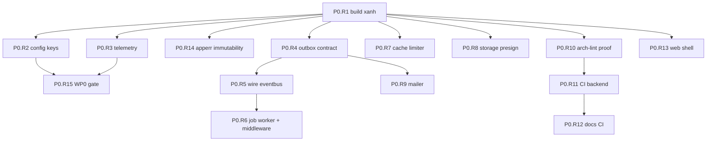

# Phase 0 — Remediation Plan (P0.R)

> **Bối cảnh:** WP0 đã được implement nhưng chưa đạt Definition of Done. `go build ./...` fail,
> một unit test đỏ, và 5 acceptance criteria cốt lõi của WP0 không thể pass với code hiện tại.
> Plan này là danh sách task để đưa WP0 về đúng trạng thái mà `docs/development/phase-1-plan.md`
> §1.5 mô tả — **trước khi** bất kỳ task P1 nào bắt đầu.
>
> **Gate của toàn bộ plan này (P0.R15):** một request `/api/v1/ping` tạo ra trace trong Tempo,
> log line trong Loki cùng `trace_id`, và data point trong Prometheus. Đúng gate WP0 gốc.

---

## 0. Luật chơi cho agent thực hiện

Đọc trước khi làm bất kỳ card nào:

| # | Luật |
|---|---|
| **R-A** | Một card = một PR. Không gộp. Không làm task chưa tới lượt. |
| **R-B** | **Không được sửa test cho pass bằng cách nới assertion.** Nếu test đỏ, sửa code. |
| **R-C** | Không đổi signature công khai của package khác card đang làm, trừ khi card nói rõ. |
| **R-D** | Mỗi card phải kết thúc bằng `make check` xanh. Nếu `make check` không chạy được vì task khác chưa xong, ghi rõ trong PR body lệnh nào đã chạy và output. |
| **R-E** | Tuân thủ L1–L12 trong `/AGENT.md` §5. |
| **R-F** | Không thêm dependency mới nếu không thêm dòng vào `DEPENDENCIES.md` (L12). |
| **R-G** | Card nào chạm HTTP surface thì sửa `api/openapi/openapi.yaml` **trước**, show diff, rồi mới viết Go. |
| **R-H** | Nếu một card bị chặn bởi thứ không nằm trong scope của nó — **dừng và báo**, không tự mở rộng. |

Dùng canonical agent prompt ở `phase-1-plan.md` §1.3, thay `[TASK ID]` bằng ID trong plan này.

---

## 1. Thứ tự và track song song

| Track | Cards | Ghi chú |
|---|---|---|
| **Nền** | R1 → R2, R3, R14 | Phải xong trước. R1 chặn tất cả. |
| **A — Data plane** | R4 → R5 → R6, R9 | Nặng nhất |
| **B — Platform** | R7, R8 | Độc lập, chạy song song được |
| **C — Pipeline** | R10 → R11 → R12 | Độc lập |
| **D — Frontend** | R13 | Độc lập |
| **Gate** | R15 | Cuối cùng, sau R2 + R3 |

---

## 2. Cards

### P0.R1 — Đưa `go build ./...` về xanh `S`

| | |
|---|---|
| **Depends on** | — |
| **Branch** | `fix/build-and-module-graph` |
| **Context** | `go.mod`, `api/openapi/codegen-*.yaml`, `DEPENDENCIES.md` |
| **Files** | `go.mod`, `go.sum` |
| **Do** | `api/openapi/server.gen.go` và `client.gen.go` import `github.com/getkin/kin-openapi/openapi3` và `github.com/oapi-codegen/runtime` — hai package này không có trong `go.mod`. Thêm chúng. Sau đó chạy `go mod tidy` và sửa lại block `require`: hiện có ~10 dependency **được import trực tiếp** nhưng đang bị đánh dấu `// indirect` (chi, minio-go, go-redis, river, otelpgx, singleflight…). Cập nhật `DEPENDENCIES.md` cho mọi dep trực tiếp còn thiếu dòng. |
| **Acceptance** | `go build ./...` không output gì. `go mod tidy` chạy lần hai không tạo diff. Không còn dep trực tiếp nào mang comment `// indirect`. Mọi dep trực tiếp có một dòng trong `DEPENDENCIES.md`. |
| **Trap** | Đừng xoá `api/openapi/*.gen.go` để cho build qua. File generated là output của `make gen-api`; nếu nó không compile thì pipeline P0.7 sai, không phải file thừa. |

---

### P0.R2 — Sửa mapping config key, chặn regression `M`

| | |
|---|---|
| **Depends on** | P0.R1 |
| **Branch** | `fix/config-env-key-mapping` |
| **Context** | `internal/shared/config/config.go`, `.env.example`, `docs/deployment/configuration.md` |
| **Files** | `internal/shared/config/{config.go,config_test.go}`, `cmd/api/main.go`, `cmd/worker/main.go`, `.env.example` |
| **Do** | Bug: `envKey` đổi `_` → `.`, nên `S3_ACCESS_KEY` thành key `s3.access.key`, trong khi `cmd/api` khai `Required: s3.access_key` → **API không bao giờ boot được**. Sửa cả ba mặt: (1) thống nhất một quy ước duy nhất cho tên key và ghi nó vào doc comment của `config.Load`; (2) sửa `Required` list và struct tag của `cmd/api` + `cmd/worker` cho khớp — chú ý `cmd/worker` đang dùng `otel.exporter_otlp_endpoint`, không env var nào chạm tới được; (3) `REQUEST_TIMEOUT` trong `.env.example` map thành `request.timeout` nhưng code đọc `http.request.timeout` — sửa một trong hai. Thêm `EnvPrefix` mặc định (hoặc allowlist) để `env.Provider` **ngừng nạp toàn bộ environment của máy** vào cây config. Thay `mustDuration` (đang nuốt lỗi trả `0`) bằng parse fail-fast lúc load config. |
| **Acceptance** | Một test bảng đọc `.env.example`, set từng biến vào env, và khẳng định **mọi** key mà `cmd/api` và `cmd/worker` khai trong `Required` đều resolve được — test này fail trên code hiện tại. `PATH` và `TEMP` của máy không xuất hiện trong cây config (assert bằng test). Timeout không parse được làm `run()` trả error, không im lặng dùng 0. |
| **Trap** | Đây là loại bug chỉ lộ ra khi chạy binary thật. Test phải đi từ `.env.example` chứ không phải từ hằng số copy trong test — nếu không nó sẽ trôi khỏi doc lần nữa. |

---

### P0.R3 — Telemetry: propagator độc lập, log không mất `error` `S`

| | |
|---|---|
| **Depends on** | P0.R1 |
| **Branch** | `fix/telemetry-propagator-redaction` |
| **Context** | `/OBSERVABILITY_GUIDELINE.md`, `/LOGGING_GUIDELINE.md` §LG6 |
| **Files** | `internal/platform/telemetry/{middleware.go,redact.go,redact_test.go,middleware_test.go}` |
| **Do** | (1) `TestMiddleware_ExtractsTraceContext` đang **đỏ**: middleware phụ thuộc `otel.GetTextMapPropagator()` global, mà global chỉ được set trong `NewProvider`. Cho `Middleware` nhận propagator qua tham số hoặc mặc định về `propagation.TraceContext{}` khi global còn no-op. (2) `DefaultAllowedLogKeys` **không có `error`** → mọi `slog.Error(..., "error", err)` trong toàn repo render `error=[redacted]`, log vận hành thành vô dụng. Đối chiếu `LOGGING_GUIDELINE.md` §LG6 và bổ sung tập key an toàn còn thiếu (`error`, `event`, `topic`, `id`… — chỉ những gì doc cho phép). (3) `RedactingHandler.Handle` đặt tên biến `copy`, che builtin — đổi tên. |
| **Acceptance** | `go test ./internal/platform/telemetry/...` xanh **không sửa assertion nào của test cũ**. Test mới: gọi `Middleware` khi chưa từng gọi `NewProvider`, gửi header `traceparent` hợp lệ → span context trong handler là valid. Test mới: `slog.Error("x", "error", errors.New("boom"))` cho ra `boom` chứ không phải `[redacted]`. Test cũ về fail-closed (key lạ → `[redacted]`) vẫn xanh. |
| **Trap** | Chỉ mở allowlist đúng những key doc cho phép. Mở rộng "cho tiện" là đường quay lại rò PII — allowlist tồn tại vì lý do đó. |

---

### P0.R4 — Outbox: hợp đồng dùng được, retry, dead-letter, metric `L`

| | |
|---|---|
| **Depends on** | P0.R1 |
| **Branch** | `fix/outbox-contract-and-retry` |
| **Context** | `ADR-0009`, `ADR-0010`, `phase-1-plan.md` P0.10 |
| **Files** | `internal/shared/outbox/{writer.go,publisher.go,outbox_test.go}`, `db/migrations/job/`, `internal/platform/telemetry/instruments.go` |
| **Do** | Bốn lỗi độc lập: (1) `DBTx.Exec` khai `(commandTag any, err error)` — `pgx.Tx.Exec` trả `pgconn.CommandTag`, Go khớp method set theo signature chính xác nên **`pgx.Tx` không satisfy `DBTx`**; writer chỉ chạy được với fake. Sửa signature về `pgconn.CommandTag`. (2) `EventDispatcher.Dispatch` nhận `jsonbMessage` — kiểu **unexported** ⇒ package khác không thể implement interface. Export kiểu payload (hoặc dùng `json.RawMessage`). (3) Thêm cột `event_id uuid NOT NULL UNIQUE DEFAULT gen_random_uuid()` vào `ops.outbox_events` và **truyền `event_id` vào `Dispatch`** — không có nó thì consumer không thể idempotent, và P1.4 sẽ kẹt. (4) Cột `attempts` hiện không ai ghi: dispatch fail chỉ `continue`, không backoff, không dead-letter ⇒ event lỗi retry vô hạn mỗi 500 ms. Tăng `attempts`, backoff theo `attempts`, quá ngưỡng thì chuyển sang `ops.job_failures`. Thêm metric `outbox_lag_seconds` (hiện **không tồn tại**, dù P0.10 acceptance yêu cầu). |
| **Acceptance** | Một biến `var _ outbox.DBTx = (pgx.Tx)(nil)` compile được. Một type ở package **khác** implement được `EventDispatcher` (viết test ở package `outbox_test`). Integration test: transaction rollback ⇒ 0 outbox row. Dispatch fail 1 lần ⇒ `attempts=1`, event vẫn chưa published, lần poll sau không xảy ra ngay lập tức (assert backoff). Vượt ngưỡng ⇒ có row trong `ops.job_failures`, không còn được poll. `outbox_lag_seconds` xuất hiện trong metric export. Migration reversible. |
| **Trap** | Đừng dispatch bên ngoài transaction để "cho gọn". Ranh giới hiện tại (dispatch trong tx, mark published trong cùng tx) là at-least-once đúng; đổi nó thành at-most-once là mất event. |

---

### P0.R5 — Nối outbox → eventbus vào worker `M`

| | |
|---|---|
| **Depends on** | P0.R4 |
| **Branch** | `feat/wire-outbox-eventbus` |
| **Context** | `ADR-0009`, `phase-1-plan.md` P0.12 |
| **Files** | `internal/shared/eventbus/{bus.go,inprocess.go}`, `cmd/worker/main.go` |
| **Do** | `cmd/worker/main.go` đang gọi `outbox.NewPublisher(pool, nil, ...)` — **dispatcher nil ⇒ mọi event bị đánh dấu published mà không ai nhận**. Viết adapter từ `EventDispatcher` sang `eventbus.EventBus` (topic = `aggregate.event`), truyền `event_id` xuống handler để dedupe. `eventbus.Event.Ack` hiện được khai báo nhưng không dùng ở đâu — hoặc đưa ack vào interface cho đúng "shaped like a broker client" như P0.12 yêu cầu, hoặc xoá nó và ghi lý do vào `AGENT.md` của package. Xoá `redisClient` trong worker (tạo ra rồi không dùng). |
| **Acceptance** | Integration test: ghi 1 event qua `outbox.Writer` trong tx, commit → handler đăng ký trên bus nhận đúng payload và `event_id`, row có `published_at`. Handler trả error → row **không** được mark published và `attempts` tăng. Handler chậm không chặn handler khác (test bằng 2 handler, một sleep). Interface `EventBus` không có method nào đặc thù in-process. |
| **Trap** | Card này là chỗ chứng minh P0.10 + P0.12 thực sự chạy. Nếu test chỉ gọi bus trực tiếp mà không đi qua bảng outbox thì nó không chứng minh gì cả. |

---

### P0.R6 — River worker + job middleware `L`

| | |
|---|---|
| **Depends on** | P0.R5 |
| **Branch** | `feat/job-worker-middleware` |
| **Context** | `internal/platform/job/AGENT.md`, `ADR-0010` |
| **Files** | `internal/platform/job/{worker.go,middleware.go,cron.go}`, `cmd/worker/main.go`, `internal/platform/telemetry/instruments.go` |
| **Do** | P0.10 yêu cầu `platform/job/{client.go,worker.go,middleware.go,cron.go}` — **`worker.go` và `middleware.go` chưa tồn tại**, River worker chưa từng được start; `job.DefaultQueues()` mới chỉ được đem đi log. Tạo River worker với 5 queue và concurrency đọc từ config (không hardcode). Job middleware: span, structured log, **panic recovery**, timeout, metrics. Đăng ký callback cho `job_oldest_pending_seconds` — hiện nó được khai báo là `Int64ObservableGauge` nhưng **không có callback nên không bao giờ phát số**. Job fail vĩnh viễn → `ops.job_failures`. |
| **Acceptance** | Integration test: handler panic → được recover, ghi vào `job_failures`, **worker vẫn sống và xử lý job kế tiếp**. Job vượt timeout bị huỷ, không treo queue. `job_oldest_pending_seconds` có giá trị thật khi có job pending (assert qua manual reader). Concurrency mỗi queue đọc từ config, đổi config đổi hành vi. |
| **Trap** | Panic recovery phải ở middleware, không phải trong từng handler. Một handler quên recover là chết cả worker. |

---

### P0.R7 — Cache limiter: degrade allow-with-warn `S`

| | |
|---|---|
| **Depends on** | P0.R1 |
| **Branch** | `fix/cache-limiter-degradation` |
| **Context** | `phase-1-plan.md` P0.8 và P2.8, `/API_GUIDELINE.md` §11 |
| **Files** | `internal/platform/cache/{limiter.go,cache.go,cache_test.go}` |
| **Do** | `RedisLimiter.Allow` khi Redis lỗi trả **error** → caller sẽ deny. P0.8 nói mọi operation phải degrade, P2.8 nói rõ "Redis down degrades to allow-with-warn, not deny-all". Sửa: lỗi Redis → `Allowed: true`, log `warn`, tăng `cache_unavailable_total`. Phân biệt rõ với lỗi logic (script trả shape lạ) — cái đó vẫn là error. Sửa `recordUnavailable` đang log nguyên cache key (chứa entity ID) — log module/operation thay vì key. TTL trả `-1` (key không có expire) không được biến thành `ResetIn` âm. |
| **Acceptance** | Test với client Redis trỏ vào port chết: `Allow` trả `Allowed=true`, counter `cache_unavailable_total` tăng, không trả error. Test: script trả shape sai vẫn là error. Cache key không xuất hiện trong log output (assert bằng capture handler). Không có test cũ nào bị nới. |
| **Trap** | Đừng fail-open cho `Locker` — lock mà fail-open là mất mutual exclusion. Chỉ limiter và cache mới degrade. |

---

### P0.R8 — Storage: presign có ràng buộc thật + sniffing `M`

| | |
|---|---|
| **Depends on** | P0.R1 |
| **Branch** | `fix/storage-presign-policy` |
| **Context** | `internal/platform/storage/AGENT.md`, `ADR-0018`, `phase-1-plan.md` P0.9 |
| **Files** | `internal/platform/storage/{store.go,presign.go}`, `deploy/minio/init.sh` |
| **Do** | `PresignPut` build `reqParams` rồi **vứt đi**; `PresignedPutObject` không nhận policy nào, nên `contentType` và `maxBytes` chỉ là gợi ý trả về cho client — MinIO không từ chối gì cả. Đổi sang `PresignedPostPolicy` với điều kiện `content-type` và `content-length-range`, expiry 5 phút pinned. `VerifyUpload` hiện chỉ đọc `stat.ContentType` — header do **client tự khai**; bổ sung sniff magic bytes trên vài KB đầu của object và so với content type mong đợi. Tách phần presign sang `presign.go` cho khớp file list của P0.9. Thêm span + `StorageOperationDuration`/`StorageBytes` (instruments đã có sẵn nhưng chưa ai dùng). |
| **Acceptance** | Integration test (testcontainers MinIO): PUT với content type khác cam kết → **MinIO trả lỗi**. PUT vượt `content-length-range` → MinIO trả lỗi. `VerifyUpload` bắt được file `.exe` đổi tên thành `.png` (magic bytes), object thiếu, và size sai. Key builder deterministic: cùng input ⇒ cùng key. |
| **Trap** | Presigned URL chỉ ràng buộc *ý định* của client. Nếu không sniff sau upload thì `VerifyUpload` chỉ đang xác nhận lời khai của attacker. |

---

### P0.R9 — Mailer: i18n subject, embed template, suppression bền `M`

| | |
|---|---|
| **Depends on** | P0.R4 |
| **Branch** | `fix/mailer-render-suppression` |
| **Context** | `internal/platform/mailer/AGENT.md`, `phase-1-plan.md` P0.11 |
| **Files** | `internal/platform/mailer/{render.go,suppression.go,repository.go}`, `templates/`, `db/migrations/mailer/` |
| **Do** | Bốn việc: (1) Subject đang hardcode `"Fluentra - " + templateName` → lộ tên template và không i18n. Đưa subject vào chính template theo locale. (2) `Render` đọc + parse template từ disk **mỗi lần gửi**; chuyển sang `embed.FS` + parse một lần lúc startup. (3) `templateName` và `locale` được nối thẳng vào `filepath.Join` — **path traversal** nếu locale đến từ user preference; validate cả hai theo allowlist đã biết. (4) `MemorySuppressionStore` là impl duy nhất → suppression mất khi restart, dù `db/migrations/mailer/` đã có bảng. Viết store trên Postgres dùng `email_suppressions`, ghi `email_log`. Đổi tên template `verification` → `verify_email` cho khớp thứ P2.2 sẽ gọi. |
| **Acceptance** | Thiếu một locale của bất kỳ template nào ⇒ **fail lúc startup**, không phải lúc request. `locale="../../etc"` bị từ chối, không đọc ra file ngoài `templates/`. Render escape được display name chứa `<script>`. Hard bounce ⇒ địa chỉ bị suppress và **vẫn còn sau khi restart process**. Subject của `verify_email` khác nhau giữa `en` và `vi`. |
| **Trap** | Đổi tên template là breaking change với P2.2 — làm ngay bây giờ trong khi chưa ai gọi, rẻ hơn nhiều so với sau. |

---

### P0.R10 — Sửa bằng chứng arch-lint `S`

| | |
|---|---|
| **Depends on** | P0.R1 |
| **Branch** | `fix/arch-lint-proof` |
| **Context** | `/.go-arch-lint.yml`, `ADR-0001`, `phase-1-plan.md` P0.13 |
| **Files** | `scripts/verify-arch-lint.sh` |
| **Do** | Script tạo file vi phạm import `internal/modules/auth/service` — package **không tồn tại**. `go-arch-lint` fail vì import không resolve, **không phải** vì vi phạm boundary. Nghĩa là script báo "PASS" kể cả khi rule L1 bị xoá sạch khỏi `.go-arch-lint.yml`. Sửa: vi phạm phải import một package **thật sự tồn tại** thuộc module khác, và script phải khẳng định output của linter nêu đúng tên rule bị vi phạm, không chỉ là exit code khác 0. `cleanup` phải xoá cả thư mục vừa `mkdir -p`, không chỉ file. |
| **Acceptance** | Chạy script trên tree sạch → pass. Tạm xoá rule L1 khỏi `.go-arch-lint.yml` rồi chạy → script **fail** (đây là bài test của chính script; ghi lại kết quả trong PR body). Sau khi chạy, `git status` sạch — không còn file hay thư mục thừa. |
| **Trap** | Đúng nguyên văn plan gốc: "một boundary linter chưa ai thấy fail là một boundary linter không ai tin". Card này là để nó fail đúng lý do. |

---

### P0.R11 — CI backend đủ cổng `M`

| | |
|---|---|
| **Depends on** | P0.R10 |
| **Branch** | `ci/backend-gates` |
| **Context** | `/GITHUB_ACTIONS.md`, `phase-1-plan.md` P0.14 |
| **Files** | `.github/workflows/{ci-backend.yml,security.yml,build.yml}` |
| **Do** | So với P0.14, `ci-backend.yml` thiếu: bước **integration test (testcontainers)**, bước **spectral**, và **coverage gate** (hiện có chạy `-coverprofile` nhưng không kiểm tra ngưỡng nào). Ngoài ra: `make gen \|\| true` khiến codegen hỏng vẫn qua được cổng staleness — bỏ `\|\| true`. `golangci-lint` đang pin `v1.60.1`, không hỗ trợ Go 1.25 — nâng lên bản tương thích. Actions chưa pin SHA (P0.14 yêu cầu). `make test` rồi lại `go test -race` toàn bộ lần nữa — gộp lại. Thêm `timeout-minutes` và path filter cho mọi job còn thiếu. |
| **Acceptance** | PR để generated code stale ⇒ fail. PR có boundary violation ⇒ fail. PR làm coverage tụt dưới ngưỡng ⇒ fail. PR có operation OpenAPI thiếu `x-permission` ⇒ spectral fail. Mọi `uses:` đều pin SHA. Backend CI ấm chạy dưới 8 phút. `make ci` local cho cùng kết quả với CI. |
| **Trap** | Cổng nào có `\|\| true` thì không phải cổng. Nếu một bước chưa chạy được, để nó fail và ghi issue — đừng vô hiệu hoá nó. |

---

### P0.R12 — Docs CI đủ kiểm tra `S`

| | |
|---|---|
| **Depends on** | P0.R11 |
| **Branch** | `ci/docs-checks` |
| **Context** | `/AI_CONTEXT.md` §7, `phase-1-plan.md` P0.16 |
| **Files** | `.github/workflows/docs.yml`, `tools/docgen/check-drift.mjs` |
| **Do** | `docs.yml` hiện chỉ chạy `check-drift.mjs` và một `docgen --check` bị `\|\| true` vô hiệu hoá. Bổ sung theo P0.16: markdownlint, lychee link check, front-matter schema validation, required-section check cho mọi `AGENT.md`, và ba drift check: `tables:` vs migrations, `API.md` vs `openapi.yaml`, `depends_on` vs `.go-arch-lint.yml`. Bỏ `\|\| true`. Thêm weekly staleness report cho `last_verified` cũ hơn 90 ngày. |
| **Acceptance** | Thêm một bảng vào migration mà không cập nhật front-matter của module ⇒ CI fail. Thêm mũi tên dependency vào `.go-arch-lint.yml` mà không cập nhật `MODULE_INDEX.md` ⇒ CI fail. Một link chết trong `docs/` ⇒ CI fail. |

---

### P0.R13 — Web shell thật `L`

| | |
|---|---|
| **Depends on** | P0.R1 |
| **Branch** | `feat/web-shell-complete` |
| **Context** | `web/AGENT.md`, `ADR-0014`, `phase-1-plan.md` P0.15 |
| **Files** | `web/` |
| **Do** | Hiện tại `web/` là stub 8 file và **không build được**: không có `index.html`, không có entry `main.tsx`. Dùng class Tailwind khắp `App.tsx` nhưng **không có dependency `tailwindcss`** và không có config. Khai `@tanstack/react-router` nhưng không có route tree. Thiếu: TS strict (`noUncheckedIndexedAccess`, `exactOptionalPropertyTypes`), generated OpenAPI client, shadcn/ui base, error boundary, theme, i18n (en, vi), MSW handlers, OTel Web SDK lazy-load, bundle budget. `src/api/client.ts` tự chế `traceparent` với trace ID **ngẫu nhiên** → server nhận parent span không tồn tại, tạo trace mồ côi; phải sinh từ OTel Web SDK để nối được vào trace server. |
| **Acceptance** | `pnpm build` thành công trong bundle budget. `pnpm test` chạy với MSW. Một tương tác trên browser tạo ra trace **nối vào trace server** của cùng request đó (kiểm bằng Tempo). `eslint-plugin-boundaries` fail khi có deep import cross-slice. TS strict bật đầy đủ và `tsc -b` sạch. |
| **Trap** | Đừng giữ `client.ts` sinh traceparent thủ công. Nó *trông* như đã có distributed tracing, và đó là lý do lỗi này sống sót tới giờ. |

---

### P0.R14 — `apperr` không mutate dùng chung `S`

| | |
|---|---|
| **Depends on** | P0.R1 |
| **Branch** | `fix/apperr-immutability` |
| **Context** | `/ERROR_HANDLING.md` |
| **Files** | `internal/shared/apperr/{error.go,error_test.go}` |
| **Do** | `Wrap` trả về **chính con trỏ** error cũ khi `errors.As` khớp, còn `WithMeta`/`WithFields`/`WithRetryAfter` mutate in-place. Hệ quả: một sentinel package-level (`var ErrX = apperr.New(...)`) bị request này sửa thì request khác thấy. Chuyển sang copy-on-write: mỗi `With*` trả về bản sao. |
| **Acceptance** | Test: gọi `WithMeta` trên một sentinel package-level không làm đổi sentinel đó. Test rò rỉ hiện có (SQL error bọc trong `Cause` không xuất hiện trong body render) vẫn xanh. Race test với 2 goroutine cùng `Wrap` một sentinel sạch dưới `-race`. |
| **Trap** | Đây là lỗi im lặng và phụ thuộc thời điểm. Sửa bây giờ khi mới có vài chỗ dùng, rẻ hơn sau khi 30 module gọi. |

---

### P0.R15 — WP0 gate: chứng minh ba tín hiệu tương quan `M`

| | |
|---|---|
| **Depends on** | P0.R2, P0.R3 |
| **Branch** | `test/wp0-trace-proof` |
| **Context** | `docs/development/getting-started.md` §5, `phase-1-plan.md` §1.5 |
| **Files** | `test/`, `docs/development/getting-started.md` |
| **Do** | Đây là gate mà `phase-1-plan.md` mô tả cho WP0 và chưa từng được verify. `make dev` từ máy sạch, gọi `GET /api/v1/ping` một lần, rồi chứng minh: trace trong Tempo có HTTP span + child span pgx + child span redis; log line trong Loki mang **cùng** `trace_id` và click được sang trace; một data point trong `http_server_request_duration_seconds`. Viết lại §5 của `getting-started.md` cho khớp thực tế, và thêm một integration test tự động hoá phần kiểm được. |
| **Acceptance** | Bài tập 15 phút trong `getting-started.md` §5 chạy end-to-end trên máy sạch. Shutdown drain được request đang bay và **flush** span đang chờ. Span name không chứa ID nào. `/ready` trả 503 khi Postgres không với tới được. |
| **Trap** | Không được đánh dấu WP0 xong trước khi cả ba tín hiệu tương quan được. Toàn bộ WP0 tồn tại vì card này — mọi thứ sau đó rẻ đi nhờ nó. |

---

### P0.R16 — `cmd/migrate`: test đếm migration đã lỗi thời `S`

| | |
|---|---|
| **Depends on** | P0.R1 |
| **Branch** | `fix/migrate-fs-test` |
| **Context** | `/DATABASE_GUIDELINE.md`, `phase-1-plan.md` P0.6 |
| **Files** | `cmd/migrate/{main.go,main_test.go}` |
| **Do** | `TestMigrationFS_FlattensEmbeddedPerModuleMigrations` hardcode `want 1` — nó được viết khi mới chỉ có `_bootstrap/`. P0.10 thêm `db/migrations/job/`, P0.11 thêm `db/migrations/mailer/` ⇒ test **đang đỏ** (`count = 3, want 1`). Đây là test đỏ thứ hai trong repo, độc lập với R3. Sửa test để nó khẳng định **tính chất** thay vì con số: mọi file được flatten về root của `migrationFS()`, mọi tên file có prefix unix-timestamp toàn cục, và **thứ tự sort theo tên là thứ tự apply đúng across module** — đó mới là thứ P0.6 cần bảo vệ. |
| **Acceptance** | Thêm một thư mục migration module mới ⇒ test **vẫn xanh** mà không cần sửa. Đổi một prefix thành không phải timestamp ⇒ test đỏ. Hai migration ở hai module khác nhau sort đúng theo timestamp toàn cục (assert bằng bảng có ít nhất 3 file xen kẽ module). |
| **Trap** | **Không được sửa `want 1` thành `want 3`.** Làm vậy thì lần thêm module tiếp theo lại đỏ, và mỗi lần như thế là một lần ai đó bị dụ nới assertion thay vì kiểm tính chất. |

---

## 3. Bảng theo dõi

| ID | Card | Size | Depends | Trạng thái |
|---|---|---|---|---|
| P0.R1 | Build xanh + module graph | S | — | ✅ |
| P0.R2 | Config key mapping | M | R1 | ✅ |
| P0.R3 | Telemetry propagator + redaction | S | R1 | ✅ |
| P0.R4 | Outbox contract + retry + metric | L | R1 | ✅ |
| P0.R5 | Wire outbox → eventbus | M | R4 | ✅ |
| P0.R6 | River worker + job middleware | L | R5 | ☐ |
| P0.R7 | Cache limiter degradation | S | R1 | ✅ |
| P0.R8 | Storage presign policy + sniff | M | R1 | ✅ |
| P0.R9 | Mailer i18n + embed + suppression | M | R4 | ✅ |
| P0.R10 | Arch-lint proof | S | R1 | ✅ |
| P0.R11 | CI backend gates | M | R10 | ☐ |
| P0.R12 | Docs CI | S | R11 | ☐ |
| P0.R13 | Web shell | L | R1 | ☐ |
| P0.R14 | apperr immutability | S | R1 | ✅ |
| P0.R15 | WP0 trace gate | M | R2, R3 | ☐ |
| P0.R16 | `cmd/migrate` stale test | S | R1 | ✅ |
| P0.R17 | Bootstrap migration + migrate CLI | M | R1 | ✅ |
| P0.R18 | `.go-arch-lint.yml` khớp cây thật | S | R1 | ✅ |
| P0.R20 | `golangci-lint` về 0 issue | M | R1 | ✅ |

### Card phát sinh trong lúc thực hiện

**P0.R19 — thay `chi/middleware.RealIP`** `S` ✅

`golangci-lint` cảnh báo `RealIP` đã deprecated vì spoofable: nó ghi đè `r.RemoteAddr` bằng giá
trị trái nhất của `X-Forwarded-For` (hoặc `True-Client-IP`/`X-Real-IP`) bất kể hạ tầng có thật sự
set hay không. Ai cũng gửi được header đó, nên một attacker tạo được "client IP" mới cho mỗi
request — vô hiệu hoá **hoàn toàn** lockout theo IP (P2.3) và rate limit theo IP (P2.8). Thay bằng
`httpx.ClientIPResolver`: mặc định lấy địa chỉ socket và bỏ qua mọi header; chỉ khi peer nằm trong
`HTTP_TRUSTED_PROXIES` mới đọc `X-Forwarded-For`, và lấy hop **phải nhất** không thuộc proxy tin cậy.
Thêm key `HTTP_TRUSTED_PROXIES` vào `.env.example`.

**P0.R17 — Bootstrap migration và `cmd/migrate` không chạy được trên DB sạch** `M` ✅

Phát hiện khi viết integration test cho R4, không thể thấy bằng đọc code. Ba lỗi chồng nhau:
`SET LOCAL ROLE fluentra_migrator` rồi tạo schema, nhưng role đó chưa từng được `GRANT CREATE`
trên database; `SET LOCAL ROLE` còn hiệu lực khi goose ghi `goose_db_version` nên bảng bookkeeping
bị từ chối; và `cmd/migrate` gọi `SET ROLE` một lần lúc khởi động, nên lần `up` đầu tiên (role chưa
tồn tại) tạo bảng thuộc superuser còn mọi lệnh sau lại chạy dưới migrator → `down` fail vì không
sở hữu bảng. Sửa: cấp `CONNECT, CREATE` cho migrator, chuyển quyền sở hữu `goose_db_version` sang
migrator (và trả lại trong Down), và `up` áp dụng từng migration một, gọi lại `SET ROLE` giữa mỗi
lần. **Verified:** `up` → `down` ×4 → `status` → `up` trên Postgres 17 sạch.

**P0.R20 — đưa `golangci-lint` về 0 issue** `M` ✅

88 issue trên cây sạch, nên `make lint` và `make check` chưa từng xanh. Ba nhóm thực chất đã sửa:
(1) `contextcheck` — `NewProvider` shutdown exporter bằng context đã cancel sẵn, tức là nếu tạo
instruments lỗi thì exporter không có cơ hội đóng kết nối; đổi sang `context.WithTimeout(ctx, 5s)`
kế thừa từ caller. (2) `gocyclo` — `run` trong `cmd/migrate/main.go` phức tạp 23, tách thành
`runUp`/`runDown`/`runStatus`. (3) `gosec` G101 — DSN hình dạng credential trong `config_test.go`,
ghép từ mảnh lúc chạy để repo không chứa chuỗi trông như connection URL thật, assertion giữ nguyên.
85 issue còn lại là hình thức (`lll` 43, `goconst` 21, `revive` 21) — sửa tay, không nới assertion
nào. **Verified:** `golangci-lint run ./...` → `0 issues`; `go test -race -short ./...` 19/19 ok;
integration suite 19/19 ok với Postgres 17 + MinIO thật; `cmd/migrate` `up → status → down ×4 → up`
trên cluster sạch cho đúng kết quả như trước khi tách hàm.

**Bẫy đã gặp:** PowerShell 5.1 `Set-Content -Encoding utf8` ghi BOM vào file `.go`, làm `gofmt`
báo đỏ. Sửa file Go bằng editor/`gofmt`, đừng ghi đè qua `Set-Content`.

**P0.R18 — `.go-arch-lint.yml` chưa bao giờ pass** `S` ✅

`go-arch-lint check` báo 39 notices trên cây sạch, nên `make arch` và `make check` chưa từng xanh.
Nguyên nhân: `depOnAnyVendor: false` toàn cục mà chỉ `shared` được miễn, nên mọi platform capability
bị cấm import chính SDK nó bọc; component `shared` gộp cả `shared/**` nên `httpx → apperr` thành
self-dependency mà linter từ chối; hai `doc.go` không thuộc component nào. Sửa: tách `shared` thành
một component mỗi package (khai báo `commonComponents`), cấp `anyVendorDeps` cho platform, loại trừ
hai `doc.go`. **Verified:** `OK - No warnings found`.

### Trạng thái bàn giao (2026-08-08, cập nhật sau P0.R20)

**Xong 14/20 card.** Mỗi card đều verify bằng hạ tầng thật, không chỉ bằng đọc code.

| Kiểm tra | Kết quả |
|---|---|
| `gofmt -l .` | sạch |
| `go build ./...` / `go vet ./...` | sạch |
| `go test -race -short ./...` | 19/19 package ok, không data race |
| `go test -tags=integration ./...` | 19/19 package ok trên Postgres 17 + MinIO |
| `go-arch-lint check` | OK — no warnings |
| `scripts/verify-arch-lint.sh` | pass, và fail đúng khi rule L1 bị nới |
| `golangci-lint run ./...` | **0 issues** |

> **Lưu ý khi chạy integration test:** các test dùng container **skip im lặng** nếu thiếu biến môi
> trường. Phải set `TEST_DATABASE_URL`, và `TEST_S3_ENDPOINT` / `TEST_S3_ACCESS_KEY` /
> `TEST_S3_SECRET_KEY` cho storage. Không set thì `go test -tags=integration ./...` vẫn in `ok` cho
> mọi package trong khi **không có test container nào chạy** — đúng thứ tạo ra cảm giác an toàn giả.
> P0.R11 nên đưa các biến này vào CI và thêm một bước khẳng định số test đã chạy khác 0.

**Việc còn lại, theo thứ tự khuyến nghị:**

1. **P0.R6** — River worker + job middleware. Card nặng nhất còn lại, verify được bằng Docker.
2. **P0.R11 / R12** — CI gates.
3. **P0.R13** — web shell. `pnpm` đã sẵn sàng.
4. **P0.R15** — WP0 trace gate. Cần full stack `make dev` (Tempo/Loki/Grafana).

**Môi trường đã dựng xong, không cần làm lại:** Go 1.26.5 amd64; gcc 64-bit (`CC` trỏ tới
`C:\msys64\mingw64\bin\gcc.exe`, và bản 32-bit đã bị gỡ khỏi Machine PATH); golangci-lint 2.12.2
bản amd64 (bản 386 cũ báo "0 issues" sai vì typecheck vỡ); sqlc, moq, pnpm 11.20.

**Ước lượng:** ~12–14 ngày cho một engineer + AI. R4, R6, R13 chiếm quá nửa.

**Điều kiện để bắt đầu P1:** R1, R2, R3, R4, R5, R10, R11, R15, R16 xong. R6–R9, R12, R13 có thể chạy song song với P1.1.
