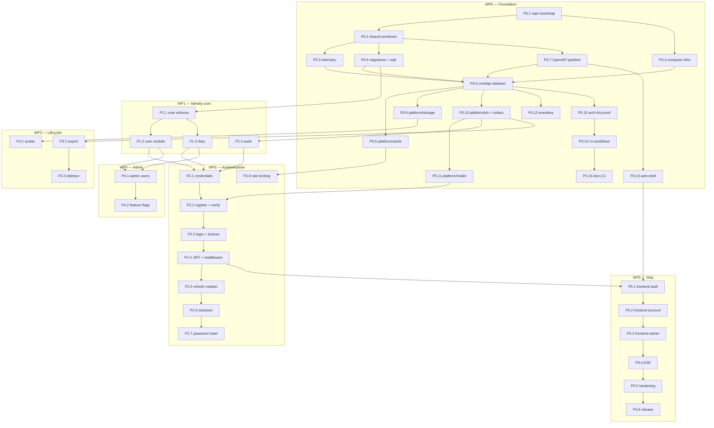

# Phase 0 + 1 — Execution Plan

> **Deliverable at the end of this plan:** a deployed, mobile-first system where a real person
> can register with an email and a 6-digit code **or** one tap of Google sign-in, stay signed in
> on their phone without ever seeing a login screen again, manage their profile, devices and
> sessions, and delete or export their account — and where an administrator can find, inspect,
> suspend and reinstate any user, with every action audited and every request traceable.
>
> No learning features yet. That is Phase 2.

---

> **Revision 2 (2026-08-07)** — three additions to authentication and one to the frontend:
> email **OTP** verification instead of links (ADR-0021), **persistent sign-in** (ADR-0022),
> **Google OAuth** moved forward from Phase 2 (ADR-0023), and a **mobile-first responsive**
> baseline (ADR-0024). Net effect: +4 tasks, +8 days. See §12 for what changed and why.

---

## 0. Scope note — why Phase 0 is here

You asked for Phase 1. Phase 1 is `auth`, `user`, `rbac`, `audit` and the admin shell — none of
which can be built before there is a running binary, a database, a migration pipeline, an error
type, and a way to see what happened. That is Phase 0.

**WP0 is therefore included.** If you want to hand over less, cut from the *bottom* (WP5, then
WP4), never from WP0 — skipping foundation work does not save time, it moves the cost to the
point where it is most expensive to pay.

| Work package | Content | Tasks | Est. |
|---|---|---|---|
| **WP0** | Foundation: skeleton, shared primitives, observability, infra, CI | 16 | ~15 days |
| **WP1** | Identity core: user, rbac, audit | 5 | ~8 days |
| **WP2** | Authentication: challenges/OTP, credentials, login, tokens, persistent sessions, Google | 11 | ~15 days |
| **WP3** | Account lifecycle: avatar, export, deletion | 3 | ~4 days |
| **WP4** | Admin shell + feature flags + dashboards | 3 | ~4 days |
| **WP5** | Frontend, responsive, E2E, hardening, release | 7 | ~12 days |
| | | **45** | **~58 days** |

Estimates assume **one experienced engineer working with an AI assistant**, and include tests
and documentation. Two engineers working in parallel on the marked-parallel tracks land it in
roughly 6 calendar weeks.

---

## 1. How to run this plan

### 1.1 One task = one pull request

A task is sized so that its diff is reviewable in one sitting. If a task's PR exceeds ~400
changed lines excluding generated code, it was too big — split it and say so.

### 1.2 Branching — there is no "Phase 1 branch"

**Do not create a long-lived branch for this plan.** Forty-five tasks over roughly eight weeks on
one branch produces a diff nobody can review, continuous conflicts with everyone else, and an
integration event at the end that is indistinguishable from a rewrite. `CONTRIBUTING.md` §4 and
`RELEASE_GUIDE.md` §3 already forbid it: short-lived branches off `main`, squash-merged, no
`develop`, no release branches.

Phase 1 is **45 branches**, not one. Each lives for a day or two.

| Element | Convention | Example |
|---|---|---|
| Branch | `<type>/<module>-<slug>` | `feat/auth-otp-challenges` |
| Type | `feat` · `fix` · `chore` · `docs` · `test` · `ci` · `refactor` | — |
| Commit | `<type>(<scope>): <subject>` | `feat(auth): add OTP challenge subsystem` |
| Commit footer | `Refs: <task id>` | `Refs: P2.1b` |
| PR title | `<commit subject> [<task id>]` | `feat(auth): add OTP challenge subsystem [P2.1b]` |

The task ID lives in the PR title and the commit footer, not in the branch name — branches stay
readable, and traceability back to this plan survives the squash-merge.

**Branch name per task** (derive the rest from the pattern):

| Task | Branch |
|---|---|
| P0.1 | `chore/repo-bootstrap` |
| P0.2 | `feat/shared-primitives` |
| P0.3 | `feat/telemetry-otel-setup` |
| P0.4 | `chore/compose-infrastructure` |
| P0.5 | `feat/api-skeleton` |
| P0.6 | `feat/db-migrations-sqlc` |
| P0.7 | `feat/openapi-pipeline` |
| P0.8 | `feat/cache-redis-facade` |
| P0.9 | `feat/storage-minio-facade` |
| P0.10 | `feat/job-river-outbox` |
| P0.11 | `feat/mailer-smtp` |
| P0.12 | `feat/shared-eventbus` |
| P0.13 | `chore/arch-lint-proof` |
| P0.14 | `ci/github-actions` |
| P0.15 | `feat/web-shell` |
| P0.16 | `ci/docs-drift-checks` |
| P1.1 | `feat/user-core-schema` |
| P1.2 | `feat/user-module` |
| P1.3 | `feat/rbac-module` |
| P1.4 | `feat/audit-module` |
| P1.5 | `chore/wire-identity-modules` |
| P2.1 | `feat/auth-credentials` |
| P2.1b | `feat/auth-otp-challenges` |
| P2.2 | `feat/auth-register-otp` |
| P2.3 | `feat/auth-login-lockout` |
| P2.4 | `feat/auth-jwt-middleware` |
| P2.5 | `feat/auth-refresh-rotation` |
| P2.6 | `feat/auth-sessions` |
| P2.7 | `feat/auth-password-reset` |
| P2.8 | `feat/auth-rate-limiting` |
| P2.9 | `feat/auth-persistent-sessions` |
| P2.10 | `feat/auth-google-oauth` |
| P3.1 | `feat/user-avatar-upload` |
| P3.2 | `feat/user-data-export` |
| P3.3 | `feat/user-account-deletion` |
| P4.1 | `feat/admin-user-management` |
| P4.2 | `feat/admin-feature-flags` |
| P4.3 | `chore/observability-dashboards` |
| P5.1 | `feat/web-auth-flows` |
| P5.2 | `feat/web-account-settings` |
| P5.3 | `feat/web-admin` |
| P5.3b | `feat/web-responsive-mobile` |
| P5.4 | `test/e2e-journeys` |
| P5.5 | `chore/security-hardening` |
| P5.6 | `chore/release-v0.1.0` |

**Phase 1 is marked complete by a tag, not by a merge:** `v0.1.0` on `main` after P5.6.

#### Why trunk-based is safe here specifically

There is no production yet. Nothing on `main` can break a learner. Once there is — from
`v0.1.0` onward — anything risky ships behind a feature flag defaulting to off
(`RELEASE_GUIDE.md` §7), which is what keeps `main` deployable without a staging branch.

The one real constraint: until **P0.14** lands there is no CI protecting `main`. Until then,
`make ci` locally before every merge is the gate, and it is not optional.

### 1.3 The canonical agent prompt

Use this for every task. Fill the four bracketed fields from the task card.

```
Read /AGENT.md, then [CONTEXT FILES from the task card].
Then read docs/development/phase-1-plan.md and find task [TASK ID].

Implement exactly that task. Nothing more.

Scope:      only the files listed under "Files" in the card.
Rules:      obey L1–L12 from /AGENT.md. Business rules for the module are in its AGENT.md §9.
Order:      if the task touches the API, edit api/openapi/openapi.yaml FIRST and show me
            that diff before writing Go.
Stop if:    you need to touch a module not named in this task, you need a config key that is
            not in .env.example, or a rule in /AGENT.md §5 blocks the obvious solution.

When done:
  1. make check
  2. show me the diff, grouped by file
  3. state which acceptance criteria you verified and how
  4. update the module's AGENT.md and TODO.md if this task changed either
```

### 1.4 Per-task Definition of Done

Every task is done when **all** of these hold — not most:

- [ ] `make check` green (fmt, vet, lint, **arch-lint**, unit tests)
- [ ] Unit tests cover the new branches; integration test if it touches Postgres/Redis/MinIO
- [ ] `api/openapi/openapi.yaml` updated in the same commit if the HTTP surface changed
- [ ] Migration is reversible; every FK indexed
- [ ] Errors are `shared/apperr` with documented codes; logs structured, no PII
- [ ] Span covers the new I/O; a metric exists if the outcome is meaningful
- [ ] The module's `AGENT.md` reflects reality; `last_verified` bumped
- [ ] The module's `TODO.md` item checked off
- [ ] `CHANGELOG.md` entry under `Unreleased` if user-visible

### 1.5 Verification per work package

| WP | Gate |
|---|---|
| WP0 | A request to `/api/v1/ping` is visible as a trace in Tempo, a log line in Loki with the same `trace_id`, and a metric in Prometheus. `make check` green on an otherwise empty project. A deliberate boundary violation fails CI. |
| WP1 | A user row can be created, read, updated and role-checked through the API, and every write appears in `audit_logs`. |
| WP2 | Register → OTP → auto sign-in works. Google sign-in works for all five linking branches. Refresh-reuse revokes the family. A session survives a browser restart but dies at the absolute cap. Integration tests prove all four. |
| WP3 | A user can upload an avatar, request an export and receive a link, request deletion and cancel it. |
| WP4 | An admin can find and suspend a user; the user's next request fails and their sessions and devices are gone. |
| WP5 | All 10 E2E journeys pass on all 4 device projects. ASVS L1 checklist complete. `v0.1.0` tagged and deployed to staging. |

---

## 2. Dependency graph



### 2.1 Parallel tracks

Once **P0.5** lands, three tracks run independently:

| Track | Tasks | Owner suggestion |
|---|---|---|
| **A — Platform** | P0.8 → P0.9 → P0.10 → P0.11 → P0.12 | Backend engineer 1 |
| **B — Pipeline** | P0.13 → P0.14 → P0.16 | Either, ~2 days total |
| **C — Frontend** | P0.15 → P5.1 (blocked on P2.4 for real auth) | Frontend engineer |

WP1 tasks P1.2, P1.3, P1.4 are independent of each other once P1.1 lands.

---

## 3. WP0 — Foundation

### P0.1 — Repository bootstrap `S`

| | |
|---|---|
| **Depends on** | — |
| **Context** | `/PROJECT_STRUCTURE.md`, `/CODING_STANDARD.md` |
| **Files** | `go.mod`, `.gitignore`, `.editorconfig`, `.golangci.yml`, `sqlc.yaml`, `.pre-commit-config.yaml`, empty package dirs with `doc.go` |
| **Do** | Initialise the Go module as `github.com/fluentra/fluentra`. Create every directory in `PROJECT_STRUCTURE.md` §1–3 with a `doc.go` stating the package's purpose. Configure `golangci-lint` with: errcheck, govet, staticcheck, revive, gosec, bodyclose, sqlclosecheck, nilerr, containedctx, contextcheck, goconst, gocyclo (15), lll (120). |
| **Acceptance** | `go build ./...` succeeds. `golangci-lint run` succeeds. `make help` lists targets. Every directory in `PROJECT_STRUCTURE.md` exists. |
| **Trap** | Do not add dependencies yet. An empty `go.mod` at this point is correct. |

### P0.2 — `internal/shared` primitives `L`

| | |
|---|---|
| **Depends on** | P0.1 |
| **Context** | `/ERROR_HANDLING.md`, `/CODING_STANDARD.md`, `/API_GUIDELINE.md` §4 |
| **Files** | `shared/{apperr,config,id,clock,pagination,httpx,dbx,validation,secret}/` |
| **Do** | `apperr`: the typed error from `ERROR_HANDLING.md` §1 with all 12 kinds, `Wrap`, `Is`, and Problem Details rendering. `config`: koanf loader with defaults → file → env, struct unmarshalling, **fail-fast validation naming the missing key**. `id`: UUIDv7 + ULID. `clock`: `Clock` interface + real + fake. `pagination`: opaque cursor encode/decode over `(sort_value, id)`. `httpx`: strict JSON decode (unknown fields rejected, size cap), response writers, `X-Request-Id`. `dbx`: pgx pool constructor, `Querier` interface, `InTx` helper with serialisation retry. `validation`: validator v10 wiring + locale messages. `secret`: `Redacted[T]` so tokens cannot be printed or logged. |
| **Acceptance** | ≥ 90 % coverage. `apperr` renders exactly the RFC 9457 shape in `ERROR_HANDLING.md` §5. A missing required config key produces an error naming the key and the doc section. `Redacted[string].String()` returns `[redacted]`. Cursor round-trips for every supported sort type. |
| **Tests** | Table-driven per package. Property test for cursor round-trip. |
| **Trap** | `apperr` must keep `Cause` and `Internal` **unexported from the JSON rendering**. Write a test asserting a wrapped SQL error never appears in the rendered body — this is the single most commonly reintroduced leak. |

### P0.3 — `platform/telemetry` `M`

| | |
|---|---|
| **Depends on** | P0.2 |
| **Context** | `/OBSERVABILITY_GUIDELINE.md`, `/LOGGING_GUIDELINE.md`, `internal/platform/telemetry/AGENT.md` |
| **Files** | `platform/telemetry/{provider.go,middleware.go,slog.go,redact.go,instruments.go,health.go}` |
| **Do** | OTel tracer/meter/logger providers with OTLP gRPC exporters and resource attributes (`service.name`, `service.version`, `deployment.environment`, `git.commit.sha`). Graceful shutdown that **flushes**. HTTP middleware: extract `traceparent`, generate/echo `X-Request-Id`, name spans by route pattern, recover panics, emit the access log. `slog` handler bridged to OTLP with the **redaction allowlist** (`LG6`). Shared instruments for HTTP, DB, cache, storage, jobs. `/health`, `/ready`, `/version`. |
| **Acceptance** | A log record whose attribute key is not on the allowlist renders `[redacted]`. `trace_id` and `span_id` appear automatically on every record inside a span. `/ready` returns 503 when Postgres is unreachable. Shutdown flushes pending spans (test with a stub exporter). Span names contain no IDs. |
| **Trap** | The redaction allowlist must **fail closed** — a new, unknown key is redacted by default. Test that explicitly. |

### P0.4 — Compose infrastructure `M`

| | |
|---|---|
| **Depends on** | P0.1 |
| **Context** | `/DOCKER_GUIDE.md`, `/DEPLOYMENT_GUIDE.md` |
| **Files** | `deploy/compose/{compose.yaml,compose.dev.yaml,compose.observability.yaml,compose.prod.yaml}`, `deploy/{otel,prometheus,loki,tempo,grafana,minio,nginx}/*` |
| **Do** | Base: postgres 17, redis 7.4, minio, migrate (one-shot). Observability overlay: otel-collector (memory_limiter → resource → attributes/redaction → tail_sampling → batch), prometheus, loki, tempo, grafana with provisioned datasources. Dev overlay: air, vite, mailpit, jaeger, adminer, river-ui, seed. Prod overlay: nginx, resource limits, restart policies, log rotation, **no published database ports**. Healthchecks on everything; `depends_on: service_healthy`. |
| **Acceptance** | `make dev` brings everything up healthy from a clean machine. Grafana has Prometheus, Loki and Tempo datasources pre-provisioned, with the Loki→Tempo derived field for `trace_id`. `docker compose -f base -f prod config` exposes only 80/443. |
| **Trap** | Set the Loki→Tempo derived field now. Doing it later means every incident until then is debugged the hard way. |

### P0.5 — `cmd/api` skeleton + the trace proof `M`

| | |
|---|---|
| **Depends on** | P0.2, P0.3, P0.4, P0.6, P0.7 |
| **Context** | `/ARCHITECTURE.md` §6.3, `ADR-0006` |
| **Files** | `cmd/api/main.go`, `internal/shared/httpx/router.go` |
| **Do** | Composition root in the order from `ARCHITECTURE.md` §6.3: config → telemetry → pg pool → redis → minio → platform → modules → router → server. `signal.NotifyContext`, graceful shutdown with a 30 s drain. chi router with the standard middleware chain. `GET /api/v1/ping` that performs one trivial DB query and one Redis call so the trace has depth. |
| **Acceptance** | **The 15-minute exercise in `docs/development/getting-started.md` §5 passes end to end.** One `/ping` request produces: a trace in Tempo containing the HTTP span plus pgx and redis child spans; a log line in Loki carrying the same `trace_id`, clickable through to the trace; a data point in `http_server_request_duration_seconds`. Shutdown drains in-flight requests. |
| **Trap** | This task is the whole point of WP0. Do not move on until all three signals correlate. Everything after this is cheaper because of it. |

### P0.6 — Migrations and sqlc `M`

| | |
|---|---|
| **Depends on** | P0.2 |
| **Context** | `/DATABASE_GUIDELINE.md`, `ADR-0003`, `ADR-0004` |
| **Files** | `cmd/migrate/main.go`, `db/migrations/_bootstrap/`, `sqlc.yaml`, `Makefile` targets |
| **Do** | goose with `embed.FS` and **per-module directories** ordered by a global unix-timestamp prefix. Bootstrap migration: `CREATE EXTENSION pgcrypto, pg_stat_statements, pg_trgm, btree_gin`; create all 11 schemas from `ARCHITECTURE.md` §8.2; create the least-privilege application role and the separate migration owner role. `sqlc.yaml` configured per module with pgx/v5, `uuid` → `uuid.UUID`, `timestamptz` → `time.Time`, and `emit_pointers_for_null_types`. |
| **Acceptance** | `make migrate-up` / `migrate-down` / `migrate-status` work. The application role has no DDL rights. `make gen-sql` is reproducible — running it twice produces no diff. |
| **Trap** | Set up the two-role split now. Retrofitting least privilege after 40 tables exist is a migration you will not enjoy writing. |

### P0.7 — OpenAPI pipeline `M`

| | |
|---|---|
| **Depends on** | P0.2 |
| **Context** | `/API_GUIDELINE.md`, `ADR-0005` |
| **Files** | `api/openapi/{openapi.yaml,components/,codegen-server.yaml,codegen-client.yaml}`, `.spectral.yaml` |
| **Do** | OpenAPI 3.1 skeleton with `info`, `servers`, security schemes (bearer + refresh cookie), and shared components: `Problem`, `ValidationProblem`, `Page`, `Cursor`, standard headers, standard error responses. `oapi-codegen` configs for a chi server (strict mode) and a typed client. Custom `spectral` ruleset enforcing: `operationId` present and `camelCase`, `x-permission` present unless `security: []`, at least one example per response, description on every operation. |
| **Acceptance** | `make gen-api` produces a compiling server interface. `spectral lint` passes on the skeleton and **fails** on a deliberately malformed operation. |
| **Trap** | Write the spectral rule for `x-permission` now. It is the mechanism that stops an unguarded endpoint shipping later. |

### P0.8 — `platform/cache` `M`

| | |
|---|---|
| **Depends on** | P0.5 |
| **Context** | `internal/platform/cache/AGENT.md`, `/ARCHITECTURE.md` §12 |
| **Files** | `platform/cache/{cache.go,key.go,loader.go,lock.go,limiter.go}` |
| **Do** | Generic `Cache[T]` over go-redis v9 with JSON codec. `Key()` builder producing `fluentra:{env}:{module}:{entity}:{id}:v{n}`. `GetOrLoad` with `singleflight` and ±10 % TTL jitter. `Locker` with `SET NX PX` and **token-checked release**. `Limiter` wrapping `redis_rate` returning remaining and reset. **Degradation**: every operation falls through to the loader when Redis is unreachable, logs `warn`, increments `cache_unavailable_total`. |
| **Acceptance** | Integration test with the Redis container **stopped** proves every consumer path still returns correct data. Single-flight test: 100 concurrent `GetOrLoad` on a cold key produce exactly 1 loader call. A lock cannot be released by a different holder. |
| **Trap** | Write the Redis-down test first. It is the requirement, not an edge case. |

### P0.9 — `platform/storage` `M`

| | |
|---|---|
| **Depends on** | P0.5 |
| **Context** | `internal/platform/storage/AGENT.md`, `ADR-0018` |
| **Files** | `platform/storage/{store.go,presign.go,keys.go,buckets.go}`, `deploy/minio/init.sh` |
| **Do** | minio-go v7 facade: `PresignPut` (content type + max size + 5 min pinned), `PresignGet` (15 min), `Stat`, `Copy`, `Delete`. Deterministic key builder `{owner_type}/{owner_id}/{yyyy}/{mm}/{asset_id}.{ext}`. Bucket creation, policies and lifecycle rules in `init.sh`. Post-upload verification helper (exists + size + sniffed content type). |
| **Acceptance** | Integration test: a presigned PUT with a mismatched content type is **rejected by MinIO**. Verification catches a missing object and a size mismatch. Key generation is deterministic — same inputs, same key. |
| **Trap** | Verify after upload. The presigned URL constrains the client's *intent*; only `Stat` plus sniffing tells you what actually landed. |

### P0.10 — `platform/job` + outbox `L`

| | |
|---|---|
| **Depends on** | P0.5 |
| **Context** | `internal/platform/job/AGENT.md`, `ADR-0009`, `ADR-0010` |
| **Files** | `platform/job/{client.go,worker.go,middleware.go,cron.go}`, `shared/outbox/{writer.go,publisher.go}`, `cmd/worker/main.go`, `db/migrations/job/` |
| **Do** | River client and worker with the five queues (`default`, `ai`, `media`, `notify`, `batch`) and per-queue concurrency from config. Job middleware: span, structured log, panic recovery, timeout, metrics. Cron with Postgres advisory locking. `outbox_events` table; writer that inserts **inside the caller's transaction**; publisher loop polling with `FOR UPDATE SKIP LOCKED`, dispatching to the event bus, marking published. `job_failures` dead-letter table. |
| **Acceptance** | Integration test: a rolled-back transaction leaves **no** job and **no** outbox row. A handler that panics is recovered, recorded, and does not kill the worker. Redelivering the same event to a consumer produces one effect. `job_oldest_pending_seconds` and `outbox_lag_seconds` are exported. |
| **Trap** | `job.Enqueuer.Enqueue` must take the transaction as a parameter. If the signature lets a caller enqueue without one, someone will — and the guarantee this whole design exists for is gone. |

### P0.11 — `platform/mailer` `M`

| | |
|---|---|
| **Depends on** | P0.10 |
| **Context** | `internal/platform/mailer/AGENT.md` |
| **Files** | `platform/mailer/{sender.go,smtp.go,render.go,suppression.go}`, `templates/`, `db/migrations/mailer/` |
| **Do** | `Sender` interface; SMTP implementation; MJML compiled at build time to HTML + plain-text alternative. Locale resolution (en, vi) with **startup validation that every template exists in every locale**. `email_log` and `email_suppressions` tables. Async send via the `notify` queue with transient/permanent retry classification. |
| **Acceptance** | A missing locale for any template **fails startup**, not a request. Rendering escapes a display name containing `<script>`. A hard bounce suppresses the address. In dev, mail lands in Mailpit and never leaves the machine. |

### P0.12 — `shared/eventbus` `S`

| | |
|---|---|
| **Depends on** | P0.5 |
| **Context** | `ADR-0009` |
| **Files** | `shared/eventbus/{bus.go,inprocess.go,registry.go}` |
| **Do** | Publish/subscribe interface deliberately shaped like a broker client (topic, payload, ack semantics) with an in-process implementation. Handler registry keyed by event name. Handlers run in the outbox publisher's goroutine, are `ctx`-bound, and record their own span. |
| **Acceptance** | The interface has no in-process-specific method — a NATS implementation would satisfy it unchanged. A slow handler does not block other handlers. Handler failure is recorded and retried by the outbox, not swallowed. |

### P0.13 — Boundary enforcement proof `S`

| | |
|---|---|
| **Depends on** | P0.5 |
| **Context** | `/.go-arch-lint.yml`, `ADR-0001` |
| **Files** | `.go-arch-lint.yml`, `scripts/verify-arch-lint.sh` |
| **Do** | Verify the checked-in config against the real tree. Then add a script that **deliberately introduces a violation** (a temporary file importing another module's `service`), asserts `go-arch-lint` fails, and removes it. |
| **Acceptance** | `make arch` passes on the clean tree and provably fails on a violation. The script runs in CI. |
| **Trap** | A boundary linter nobody has seen fail is a boundary linter nobody trusts. Prove it works once, in CI, permanently. |

### P0.14 — CI workflows `M`

| | |
|---|---|
| **Depends on** | P0.13 |
| **Context** | `/GITHUB_ACTIONS.md` |
| **Files** | `.github/workflows/{ci-backend,ci-frontend,security,build}.yml`, `.github/{pull_request_template.md,ISSUE_TEMPLATE/}` |
| **Do** | Backend: cache → verify generated code is current → golangci-lint → **go-arch-lint** → `go test -race` → coverage gate → integration (testcontainers) → spectral. Frontend: tsc → eslint → vitest → build → bundle budget. Security: gitleaks, govulncheck, npm audit, CodeQL, Trivy, SBOM. Build: buildx with GHA cache, push to GHCR, cosign. Concurrency groups, path filters, SHA-pinned actions, `timeout-minutes` everywhere. |
| **Acceptance** | A PR that leaves generated code stale fails. A PR with a boundary violation fails. Warm backend CI completes in under 8 minutes. `make ci` locally produces the same result as CI. |

### P0.15 — Web application shell `L`

| | |
|---|---|
| **Depends on** | P0.7 |
| **Context** | `web/AGENT.md`, `ADR-0014` |
| **Files** | `web/` — vite config, tsconfig strict, eslint flat config with `eslint-plugin-boundaries`, tailwind, `src/app/`, `src/components/{ui,layout}/`, `src/api/`, `src/test/` |
| **Do** | Vite + React 19 + TS strict (`noUncheckedIndexedAccess`, `exactOptionalPropertyTypes`). TanStack Router with a typed route tree. TanStack Query client with sane defaults. Generated OpenAPI client + fetch wrapper with the `X-Request-Id` and `traceparent` interceptors. shadcn/ui base components. App shell, error boundary, theme, i18n (en, vi). MSW set up for dev and tests. OTel Web SDK, lazy-loaded after first paint. |
| **Acceptance** | `pnpm build` succeeds within the bundle budget. `pnpm test` runs with MSW. A browser interaction produces a trace that **joins the server trace** for the same request. `eslint-plugin-boundaries` fails on a cross-slice deep import. |

### P0.16 — Documentation CI `S`

| | |
|---|---|
| **Depends on** | P0.14 |
| **Context** | `/AI_CONTEXT.md` §7 |
| **Files** | `.github/workflows/docs.yml`, `tools/docgen/check-drift.mjs` |
| **Do** | markdownlint, lychee link check, front-matter schema validation, required-section check for every `AGENT.md`, `docgen --check`, and the three drift checks: `tables:` vs migrations, `API.md` vs `openapi.yaml`, `depends_on` vs `.go-arch-lint.yml`. Weekly staleness report for `last_verified` older than 90 days. |
| **Acceptance** | Adding a table without updating the module's front-matter fails CI. Adding a dependency arrow to `.go-arch-lint.yml` without updating `MODULE_INDEX.md` fails CI. |

---

## 4. WP1 — Identity core

### P1.1 — `core` schema `M`

| | |
|---|---|
| **Depends on** | P0.6 |
| **Context** | `internal/modules/user/AGENT.md` §5, `/DATABASE_GUIDELINE.md` |
| **Files** | `db/migrations/user/`, `db/queries/user/` |
| **Do** | `core.users` (email citext UNIQUE, status enum, `email_verified_at`), `core.profiles`, `core.user_preferences`, `core.learning_profiles`. Standard columns, checks, indexes. Seed the `content_status`-style enums needed. |
| **Acceptance** | `users` holds identity only — no profile fields. Email uniqueness is case-insensitive (test with `A@b.com` / `a@b.com`). Every FK indexed. Down-migration works. |
| **Trap** | Resist putting `display_name` on `users`. Every schema in the system foreign-keys to this table; keeping it narrow is what makes that acceptable. |

### P1.2 — `user` module `L`

| | |
|---|---|
| **Depends on** | P1.1 |
| **Context** | `internal/modules/user/AGENT.md` |
| **Files** | `internal/modules/user/**`, `api/openapi/components/user.yaml` |
| **Do** | Full vertical slice: `contract` (`Reader` with **batched** `GetManyByIDs`, `Creator`, `Summary`, events), `domain`, `service`, `repository`, `transport/http`. Endpoints: `GET/PATCH /me`, `GET/PUT /me/preferences`. |
| **Acceptance** | `GET /me` for another user's ID is impossible by construction — the handler reads the actor from context and never accepts a user ID. `PATCH /me` rejects unknown fields with 422. Display-name reserved-word list enforced. Timezone validated against IANA. `GetManyByIDs` issues one query for N ids (assert the query count). |
| **Trap** | Add `GetManyByIDs` now even though nothing batches yet. Adding it after five modules have written N+1 loops is five refactors instead of none. |

### P1.3 — `rbac` module `M`

| | |
|---|---|
| **Depends on** | P1.1 |
| **Context** | `internal/modules/rbac/AGENT.md`, `ADR-0008` |
| **Files** | `internal/modules/rbac/**`, `db/migrations/rbac/`, `db/seeds/rbac.sql` |
| **Do** | Four tables. Seed `admin` and `user` roles and the Phase-1 permission set. `Authorizer.Require`/`Can` with 5-minute cached resolution and eager invalidation. `/admin/*` route-group middleware. `GET /me/permissions`. Self-elevation and last-admin protections. Typed permission constants. |
| **Acceptance** | An operation with no declared permission is **denied**, not allowed — test it. A `user` role gets 403 on `/admin/*`. The last admin cannot be demoted. Revoking a role takes effect within the cache TTL, and immediately when busted. |
| **Trap** | Deny-by-default must be structural. If the guard's zero value permits access, one forgotten call opens a hole. |

### P1.4 — `audit` module `M`

| | |
|---|---|
| **Depends on** | P0.10 |
| **Context** | `internal/modules/audit/AGENT.md` |
| **Files** | `internal/modules/audit/**`, `db/migrations/audit/` |
| **Do** | `audit_logs` and `security_events`, partitioned monthly with three months created ahead. `Recorder` contract. Outbox consumer, idempotent on `event_id`. **Database grants: the application role gets INSERT and SELECT only.** PII redaction in diffs. Admin search endpoints. Partition rotation and retention jobs. |
| **Acceptance** | An integration test proves the application role **cannot** UPDATE or DELETE `audit_logs`. A duplicate event produces one row. An audit failure does not roll back the business operation. IP addresses are stored hashed. |
| **Trap** | Enforce append-only with grants, not with application discipline. Discipline is a person; grants are a guarantee. |

### P1.5 — Wire WP1 into the composition root `S`

| | |
|---|---|
| **Depends on** | P1.2, P1.3, P1.4 |
| **Files** | `cmd/api/main.go`, `cmd/worker/main.go` |
| **Do** | Construct `audit` → `rbac` → `user` in dependency order; mount routers; register the audit outbox consumer in the worker. |
| **Acceptance** | `make check` green. `/me` and `/admin/*` reachable. A profile update appears in `audit_logs` with the correct actor and trace ID. |

---

## 5. WP2 — Authentication

> Every task in this work package requires **two reviewers** (rule S11).

### P2.1 — Credentials and password policy `M`

| | |
|---|---|
| **Depends on** | P1.5 |
| **Context** | `internal/modules/auth/AGENT.md`, `/SECURITY_GUIDELINE.md` §2 |
| **Files** | `internal/modules/auth/{domain,repository}/`, `db/migrations/auth/` |
| **Do** | `core.credentials` table. Argon2id hashing (m=64 MiB, t=3, p=2) with parameters embedded in the hash and **rehash-on-login when parameters change**. Password policy: ≥ 12 chars, not equal to the email local part, breached-password check via HIBP k-anonymity with an 800 ms timeout that **fails open** with a warn log. |
| **Acceptance** | Verification is constant-time. A hash created with old parameters is transparently upgraded on successful login. The breach check failing does not block registration. Only the first 5 characters of the SHA-1 hash ever leave the system. |

### P2.1b — Challenge subsystem (OTP primitive) `M` 🆕

| | |
|---|---|
| **Depends on** | P2.1, P0.8, P0.11 |
| **Context** | `ADR-0021`, `internal/modules/auth/AGENT.md` §9, `internal/modules/auth/FLOW.md` |
| **Files** | `auth/domain/challenge.go`, `auth/service/challenge.go`, `auth/repository/challenge.go`, `db/migrations/auth/*_create_auth_challenges.sql` |
| **Do** | Build the generic primitive **before** anything uses it. `auth_challenges` with `purpose` enum (`verify_email`, `login_otp`, `password_reset`, `link_oauth`), `code_hash` = `HMAC-SHA256(code, server_key)`, `attempts`, `max_attempts` (5), `expires_at` (10 min), `consumed_at`. Service: `Issue(purpose, subject) → challenge_id`, `Verify(challenge_id, code)`, `Resend(challenge_id)`. Rate limiters in Redis: 60 s resend cooldown per challenge, 3 issuances per subject per hour, plus a **per-IP global issuance cap** to catch distributed guessing across many challenges. |
| **Acceptance** | Code is single-use; expires at 10 minutes; exactly 5 wrong attempts then the challenge is **burned** and cannot be retried. Comparison is constant-time (`crypto/subtle`). A code from challenge A does not verify challenge B. Resend replaces the code and resets attempts but **does not** extend the absolute expiry. The code appears in no response body, no log record, no span attribute, and no test fixture — assert this with a test that greps the captured log output. |
| **Trap** | Build this once, generically. Three purpose-specific implementations means three chances to get constant-time comparison or attempt capping wrong — and the bug would be silent in two of them. |

### P2.2 — Registration with OTP verification `M` ✏️

| | |
|---|---|
| **Depends on** | P2.1b |
| **Files** | `auth/service/register.go`, `auth/transport/http/`, `api/openapi/components/auth.yaml`, `platform/mailer/templates/verify_email.*` |
| **Do** | `POST /auth/register`: validate, create the user via `user.Creator`, the credential, the `verify_email` challenge, and the outbox row that sends the code — **all in one transaction**. Returns `{ challenge_id, expires_at, resend_after }`. `POST /auth/challenges/{id}/verify` activates the account and signs the learner in immediately. `POST /auth/challenges/{id}/resend`. Templates in English and Vietnamese. |
| **Acceptance** | A rolled-back registration sends no code — test by forcing a failure after the user insert. Registering an existing **verified** email returns the same response shape as a fresh registration and sends a "someone tried to register with your address" email instead — enumeration must not be possible from the response. Successful verification returns tokens, so the learner is signed in without a second step. Unverified accounts expire after 7 days. |
| **Trap** | The email goes through the outbox, never a direct call. A mailer outage must not fail registration — the learner can resend. |

### P2.3 — Login, lockout, timing equalisation `M`

| | |
|---|---|
| **Depends on** | P2.2, P0.8 |
| **Files** | `auth/service/login.go`, `auth/repository/attempts.go` |
| **Do** | `POST /auth/login`. Per-account **and** per-IP counters in Redis, independent, exponentially backing off. `login_attempts` table (partitioned) for forensics. Suspended and unverified statuses checked. Timing equalised: perform a dummy Argon2id verify when the email is unknown. |
| **Acceptance** | An integration test measures response times for unknown-email versus wrong-password across 100 samples and asserts the distributions are statistically indistinguishable. Lockout counters are independent — locking an IP does not lock the account and vice versa. A suspended user cannot log in. Redis down does not prevent login (falls back to the DB counter). |
| **Trap** | The dummy verify is not optional. Without it, a timing side channel enumerates your entire user base. |

### P2.4 — JWT issuance and the auth middleware `M`

| | |
|---|---|
| **Depends on** | P2.3 |
| **Context** | `ADR-0007` |
| **Files** | `auth/service/token.go`, `auth/transport/http/middleware.go`, `auth/contract/actor.go` |
| **Do** | Sign HS256 JWTs with `sub`, `sid`, `role`, `jti`, `iat`, `exp`, `aud`, `iss` — **no PII**. Two-key support for rotation (`JWT_SIGNING_KEY` + `JWT_PREVIOUS_KEY`). Validating middleware placing `auth.Actor` in the request context. Redis `jti` denylist for explicit logout. 60-second clock leeway. |
| **Acceptance** | A token signed with the previous key still validates; a token signed with an unknown key does not. Claims contain no email or name. A denylisted `jti` is rejected. An expired token returns `TOKEN_EXPIRED`, a malformed one `TOKEN_INVALID` — the client needs to tell them apart. |

### P2.5 — Refresh rotation with reuse detection `L`

| | |
|---|---|
| **Depends on** | P2.4 |
| **Context** | `internal/modules/auth/FLOW.md` — the sequence diagram is the specification |
| **Files** | `auth/service/refresh.go`, `db/migrations/auth/` |
| **Do** | `refresh_tokens` (SHA-256 `token_hash` UNIQUE, `family_id`, `session_id`, `used_at`) and `sessions`. `POST /auth/refresh`: look up by hash; if `used_at` is set, **revoke the entire family**, revoke the session, raise a `refresh_reuse` security event, return 401. Otherwise rotate in a transaction. Cookie `HttpOnly; Secure; SameSite=Lax; Path=/api/v1/auth`. |
| **Acceptance** | Integration test: use a refresh token, then present it again → the whole family is revoked, a security event exists, and the previously-issued live token no longer works. Two concurrent refreshes with the same valid token → exactly one succeeds. Refresh one millisecond after expiry fails. |
| **Trap** | The reuse-detection test is the single most important test in this work package. Write it before the implementation. |

### P2.6 — Sessions `M`

| | |
|---|---|
| **Depends on** | P2.5 |
| **Files** | `auth/service/session.go` |
| **Do** | `GET /auth/sessions` (device label, IP country from a local database, last seen), `DELETE /auth/sessions/{id}`, `POST /auth/logout`. Contract method `SessionRevoker.RevokeAll` for `user` and `admin`. Session cache with a 5-minute TTL, busted on revoke. |
| **Acceptance** | Revoking a session invalidates its refresh family immediately and its access token within one TTL. A user cannot see or revoke another user's session (404, not 403). `ip_hash` is stored, never the address. |

### P2.7 — Password reset and change `M`

| | |
|---|---|
| **Depends on** | P2.6 |
| **Files** | `auth/service/password.go` |
| **Do** | `POST /auth/forgot-password` (**always** 202), `POST /auth/reset-password`, `POST /auth/change-password`. Both revoke all sessions on success, optionally keeping the current one for change. Requesting a second reset invalidates the first token. |
| **Acceptance** | `forgot-password` returns 202 and takes comparable time for a known and an unknown email. Reset revokes every session. The old token is dead after a second request. Reset tokens are single-use and expire in 30 minutes. |

### P2.8 — Rate limiting `S`

| | |
|---|---|
| **Depends on** | P0.8, P2.7 |
| **Files** | `shared/httpx/ratelimit.go`, route registration |
| **Do** | Middleware using `cache.Limiter`. Classes from `/API_GUIDELINE.md` §11: anonymous 60/min per IP, authenticated 600/min per user, `/auth/*` 5/min per IP **and** per account, challenge issuance 3/hour per subject plus a per-IP global cap, uploads 30/hour. `RateLimit-*` headers and `Retry-After`. |
| **Acceptance** | Headers present on limited endpoints. 429 carries `Retry-After`. Redis down degrades to allow-with-warn, not deny-all. Limits are per class, verified at the boundary and one over. The per-IP challenge cap blocks a script issuing challenges against many different addresses. |

### P2.9 — Persistent sign-in: sliding window + trusted devices `L` 🆕

| | |
|---|---|
| **Depends on** | P2.6 |
| **Context** | `ADR-0022`, `internal/modules/auth/FLOW.md` — "Staying signed in" |
| **Files** | `auth/service/{session.go,device.go}`, `db/migrations/auth/*_create_trusted_devices.sql` |
| **Do** | Make rotation **sliding**: each refresh issues a replacement with a fresh idle window instead of inheriting the original expiry. Add `absolute_expires_at` to `sessions`, set at login and **never extended**. `trusted_devices` table keyed by a hashed client-generated `device_id`. `login` accepts `remember_device` and `device_id`. Windows from config: idle 30 d default / 90 d trusted / **12 h for `admin`**; absolute 180 d / **7 d for `admin`**. `GET /auth/devices`, `DELETE /auth/devices/{id}`. Password change, reset and suspension revoke every device and family. |
| **Acceptance** | Rotation moves the idle window forward but **never past `absolute_expires_at`** — test with a clock jumped forward. A continuously active session still forces re-authentication at the absolute cap with `SESSION_ABSOLUTE_EXPIRED`. An admin session does **not** receive the extended window (assert explicitly — this is easy to get wrong by sharing one code path). Untrusting a device revokes its refresh family immediately. Password reset revokes all devices. |
| **Trap** | The absolute cap is the entire security argument for the long idle window. Write its test before the sliding logic, or you will ship sliding-with-no-cap and not notice — the happy path looks identical. |

### P2.10 — Google OAuth `L` 🆕

| | |
|---|---|
| **Depends on** | P2.9, P2.1b |
| **Context** | `ADR-0023`, `internal/modules/auth/FLOW.md` — "Google sign-in with account linking" |
| **Files** | `auth/service/oauth.go`, `auth/service/oauth/google/`, `db/migrations/auth/*_create_oauth_states.sql` |
| **Do** | Authorization code flow **with PKCE**. `GET /auth/oauth/google/start` generates `state`, `nonce` and the PKCE challenge, stores them server-side with a 10-minute single-use TTL, returns the authorization URL. `POST /auth/oauth/google/callback` consumes the state, exchanges the code, fetches and **caches** Google's JWKS, and verifies the ID token's signature, `iss`, `aud`, `exp` and `nonce`. Then the five-branch linking policy from ADR-0023. `POST /auth/oauth/google/link` and `DELETE /auth/oauth/google` for a signed-in learner, with `LAST_SIGN_IN_METHOD` protection. |
| **Acceptance** | All five linking branches tested: known identity → sign in; verified local match → link; **unverified local match → 409, no link**; no local account → create already-verified; unverified Google email → 403. Forged, reused and expired `state` each rejected with a security event. An ID token failing any of signature / `iss` / `aud` / `exp` / `nonce` is rejected and **creates no partial account**. JWKS is cached and refreshed on an unknown `kid`, never fetched per request. Unlinking the only sign-in method is refused. |
| **Trap** | The unverified-local-match branch is the account-takeover path. If your implementation auto-links there because it "seems friendlier", you have shipped the vulnerability this ADR exists to prevent. Test that branch first. |

---

## 6. WP3 — Account lifecycle

### P3.1 — Avatar upload `M`

| | |
|---|---|
| **Depends on** | P0.9, P1.2 |
| **Files** | `user/service/avatar.go` |
| **Do** | `POST /me/avatar/upload-intent` → presigned PUT (image/jpeg, image/png, image/webp; 5 MB; 5 min). `PUT /me/avatar` verifies the object, strips EXIF, re-encodes to WebP at three sizes, publishes to the media bucket. Old avatar deleted. |
| **Acceptance** | A renamed `.exe` is rejected by magic-byte sniffing. EXIF GPS data is absent from the output. The old object is deleted after the new one is verified. |

### P3.2 — Data export `M`

| | |
|---|---|
| **Depends on** | P0.10, P1.2 |
| **Files** | `user/service/export.go`, `user/job/export.go` |
| **Do** | `POST /me/export` → 202, one pending export at a time. Job assembles a ZIP of JSON per module (via contracts, never by reading their tables), uploads to the exports bucket, emails a 24-hour signed link. Artefact deleted after 7 days. |
| **Acceptance** | The export contains data from every module that holds personal data. The link expires. A second request while one is pending returns 409. The job is restartable. |

### P3.3 — Account deletion `M`

| | |
|---|---|
| **Depends on** | P3.2 |
| **Files** | `user/service/deletion.go`, `user/job/deletion.go` |
| **Do** | `DELETE /me` → 30-day grace, status `pending_deletion`, sessions revoked immediately via `auth`, `user.deletion_requested` published. `POST /me/deletion/cancel`. Scheduled job executes due requests: anonymise the profile, hard-delete PII, publish `user.deleted`. Erasure completeness check comparing expected against actual per module. |
| **Acceptance** | Cancellable before the deadline, irreversible after. Sessions die immediately on request. Every module holding personal data has an idempotent purge handler. Aggregate statistics survive anonymisation. |
| **Trap** | Do not implement deletion as a cascade from `user`. Publish the event; each module erases its own data. Anything else recreates the coupling the architecture exists to prevent. |

---

## 7. WP4 — Admin shell

### P4.1 — Admin user management `M`

| | |
|---|---|
| **Depends on** | P1.5, P2.6 |
| **Files** | `internal/modules/admin/**`, `api/openapi/components/admin.yaml` |
| **Do** | `GET /admin/users` (search by email hash, name, status; cursor pagination), `GET /admin/users/{id}`, `POST .../suspend`, `POST .../reinstate`, `POST .../sessions/revoke`. Every action audited with the actor and a required reason. Self-administration refused. All composition through contracts — **admin queries no other module's tables**. |
| **Acceptance** | A non-admin gets 403 on every route. Suspension revokes sessions and blocks the next request. An admin cannot suspend themselves. Admin **reads** of personal data are audited, not just writes. `go-arch-lint` confirms no cross-module internal import. |

### P4.2 — Feature flags `S`

| | |
|---|---|
| **Depends on** | P4.1 |
| **Files** | `admin/service/flags.go`, `shared/flags/` |
| **Do** | `feature_flags` table with `key`, `enabled`, `rollout_percent`, `owner`, `expires_on`. In-process cache, 30 s TTL. `FlagReader.IsEnabled(ctx, key, userID)` with stable per-user bucketing. Admin CRUD. Weekly expired-flag report. |
| **Acceptance** | Bucketing is stable — the same user always lands the same side of a percentage rollout. A change propagates within 30 seconds. A flag without an owner and expiry cannot be created. |

### P4.3 — Dashboards, alerts, runbooks `M`

| | |
|---|---|
| **Depends on** | P4.1 |
| **Files** | `deploy/grafana/dashboards/`, `deploy/prometheus/rules/`, `docs/operations/runbooks/` |
| **Do** | Dashboards: API Overview (RED), Database, Redis, Jobs & Queues, Auth & Security. Alerts from `/OBSERVABILITY_GUIDELINE.md` §8 applicable to Phase 1. A runbook per alert. |
| **Acceptance** | Every alert links to a runbook containing an actual query or command. Firing an alert in staging produces a notification that a person can act on without asking anyone. |

---

## 8. WP5 — Frontend, E2E, hardening, release

### P5.1 — Frontend auth flows `L` ✏️

| | |
|---|---|
| **Depends on** | P0.15, P2.10 |
| **Files** | `web/src/features/auth/**`, `web/src/app/router.tsx` |
| **Do** | Register → **OTP screen** (6 segmented inputs, `inputmode="numeric"`, `autocomplete="one-time-code"` so iOS and Android offer the code from the notification, paste-to-fill across all six boxes, live countdown, resend disabled during cooldown, remaining-attempts feedback). Login with a **"Stay signed in"** checkbox, defaulted on, that sets `remember_device` and sends a `device_id` persisted in local storage. **"Continue with Google"** button on both register and login. Forgot/reset password reusing the OTP screen. Logout. Access token **in memory only**. **Boot-time silent refresh before first render**, so a returning learner never sees a login screen. Single-flight refresh on 401. |
| **Acceptance** | The access token appears nowhere in `localStorage`, `sessionStorage`, or a readable cookie. Ten concurrent 401s trigger exactly one refresh. A returning learner with a valid session lands on the dashboard with **no login screen flash** — assert on the rendered route sequence, not on a screenshot. Pasting a 6-digit code fills all six inputs. `SESSION_ABSOLUTE_EXPIRED` shows a distinct, non-alarming message from `SESSION_REVOKED`. The Google button handles the popup-blocked case. `OAUTH_ACCOUNT_CONFLICT` renders actionable copy, not a raw error code. Every form is keyboard-navigable and labelled. |
| **Trap** | `autocomplete="one-time-code"` is what makes OTP tolerable on mobile — it lets the OS surface the code above the keyboard. Omitting it turns a two-second interaction into an app-switch. |

### P5.2 — Frontend account management `M` ✏️

| | |
|---|---|
| **Depends on** | P5.1, P3.3 |
| **Files** | `web/src/features/{settings,account}/**` |
| **Do** | Profile edit, preferences, avatar upload with crop and direct-to-storage PUT, **device list** (this device marked, last seen, expiry, untrust), session list with revoke, Google link/unlink, export request, deletion request with a genuine confirmation and cancellation path. |
| **Acceptance** | Avatar uploads go straight to MinIO — the API never sees bytes (assert in the network panel and in the E2E trace). The device list marks the current device and refuses to let a learner strand themselves without explanation. Unlinking Google when it is the only sign-in method is blocked in the UI **and** by the server. The deletion flow states plainly what will happen and when. |

### P5.3 — Frontend admin `M`

| | |
|---|---|
| **Depends on** | P5.1, P4.2 |
| **Files** | `web/src/features/admin/**` |
| **Do** | User table (TanStack Table, cursor pagination, server-side search), detail drawer, suspend/reinstate with a required reason, session revocation, feature flag management. Visually distinct admin shell. |
| **Acceptance** | Pagination is cursor-based. Actions requiring a reason cannot be submitted without one. Permission-gated controls are hidden **and** the server still enforces them. |

### P5.3b — Responsive & mobile baseline `L` 🆕

| | |
|---|---|
| **Depends on** | P5.3 |
| **Context** | `ADR-0024`, `web/AGENT.md` §12 |
| **Files** | `web/src/components/{ui,layout}/**`, `web/tailwind.config.ts`, `web/src/hooks/useViewport.ts`, `web/playwright.config.ts` |
| **Do** | Convert the shell to mobile-first: bottom navigation below `md`, sidebar above. Enforce the baseline — 44×44 CSS px minimum touch targets, 16 px minimum input font size (below this iOS zooms the page on focus), `env(safe-area-inset-*)` honoured for notch and home indicator, no hover-only affordance, `visualViewport`-aware layout so the virtual keyboard does not cover the field being typed into. Sheets instead of modals on small viewports. Tables become card lists. Add four Playwright device projects: iPhone-class 390×844, Android-class 412×915, tablet 768×1024, desktop 1280×800. Set the Web Vitals budget against a **mid-tier Android on 4G**, not a developer laptop. |
| **Acceptance** | Every screen from P5.1–P5.3 is usable at 320 px width with no horizontal scroll. A lint rule fails a touch target under 44 px and an input font under 16 px. Focusing an input near the bottom of the OTP screen keeps it visible above the keyboard on a real iOS viewport. Safe-area padding is present on notched devices. All E2E journeys pass on all four device projects. LCP < 2.5 s and INP < 200 ms under 4G throttling with mid-tier CPU throttling. |
| **Trap** | The 16 px input rule looks like a style preference. It is not — below 16 px, iOS Safari zooms the viewport on focus, and the learner then has to pinch back out mid-form. This single rule causes more mobile complaints than any other. |

### P5.4 — E2E journeys `M` ✏️

| | |
|---|---|
| **Depends on** | P5.3b |
| **Files** | `web/e2e/` |
| **Do** | Ten journeys, each run across all four device projects: (1) register → OTP → auto signed in → dashboard; (2) OTP wrong 5× → burned → resend → success; (3) Google sign-in, new account; (4) Google sign-in linking to a verified existing account; (5) Google sign-in against an **unverified** local account → conflict → OTP → link; (6) login with "stay signed in" → close browser → reopen → **no login screen**; (7) forgot → reset → old sessions and devices dead; (8) device list → untrust → that device logged out; (9) admin suspends → user's next request fails; (10) export request → email → download. |
| **Acceptance** | All ten pass in CI, sharded, on all four device projects, with zero flakes across ten consecutive runs. Traces and video retained on failure. Mailpit supplies the OTP codes; a stubbed Google endpoint supplies the OAuth responses — no external network in CI. |
| **Trap** | Journey 6 is the one that proves the headline feature. Assert on the rendered route sequence, not on a screenshot — a login screen that flashes for 200 ms and disappears still fails the requirement, and a screenshot will not catch it. |

### P5.5 — Security hardening pass `M`

| | |
|---|---|
| **Depends on** | P5.4 |
| **Context** | `/SECURITY_GUIDELINE.md`, `docs/security/asvs-mapping.md` |
| **Do** | Security headers and CSP with nonces in nginx. CORS allowlist. Cookie attributes verified. Complete the OWASP ASVS L1 checklist. Run `gitleaks`, `govulncheck`, Trivy, CodeQL and fix everything high or critical. Verify PII redaction end to end by inspecting real Loki output. Confirm the least-privilege database role. IDOR suite: for every user-owned resource, user B receives **404** for user A's row. **Plus, for this revision:** a distributed OTP-guessing simulation against the per-IP cap; an OAuth abuse pass (forged/reused/expired `state`, tampered ID token, `aud` confusion); and a stolen-cookie simulation confirming the absolute cap terminates the session. |
| **Acceptance** | ASVS L1 complete with evidence per item. Zero high/critical findings. `securityheaders.com`-equivalent grade A on staging. No PII **and no OTP code** in Loki, verified by inspecting real output rather than assuming. The OTP guessing simulation is blocked by the global limiter, not merely by per-challenge attempts. |

### P5.6 — Release v0.1.0 `S`

| | |
|---|---|
| **Depends on** | P5.5 |
| **Context** | `/RELEASE_GUIDE.md` |
| **Do** | Complete the pre-release checklist. Run on staging for 24 hours with production-like data. Edit the generated changelog into real release notes. Tag `v0.1.0`. Deploy with approval. Complete post-deploy verification. Run a restore drill and record the timing. |
| **Acceptance** | Staging soak clean for 24 hours. Rollback tested by deploying and reverting on staging. Restore drill completes inside the 1-hour RTO. Release notes readable by a non-engineer. |

---

## 9. Sequencing traps — the five that actually cost time

| # | Trap | Why it hurts | Do this instead |
|---|---|---|---|
| 1 | Building `auth` before observability works | Every auth bug is then debugged by adding print statements to a security-critical path | Finish P0.5 and prove all three signals correlate first |
| 2 | Writing handlers before the OpenAPI spec | The spec, the client, the mocks and the tests all get retrofitted and immediately drift | P0.7 before any endpoint; spec diff before Go diff, every time |
| 3 | Leaving `go-arch-lint` for later | Boundary violations appear within days and are then expensive to unwind | P0.13 immediately after the skeleton compiles |
| 4 | Treating refresh rotation as "just tokens" | Reuse detection has subtle concurrency behaviour; getting it wrong silently disables the protection | Write the reuse and concurrency tests before the implementation |
| 5 | Deferring the outbox until something needs it | Direct calls get written first and every one must later be unwound | P0.10 before any module publishes an event |

---

## 10. Tracking

| ID | Task | WP | Size | Depends on | Reviewers | Status |
|---|---|---|---|---|---|---|
| P0.1 | Repository bootstrap | 0 | S | — | 1 | ☐ |
| P0.2 | shared primitives | 0 | L | P0.1 | 1 | ☐ |
| P0.3 | platform/telemetry | 0 | M | P0.2 | 1 | ☐ |
| P0.4 | Compose infrastructure | 0 | M | P0.1 | 1 | ☐ |
| P0.5 | cmd/api + trace proof | 0 | M | P0.2–4, 6, 7 | 1 | ☐ |
| P0.6 | Migrations + sqlc | 0 | M | P0.2 | 1 | ☐ |
| P0.7 | OpenAPI pipeline | 0 | M | P0.2 | 1 | ☐ |
| P0.8 | platform/cache | 0 | M | P0.5 | 1 | ☐ |
| P0.9 | platform/storage | 0 | M | P0.5 | 1 | ☐ |
| P0.10 | platform/job + outbox | 0 | L | P0.5 | 1 | ☐ |
| P0.11 | platform/mailer | 0 | M | P0.10 | 1 | ☑ |
| P0.12 | shared/eventbus | 0 | S | P0.5 | 1 | ☑ |
| P0.13 | Boundary enforcement proof | 0 | S | P0.5 | 1 | ☑ |
| P0.14 | CI workflows | 0 | M | P0.13 | 1 | ☑ |
| P0.15 | Web application shell | 0 | L | P0.7 | 1 | ☑ |
| P0.16 | Documentation CI | 0 | S | P0.14 | 1 | ☑ |
| P1.1 | core schema | 1 | M | P0.6 | 1 | ☐ |
| P1.2 | user module | 1 | L | P1.1 | 1 | ☐ |
| P1.3 | rbac module | 1 | M | P1.1 | **2** | ☐ |
| P1.4 | audit module | 1 | M | P0.10 | 1 | ☐ |
| P1.5 | Wire WP1 | 1 | S | P1.2–4 | 1 | ☐ |
| P2.1 | Credentials + policy | 2 | M | P1.5 | **2** | ☐ |
| P2.1b | 🆕 Challenge subsystem (OTP) | 2 | M | P2.1, P0.8, P0.11 | **2** | ☐ |
| P2.2 | ✏️ Register + OTP verification | 2 | M | P2.1b | **2** | ☐ |
| P2.3 | Login + lockout | 2 | M | P2.2, P0.8 | **2** | ☐ |
| P2.4 | JWT + middleware | 2 | M | P2.3 | **2** | ☐ |
| P2.5 | Refresh rotation | 2 | L | P2.4 | **2** | ☐ |
| P2.6 | Sessions | 2 | M | P2.5 | **2** | ☐ |
| P2.7 | Password reset/change | 2 | M | P2.6 | **2** | ☐ |
| P2.8 | Rate limiting | 2 | S | P0.8, P2.7 | **2** | ☐ |
| P2.9 | 🆕 Persistent sign-in + devices | 2 | L | P2.6 | **2** | ☐ |
| P2.10 | 🆕 Google OAuth | 2 | L | P2.9, P2.1b | **2** | ☐ |
| P3.1 | Avatar upload | 3 | M | P0.9, P1.2 | **2** | ☐ |
| P3.2 | Data export | 3 | M | P0.10, P1.2 | 1 | ☐ |
| P3.3 | Account deletion | 3 | M | P3.2 | **2** | ☐ |
| P4.1 | Admin user management | 4 | M | P1.5, P2.6 | **2** | ☐ |
| P4.2 | Feature flags | 4 | S | P4.1 | 1 | ☐ |
| P4.3 | Dashboards + runbooks | 4 | M | P4.1 | 1 | ☐ |
| P5.1 | ✏️ Frontend auth (OTP, Google, stay-signed-in) | 5 | L | P0.15, P2.10 | **2** | ☐ |
| P5.2 | ✏️ Frontend account + devices | 5 | M | P5.1, P3.3 | 1 | ☐ |
| P5.3 | Frontend admin | 5 | M | P5.1, P4.2 | 1 | ☐ |
| P5.3b | 🆕 Responsive & mobile baseline | 5 | L | P5.3 | 1 | ☐ |
| P5.4 | ✏️ E2E journeys (10 × 4 devices) | 5 | M | P5.3b | 1 | ☐ |
| P5.5 | ✏️ Security hardening | 5 | M | P5.4 | **2** | ☐ |
| P5.6 | Release v0.1.0 | 5 | S | P5.5 | **2** | ☐ |

`S` ≤ 0.5 day · `M` 1–2 days · `L` 3–5 days, assuming AI-assisted work including tests and docs.

---

## 11. Exit criteria for Phase 1

- [ ] All 45 tasks complete, each meeting its own Definition of Done
- [ ] `auth` coverage ≥ 85 %, `shared` ≥ 90 %, overall backend ≥ 75 %
- [ ] All ten E2E journeys green in CI on all four device projects, zero flakes over ten runs
- [ ] A learner who signed in yesterday on their phone opens the app today and sees no login screen
- [ ] Google sign-in works across all five linking branches, and the unverified-match branch refuses
- [ ] No OTP code and no PII appears anywhere in Loki, verified by inspecting real output
- [ ] Every screen usable at 320 px with no horizontal scroll; Web Vitals budget met under 4G + mid-tier CPU throttling
- [ ] OWASP ASVS L1 checklist complete with evidence
- [ ] Every authentication flow traced, dashboarded and alerted, with a runbook per alert
- [ ] `v0.1.0` deployed to staging and soaked for 24 hours
- [ ] Rollback and restore drills executed and timed
- [ ] Every module's `AGENT.md` accurate, `last_verified` current, `docs.yml` green
- [ ] Retro held; anything learned that changes a decision written up as an ADR

**Then** Phase 2 begins with `content` and the exercise engine — the highest-leverage work in
the project, and the reason Phase 3 is six thin modules instead of six copies of Phase 2.

---

## 12. Revision 2 — what changed and why

| Request | Delivered as | Tasks | Cost | ADR |
|---|---|---|---|---|
| Google login | Full authorization-code + PKCE flow with an explicit five-branch linking policy | P2.10, P5.1 | +3 d | [0023](../adr/ADR-0023-google-oauth-linking.md) |
| Email OTP verification | A **generic challenge subsystem** (not a one-off), serving verification now and password reset and step-up later | P2.1b, P2.2 ✏️, P5.1 ✏️ | +2 d | [0021](../adr/ADR-0021-email-otp-challenges.md) |
| Stay signed in | Sliding idle window + absolute cap + trusted devices | P2.9, P5.2 ✏️ | +2 d | [0022](../adr/ADR-0022-persistent-sessions.md) |
| Mobile responsive | Mobile-first baseline with enforced rules and a 4-device E2E matrix | P5.3b, P5.4 ✏️ | +3 d | [0024](../adr/ADR-0024-mobile-first-responsive.md) |

### 12.1 One recorded rule was revised, deliberately

`auth/AGENT.md` §14 previously said: *"Do not add a 'remember me forever' option — rotate
refresh tokens instead."* That rule stands in spirit and has been rewritten to say what it
actually meant:

> Do not implement 'stay signed in' as a token with no expiry. Use the sliding idle window plus
> the absolute cap; an immortal credential cannot be reasoned about or revoked reliably.

The requirement — *sign in once, never again* — is met for any learner who opens the app within
their idle window, which is every active learner. The design that meets it without an immortal
credential is sliding rotation bounded by an absolute cap. Those are not a compromise between
convenience and security; they are the standard way to have both.

### 12.2 Three decisions worth knowing about before implementation starts

**The OTP is built as a primitive, not a feature.** One `auth_challenges` table with a `purpose`
enum, built in P2.1b before anything consumes it. Password reset (P2.7) and future step-up
verification reuse it unchanged. Three purpose-specific implementations would mean three chances
to get constant-time comparison and attempt capping wrong, and the bug would be silent in two.

**Six digits is low entropy, so the limiters are load-bearing.** 10⁶ with a 5-attempt cap gives a
5-in-a-million chance per challenge — fine. A script issuing thousands of challenges across many
addresses is a different attack, and only the per-IP global issuance cap stops it. That cap is
not an optimisation; without it the OTP design is materially weaker than the link it replaced.

**The dangerous Google branch is the unverified local match.** If a Google email matches a local
account that has *not* completed OTP verification, we refuse and require verification first.
Auto-linking there lets anyone who registers an address they do not own claim it later through
Google. It is the standard social-login takeover path, it looks like friendliness, and it is the
first branch to write a test for.

### 12.3 Sequencing note

P2.1b now sits **before** P2.2, and P2.10 (Google) depends on **both** P2.9 and P2.1b — Google
needs the session model finished, and it needs the challenge subsystem for the conflict-resolution
branch. P5.1 consequently waits for P2.10 rather than P2.5, which pushes the frontend track about
three days later. If that is unacceptable, build P5.1 against MSW mocks first and wire the real
endpoints when P2.10 lands; the OpenAPI spec is written before the handlers either way, so the
mocks are generated from the real contract.
