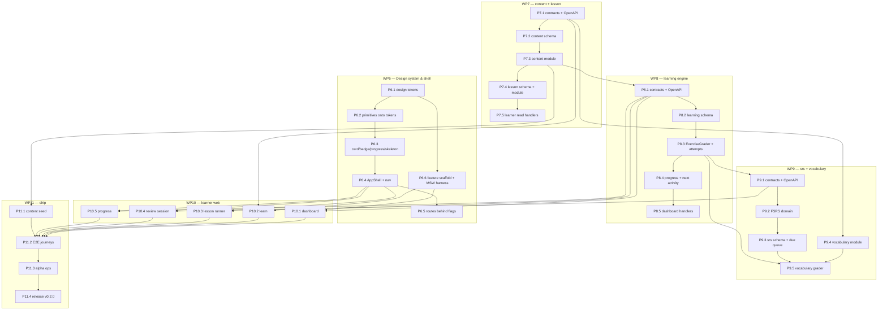

# Phase 2 — Learning core · Execution Plan

> **Deliverable at the end of this plan:** a learner signs in, sees what to do next, opens a
> lesson, answers exercises that are graded by a real engine, finishes the lesson, has
> vocabulary cards scheduled for them automatically, comes back tomorrow, clears a review
> queue that respects their own timezone, and watches a per-skill mastery figure move. An
> author can take a piece of content from draft to published without anyone touching the
> database.
>
> No AI grading, no speaking, no XP, no streaks, no badges. That is Phase 3.

**Base:** `main` after Phase 1 (`v0.1.0`). All five CI workflows green.
**Roadmap entry:** ROADMAP.md § "Phase 2 — Learning core (6 weeks)".
**Adopts:** [phase-2-ui-plan-review.md](phase-2-ui-plan-review.md) — read that first if you
are wondering why the UI work is arranged the way it is.

---

## 0. Why this phase is the one that decides the project

ROADMAP.md says it, and it is worth repeating at the top of the plan an agent will actually
read:

> **This is the phase most likely to slip.** The shared `content` + exercise engine
> (ADR-0015) is the highest-leverage work in the project — if it is done well, phase 3 is
> six thin modules; if it is done badly, phase 3 is six copies of phase 2.

Concretely: `learning.ExerciseGrader` is implemented once here and then implemented five
more times in Phase 3 by `grammar`, `reading`, `listening`, `speaking` and `writing`. Every
mistake in its shape is paid for six times. WP8 is therefore the task to slow down on, not
the one to parallelise hardest.

Everything in `internal/modules/{content,lesson,learning,srs,vocabulary}` today is
documentation and a `doc.go`. There is no Go code. This plan writes all of it.

---

## 1. Work packages

| WP | Content | Tasks | Est. | Blocked by |
|---|---|---|---|---|
| **WP6** | Design system, app shell, navigation | 6 | ~9 d | nothing — **start today** |
| **WP7** | `content` + `lesson`: items, versions, authoring, courses | 5 | ~11 d | nothing |
| **WP8** | `learning`: exercise engine, attempts, progress | 5 | ~12 d | WP7 |
| **WP9** | `srs` + `vocabulary`: FSRS, due queue, words, first grader | 5 | ~11 d | WP8 (contract only) |
| **WP10** | Learner web: dashboard, learn, lesson runner, review, progress | 5 | ~12 d | WP6 + the contract task of WP7/8/9 |
| **WP11** | Content seed, E2E, alpha readiness, release | 4 | ~8 d | all |
| | | **30** | **~63 d** | |

Estimates assume **one experienced engineer working with an AI assistant**, and include
tests and documentation — the same basis as the Phase 1 plan, which came in close.

Two engineers on the marked parallel tracks land this in roughly **6 calendar weeks**, which
is the roadmap figure.

Each work package is a separate file, sized to hand to one agent:

| File | Hand to |
|---|---|
| [phase-2/WP6-design-system.md](phase-2/WP6-design-system.md) | frontend agent |
| [phase-2/WP7-content-lesson.md](phase-2/WP7-content-lesson.md) | backend agent |
| [phase-2/WP8-learning-engine.md](phase-2/WP8-learning-engine.md) | backend agent — **the careful one** |
| [phase-2/WP9-srs-vocabulary.md](phase-2/WP9-srs-vocabulary.md) | backend agent |
| [phase-2/WP10-learner-web.md](phase-2/WP10-learner-web.md) | frontend agent |
| [phase-2/WP11-seed-e2e-ship.md](phase-2/WP11-seed-e2e-ship.md) | either |
| [phase-2/REVIEW-CHECKLIST.md](phase-2/REVIEW-CHECKLIST.md) | the reviewing agent |
| [phase-2/README.md](phase-2/README.md) | you — how to run the handoff |

---

## 2. How to run this plan

Everything in §1 of [phase-1-plan.md](phase-1-plan.md) still applies and is not repeated:
one task = one PR, no long-lived phase branch, `<type>/<module>-<slug>` branches, task ID in
the PR title and commit footer.

Branch names per task are listed inside each work-package file.

### 2.1 Test against the real stack

`make dev` brings up Postgres, Redis, MinIO, Mailpit and the observability stack. Phase 1
established that integration tests run against it rather than against a mock, and `AGENT.md`
§9 now says so. Phase 2 does not change that. If a port is taken, stop the container that
holds it — do not delete it.

### 2.2 Contract-first, without exception

Three of the six work packages open with a **contract-only task**: the OpenAPI paths and
schemas land with no implementation behind them. That task is what unblocks WP10, and it is
why the frontend does not wait for the backend.

The rule that makes this safe is already a project rule (`CLAUDE.md` #2, ADR-0005):

- The HTTP surface is authored in `api/openapi/openapi.yaml` **before** any handler.
- Go server types come from `oapi-codegen`; TypeScript types come from `pnpm gen:api`.
- MSW handlers in `web/src/test/` are typed as `components["schemas"][...]`, never by hand.

A frontend PR that declares its own `interface DashboardResponse` fails review, however
tidy it looks. Phase 1 shipped two schema mismatches into the E2E suite exactly that way.

### 2.3 Per-task Definition of Done

Phase 1's list, plus four Phase 2 additions (marked ★):

- [ ] `make check` green (fmt, vet, lint, **arch-lint**, unit tests)
- [ ] Unit tests cover the new branches; integration test if it touches Postgres/Redis/MinIO
- [ ] `api/openapi/openapi.yaml` updated in the same commit if the HTTP surface changed
- [ ] Migration is reversible; every FK indexed
- [ ] Errors are `shared/apperr` with documented codes; logs structured, no PII
- [ ] Span covers the new I/O; a metric exists if the outcome is meaningful
- [ ] The module's `AGENT.md` reflects reality; `last_verified` bumped
- [ ] The module's `TODO.md` item checked off
- [ ] `CHANGELOG.md` entry under `Unreleased` if user-visible
- [ ] ★ **Frontend PRs report the bundle figure** — before and after, from `pnpm run build`
- [ ] ★ **Every new screen ships its empty, loading and error state in the same PR**
- [ ] ★ **Accessibility is in the PR, not in a later phase**: keyboard path, visible focus,
      no colour-only status, 44×44 targets (the `mobile-baseline` lint rules already
      enforce the last two)
- [ ] ★ **Every new user-visible string exists in both `en.json` and `vi.json`**

The last three replace the UI plan's P9. A QA phase at the end means nine screens are built
wrong and then retrofitted; Phase 1 demonstrated that the per-task version works.

### 2.4 Bundle budget

200 kB gzipped. Measured 2026-08-20: **166.4 kB**. Headroom: **33.6 kB**.

```bash
cd web && pnpm run build
```

Routes are already lazy. The shell is not, and WP6 grows the shell. If a PR raises the
initial figure, the PR body says by how much and why it had to.

---

## 3. Dependency graph



### 3.1 Parallel tracks

| Track | Tasks | Starts | Owner suggestion |
|---|---|---|---|
| **A — Frontend** | WP6 in full, then WP10 | **immediately** | Frontend engineer |
| **B — Backend** | WP7 → WP8 → WP9 | immediately | Backend engineer |
| **C — Content** | P11.1 | **as soon as P7.3 lands** | Content designer |

Track C is the one that gets started late and then becomes the critical path. ROADMAP.md
already flags content production as "**the real bottleneck**; staff it early". 1 course, 8
lessons and 200 words at A2–B1 is weeks of authoring, not an afternoon. Start it the day the
authoring workflow can accept a draft — not in WP11, where it appears on the list.

### 3.2 The three contract-only tasks are the release valves

P7.1, P8.1 and P9.1 are small, land early, and each unblocks a frontend task. If the
backend slips, the frontend does not, because it is building against generated types rather
than against a running server.

---

## 4. Verification gate per work package

| WP | Gate |
|---|---|
| WP6 | Light mode and dark mode are both correct, asserted by a contrast test, on every existing auth screen. Phase 1's 39 E2E tests still pass. Initial bundle stated. |
| WP7 | An author moves a content item draft → in_review → approved → published through the API, and a published lesson resolves to an immutable version. Archiving an item does not break a learner mid-lesson. |
| WP8 | An attempt can be started, submitted twice with the same idempotency key and graded once, and the score rolls up to lesson and course progress. A grader registered for an unknown activity kind fails **at startup**, not at request time. |
| WP9 | FSRS property tests pass. A card answered `Good` reschedules further out than one answered `Hard`. The due queue for a learner in `Asia/Ho_Chi_Minh` rolls over at their local midnight, proven by a test with two timezones. |
| WP10 | Every screen renders its empty, loading and error state. The 320 px no-horizontal-scroll spec passes in **both** `en` and `vi`. Bundle within budget. |
| WP11 | The full journey passes E2E: sign in → dashboard → lesson → complete → cards scheduled → review tomorrow → progress moves. `v0.2.0` tagged and deployed to staging. |

---

## 5. Exit criteria

From ROADMAP.md, unchanged:

> An internal alpha with 20 real learners running for two weeks; D1 retention measurable; no
> manual DB edits needed to operate content.

Plus, from this plan:

- `learning` and `srs` module coverage ≥ 85 % (they are the two that Phase 3 builds on)
- FSRS scheduling is pure and property-tested, with no I/O in `srs/domain/`
- No skill module defines its own attempt table (ADR-0015 compliance, checked by arch-lint)
- The 200 kB bundle budget still holds with all five learner screens shipped

---

## 6. What is deliberately not in Phase 2

| Not building | Why | Lands in |
|---|---|---|
| XP, streaks, badges, quests, achievements | `gamification` is a Phase 3 module | Phase 3 |
| Speaking, writing, reading, listening, grammar | Each is a Phase 3 grader on this phase's engine | Phase 3 |
| Any AI call | `platform/ai` is Phase 3 | Phase 3 |
| Audio recording, microphone permission | Belongs with speaking | Phase 3 |
| Placement test | `learning.placement_results` exists in the schema; the flow is roadmap 4.3 | Phase 4 |
| Leaderboard, league, retention forecast | The UI plan defers these and is right to | Phase 4+ |
| Vertical node-map learning path | See the review, §D2 — revisit after the alpha with evidence | post-alpha |

If a task starts to reach into any row of this table, that is the signal to stop and ask,
not to widen the task.

---

*Review that shaped this plan: [phase-2-ui-plan-review.md](phase-2-ui-plan-review.md)*
*Previous phase: [phase-1-plan.md](phase-1-plan.md) · Roadmap: [/ROADMAP.md](../../ROADMAP.md)*
