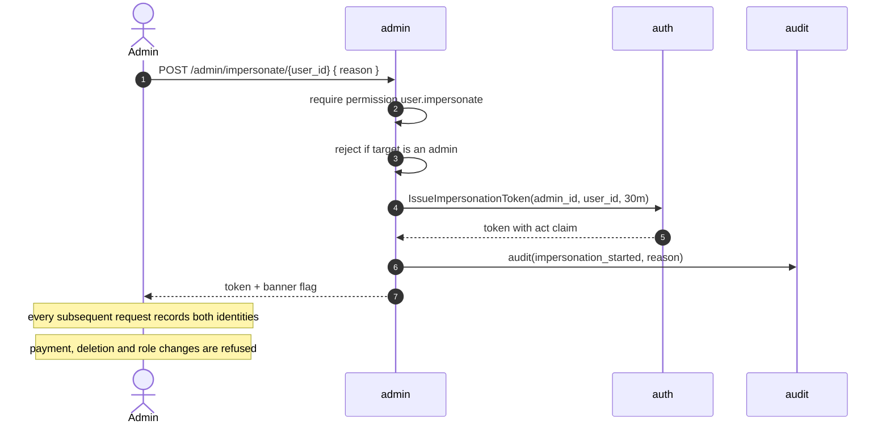

# admin — Flows

Sequence diagrams, state machines and business processes owned by this module.

<!-- BEGIN GENERATED: flows -->
## Impersonation

<!-- END GENERATED: flows -->

<!-- BEGIN GENERATED: states -->
_This module has no explicit state machine._
<!-- END GENERATED: states -->

## Failure paths

<!-- BEGIN GENERATED: failures -->
_None yet._
<!-- END GENERATED: failures -->
