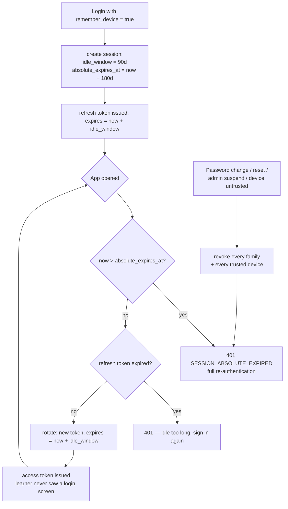
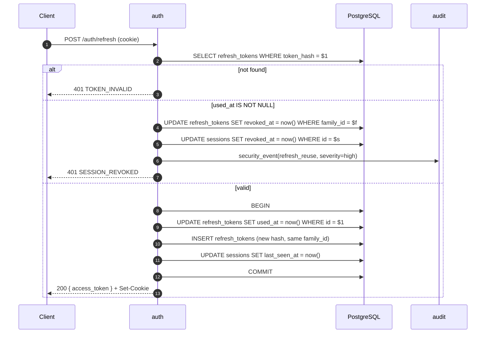
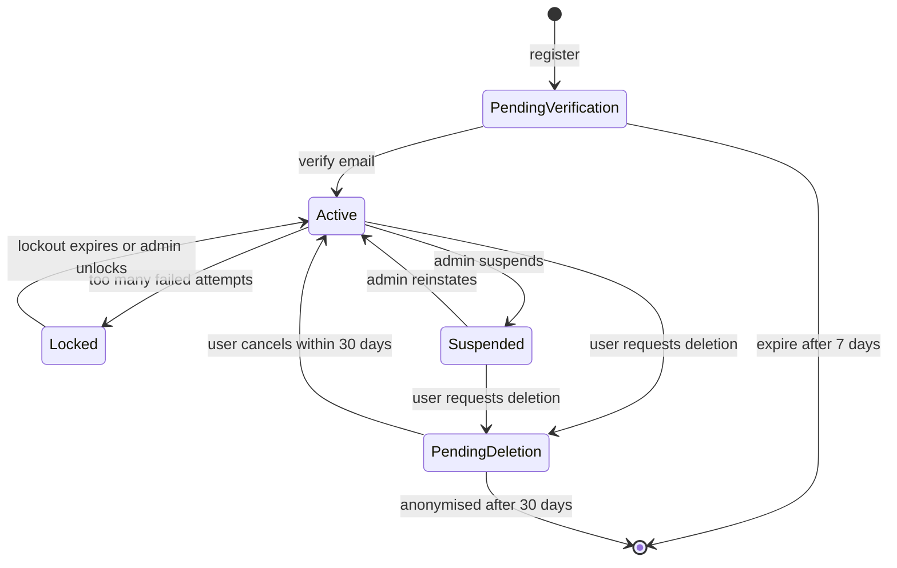

# auth — Flows

Sequence diagrams, state machines and business processes owned by this module.

<!-- BEGIN GENERATED: flows -->
## Registration with OTP verification

The account, the credential and the challenge are created in one transaction; the email is dispatched through the outbox so a code can never be sent for a rolled-back registration. The learner stays on the same screen and types the code — no context switch to a second browser.

```mermaid
sequenceDiagram
    autonumber
    actor U as User
    participant A as auth
    participant US as user (contract)
    participant D as PostgreSQL
    participant M as mailer

    U->>A: POST /auth/register { email, password }
    A->>A: validate email + password policy + breach corpus
    A->>D: BEGIN
    A->>US: CreateUser(email, locale)
    US->>D: INSERT core.users (status=pending_verification)
    A->>D: INSERT core.credentials (argon2id)
    A->>D: INSERT auth_challenges (purpose=verify_email, code_hash=HMAC(code), attempts=0, ttl=10m)
    A->>D: INSERT outbox(send verify_email code)
    A->>D: COMMIT
    A-->>U: 201 { challenge_id, expires_at, resend_after }
    Note over D,M: outbox → mailer job — never a direct call
    M->>U: email containing the 6-digit code

    loop up to 5 attempts
        U->>A: POST /auth/challenges/{id}/verify { code }
        A->>D: load challenge; check expiry and attempts
        A->>A: constant-time compare against code_hash
        alt wrong
            A->>D: attempts += 1
            A-->>U: 401 OTP_INVALID { attempts_remaining }
        else attempts exhausted
            A->>D: burn challenge
            A-->>U: 429 OTP_ATTEMPTS_EXCEEDED
        else correct
            A->>D: BEGIN; consume challenge; users.status = active
            A->>D: INSERT outbox(user.registered); COMMIT
            A-->>U: 200 { access_token } + refresh cookie
        end
    end
```

## Google sign-in with account linking

The dangerous branch is the one in the middle: a Google email that matches an **unverified** local account. Auto-linking there is the classic account-takeover path, so it is refused.

```mermaid
sequenceDiagram
    autonumber
    actor U as User
    participant W as SPA
    participant A as auth
    participant G as Google
    participant D as PostgreSQL

    U->>W: tap 'Continue with Google'
    W->>A: GET /auth/oauth/google/start
    A->>D: INSERT oauth_states (state, nonce, pkce_verifier_hash, ttl=10m)
    A-->>W: { authorization_url }
    W->>G: redirect
    U->>G: consent
    G->>W: redirect back with code + state
    W->>A: POST /auth/oauth/google/callback { code, state }
    A->>D: load + consume state (single use)
    alt missing, reused or expired
        A-->>W: 400 OAUTH_STATE_INVALID + security event
    end
    A->>G: exchange code (with PKCE verifier)
    G-->>A: id_token + access_token
    A->>G: fetch JWKS; verify signature, iss, aud, exp, nonce
    alt email_verified is false
        A-->>W: 403 OAUTH_EMAIL_UNVERIFIED
    end
    A->>D: look up oauth_identities by (google, sub)
    alt identity known
        A->>A: sign in
    else email matches a VERIFIED local account
        A->>D: INSERT oauth_identities (link)
        A->>A: sign in
    else email matches an UNVERIFIED local account
        A-->>W: 409 OAUTH_ACCOUNT_CONFLICT — verify by OTP first
    else no local account
        A->>D: create user (status=active, email already verified by Google)
        A->>A: sign in
    end
    A-->>W: 200 { access_token } + refresh cookie
```

## Staying signed in — sliding window with an absolute cap

This is what 'log in once' actually means in a design that can still revoke a stolen credential. The idle window moves forward on every use; the absolute expiry does not.



## Refresh rotation with reuse detection

The single most security-critical flow in the system. A stolen refresh token is detectable because the legitimate client will eventually present the same token the attacker already used.



<!-- END GENERATED: flows -->

<!-- BEGIN GENERATED: states -->
## State machine

Account lifecycle. Note that `suspended` is reversible and `deleted` is not — deletion runs through a 30-day grace period owned by `user`.



<!-- END GENERATED: states -->

## Failure paths

<!-- BEGIN GENERATED: failures -->
| Failure | Detected by | Behaviour |
|---|---|---|
| Mailer unavailable at registration | Outbox job retries | Account is created; the email is retried with backoff; the user can request a resend |
| Redis unavailable | `cache_unavailable_total` | Lockout counters fall back to a database query; login still works, with a warn log |
| Breached-password service unreachable | Timeout after 800 ms | Fail open with a warn log — a weak password is worse than a blocked registration, but an outage must not block signups |
| Clock skew between replicas | Token validation failures spike | 60-second leeway on `exp`/`nbf`; NTP is a host requirement |
<!-- END GENERATED: failures -->
