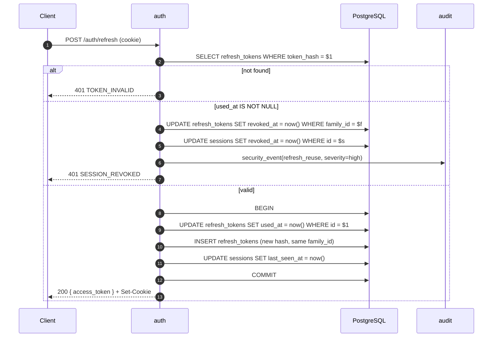
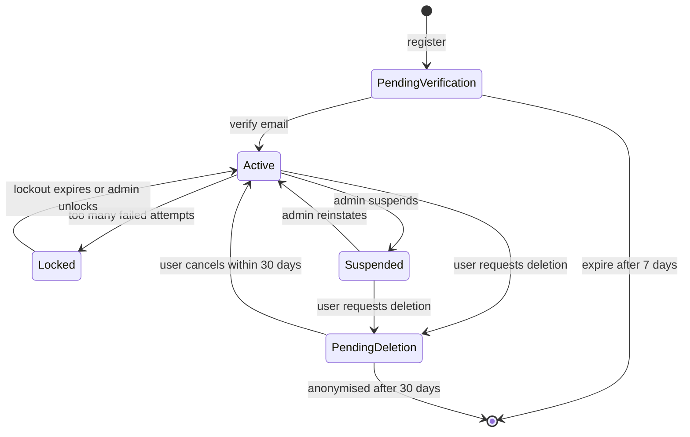

# auth — Flows

Sequence diagrams, state machines and business processes owned by this module.

<!-- BEGIN GENERATED: flows -->
## Registration and verification

The user record is created in `user` and the credential in `auth` inside one transaction; the verification email is dispatched through the outbox so it cannot be sent for a rolled-back registration.

```mermaid
sequenceDiagram
    autonumber
    actor U as User
    participant A as auth
    participant US as user (contract)
    participant D as PostgreSQL
    participant M as mailer

    U->>A: POST /auth/register
    A->>A: validate email + password policy
    A->>A: check breached-password corpus
    A->>D: BEGIN
    A->>US: CreateUser(email, locale)
    US->>D: INSERT core.users (status=pending_verification)
    A->>D: INSERT core.credentials (argon2id hash)
    A->>D: INSERT core.verification_tokens (hash, purpose=verify_email)
    A->>D: INSERT outbox(user.registered)
    A->>D: COMMIT
    A-->>U: 201 { user_id }
    Note over D,M: outbox publisher → mailer job
    M->>U: verification email (30 min TTL)
    U->>A: POST /auth/verify-email { token }
    A->>D: mark token used; users.status = active
    A-->>U: 200
```

## Refresh rotation with reuse detection

The single most security-critical flow in the system. A stolen refresh token is detectable because the legitimate client will eventually present the same token the attacker already used.



<!-- END GENERATED: flows -->

<!-- BEGIN GENERATED: states -->
## State machine

Account lifecycle. Note that `suspended` is reversible and `deleted` is not — deletion runs through a 30-day grace period owned by `user`.



<!-- END GENERATED: states -->

## Failure paths

<!-- BEGIN GENERATED: failures -->
| Failure | Detected by | Behaviour |
|---|---|---|
| Mailer unavailable at registration | Outbox job retries | Account is created; the email is retried with backoff; the user can request a resend |
| Redis unavailable | `cache_unavailable_total` | Lockout counters fall back to a database query; login still works, with a warn log |
| Breached-password service unreachable | Timeout after 800 ms | Fail open with a warn log — a weak password is worse than a blocked registration, but an outage must not block signups |
| Clock skew between replicas | Token validation failures spike | 60-second leeway on `exp`/`nbf`; NTP is a host requirement |
<!-- END GENERATED: failures -->
