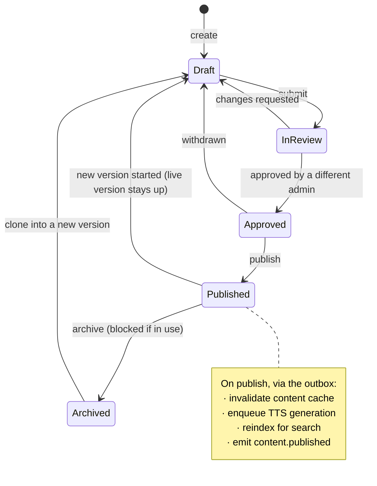

# content — Flows

Sequence diagrams, state machines and business processes owned by this module.

<!-- BEGIN GENERATED: flows -->
## Publish


```mermaid
sequenceDiagram
    autonumber
    actor AD as Admin
    participant C as content
    participant DB as PostgreSQL
    participant OB as outbox
    participant ME as media
    participant SE as search
    participant CA as cache

    AD->>C: POST /admin/content/{id}/publish
    C->>C: require content.publish; state must be Approved
    C->>ME: are all referenced assets processed?
    alt not ready
        C-->>AD: 409 MEDIA_NOT_READY
    else ready
        C->>DB: BEGIN
        C->>DB: version.status = published; item.current_version_id = version
        C->>DB: INSERT outbox(content.published)
        C->>DB: COMMIT
        C-->>AD: 200
        OB->>CA: invalidate content keys
        OB->>ME: enqueue TTS for new text
        OB->>SE: reindex
    end
```

<!-- END GENERATED: flows -->

<!-- BEGIN GENERATED: states -->
## State machine

The authoring workflow. The transition that matters most is `Published → Draft`: creating a new version does **not** take the live version down.



<!-- END GENERATED: states -->

## Failure paths

<!-- BEGIN GENERATED: failures -->
_None yet._
<!-- END GENERATED: failures -->
