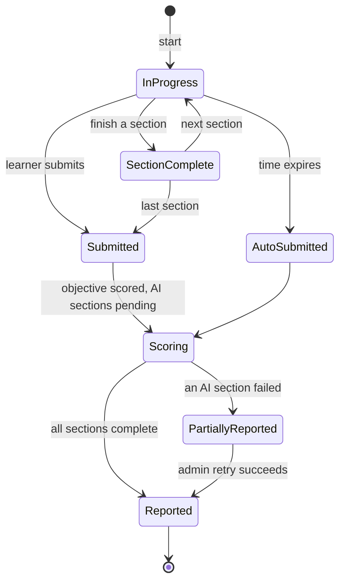

# exam — Flows

Sequence diagrams, state machines and business processes owned by this module.

<!-- BEGIN GENERATED: flows -->
## Exam sitting with auto-submit

```mermaid
sequenceDiagram
    autonumber
    actor U as Learner
    participant E as exam
    participant Q as questionbank
    participant J as job
    participant W as writing/speaking

    U->>E: POST /exams/{id}/attempts
    E->>Q: SampleItems per section with exposure control
    alt not enough items
        E-->>U: 409 INSUFFICIENT_ITEMS
    else
        E->>E: INSERT attempt (expires_at = now + total)
        E->>J: schedule auto-submit at expires_at
        E-->>U: 201 { attempt, section 1, server_time }
    end

    loop while time remains
        U->>E: PUT /answers (autosave)
        E->>E: reject if section time has expired
    end

    alt learner submits
        U->>E: POST /submit
    else time expires
        J->>E: auto-submit
    end

    E->>E: score objective sections immediately
    E->>W: dispatch writing and speaking for async grading
    E-->>U: 202 { report pending }
    W-->>E: graded events
    E->>E: complete the report; publish exam.attempt_finished

```

<!-- END GENERATED: flows -->

<!-- BEGIN GENERATED: states -->
## State machine



<!-- END GENERATED: states -->

## Failure paths

<!-- BEGIN GENERATED: failures -->
| Failure | Detected by | Behaviour |
|---|---|---|
| Learner loses connection mid-exam | No autosave for N seconds | Answers to that point are saved; the timer keeps running (as in a real exam); the learner can rejoin |
| AI section grading fails | `writing.grading_failed` | Report is partial and clearly marked; admin can retry; the learner is not charged an attempt |
<!-- END GENERATED: failures -->
