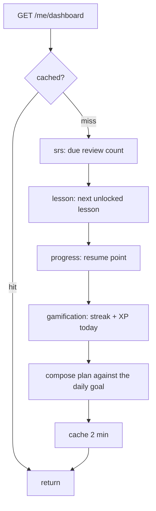
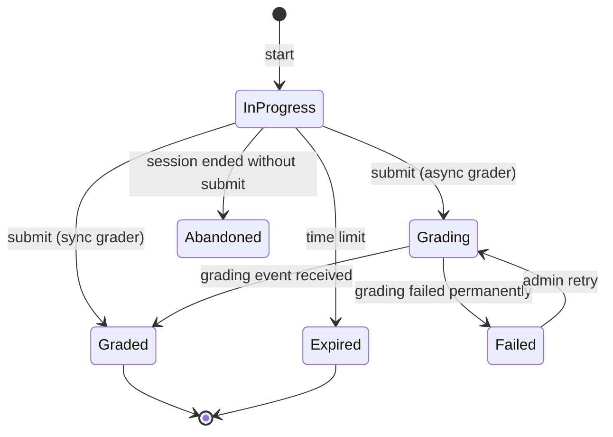

# learning — Flows

Sequence diagrams, state machines and business processes owned by this module.

<!-- BEGIN GENERATED: flows -->
## Attempt lifecycle with grader dispatch


```mermaid
sequenceDiagram
    autonumber
    actor U as Learner
    participant LE as learning (engine)
    participant G as skill grader
    participant SR as srs
    participant DB as PostgreSQL

    U->>LE: POST /activities/{id}/attempts
    LE->>LE: check unlock + not already completed
    LE->>DB: INSERT attempts (status=in_progress)
    LE-->>U: 201 { attempt_id, expires_at }

    U->>LE: POST /attempts/{id}/submit (Idempotency-Key)
    LE->>LE: validate response shape for the activity kind
    LE->>G: Grade(request)
    alt synchronous grader
        G-->>LE: { score, feedback, review_items }
        LE->>DB: BEGIN
        LE->>DB: UPDATE attempt (graded, score)
        LE->>DB: roll up progress
        LE->>SR: upsert review cards from review_items
        LE->>DB: INSERT outbox(activity.completed [, lesson.completed])
        LE->>DB: COMMIT
        LE-->>U: 200 { score, feedback }
    else asynchronous grader
        G-->>LE: { async: true }
        LE->>DB: attempt status = grading; enqueue the skill's job
        LE-->>U: 202 { attempt_id, stream_url }
        Note over LE: the skill module's completion event finishes the attempt
    end
```

## Daily plan composition

The dashboard is the most-requested endpoint in the product; it composes from four modules and is therefore cached aggressively and invalidated by events.



<!-- END GENERATED: flows -->

<!-- BEGIN GENERATED: states -->
## State machine

Attempt states. `grading` exists only for asynchronous graders and is the state a learner sees while an AI job runs.



<!-- END GENERATED: states -->

## Failure paths

<!-- BEGIN GENERATED: failures -->
| Failure | Detected by | Behaviour |
|---|---|---|
| Async grading never completes | Attempts stuck in `grading` beyond an SLO | Job retry; after final failure the attempt is `failed`, the learner is told, and the attempt does not count against them |
| Grader registry missing a kind | Startup validation | The process refuses to start — better than failing on a learner's submission |
<!-- END GENERATED: failures -->
