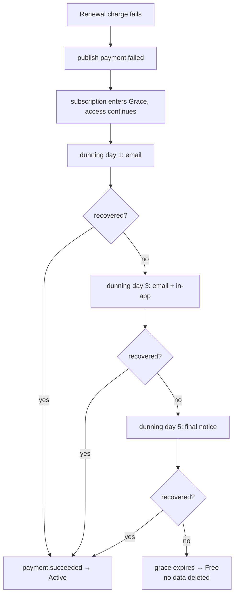

# payment — Flows

Sequence diagrams, state machines and business processes owned by this module.

<!-- BEGIN GENERATED: flows -->
## Checkout and activation

```mermaid
sequenceDiagram
    autonumber
    actor U as Learner
    participant P as payment
    participant G as Gateway
    participant S as subscription
    participant M as mailer

    U->>P: POST /billing/checkout { plan } (Idempotency-Key)
    P->>S: validate the plan is purchasable for this learner
    P->>G: create hosted session
    G-->>P: session id + redirect URL
    P->>P: INSERT checkout_sessions
    P-->>U: { redirect_url }
    U->>G: completes payment on the gateway's page
    G->>P: webhook payment.succeeded
    P->>P: verify signature on the raw body
    P->>P: store raw webhook; ack 200 immediately
    P->>P: enqueue processing job
    Note over P: processing is idempotent on provider_event_id
    P->>P: INSERT payments, invoices; generate the PDF
    P->>S: publish payment.succeeded
    S->>S: activate the subscription; invalidate entitlements
    P->>M: receipt email
    U->>P: GET /billing/checkout/{id} → completed
```

## Failed renewal and dunning



<!-- END GENERATED: flows -->

<!-- BEGIN GENERATED: states -->
_This module has no explicit state machine._
<!-- END GENERATED: states -->

## Failure paths

<!-- BEGIN GENERATED: failures -->
_None yet._
<!-- END GENERATED: failures -->
