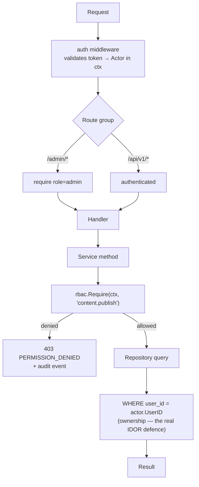

# rbac — Flows

Sequence diagrams, state machines and business processes owned by this module.

<!-- BEGIN GENERATED: flows -->
## Three-layer authorization

Each layer catches a different mistake. Middleware catches a route wired to the wrong group; the guard catches a service method called from an unexpected path; the ownership filter catches the IDOR that the other two cannot see.

<!-- END GENERATED: flows -->

<!-- BEGIN GENERATED: states -->
_This module has no explicit state machine._
<!-- END GENERATED: states -->

## Failure paths

<!-- BEGIN GENERATED: failures -->
_None yet._
<!-- END GENERATED: failures -->
