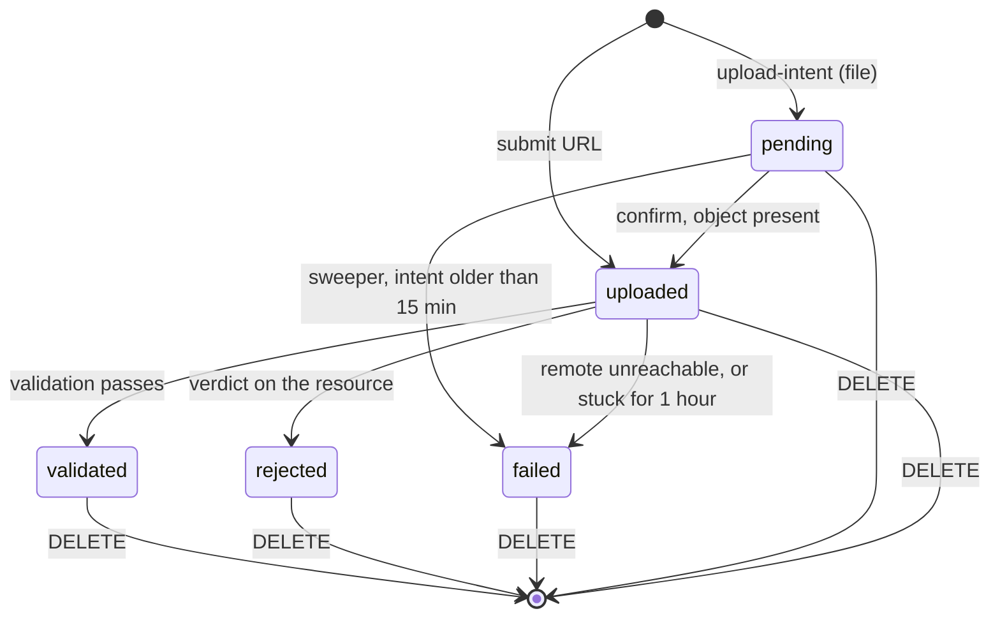

# resource — Flows

Sequence diagrams, state machines and business processes owned by this module.

<!-- BEGIN GENERATED: flows -->
## File upload and validation

Upload intent, a direct PUT to storage, then a confirmation that writes the row and enqueues validation in one transaction. Every validation outcome is conditional on the row still being uploaded.

```mermaid
sequenceDiagram
    autonumber
    actor U as Learner
    participant R as resource
    participant S as storage (fluentra-uploads)
    participant DB as PostgreSQL
    participant J as River worker

    U->>R: POST /me/resources/upload-intent {filename, content_type}
    R->>R: declared type in allow-list?
    R->>DB: count and bytes in use (50 resources, 250 MB)
    R->>S: PresignPut (pins type, 1 B to 50 MB, 5 min)
    R->>DB: INSERT resources (status=pending)
    R-->>U: 200 {id, upload_url, object_key, expires_at}
    U->>S: PUT the bytes
    U->>R: POST /me/resources {resource_id}
    R->>S: Stat (409 RESOURCE_NOT_UPLOADED if absent)
    R->>DB: BEGIN; UPDATE status=uploaded WHERE status=pending
    R->>DB: enqueue resource.validate; COMMIT
    R-->>U: 202 {id, status=uploaded}
    J->>S: Stat, then read the first 1024 bytes
    J->>J: sniff; declared and detected kinds must agree
    alt allowed and consistent
        J->>DB: UPDATE status=validated, detected_mime, byte_size, checksum WHERE status=uploaded
    else wrong type, empty, or too large
        J->>DB: UPDATE status=rejected, failure_reason WHERE status=uploaded
    else storage unreachable
        J-->>J: return error, River retries (3 attempts)
    end
```

## URL submission

A synchronous early check for a friendly 422, then the real guard: the dialer refuses any non-public address it is about to connect to, which also covers redirects and DNS rebinding.

```mermaid
sequenceDiagram
    autonumber
    actor U as Learner
    participant R as resource
    participant DB as PostgreSQL
    participant J as River worker
    participant EXT as Remote site

    U->>R: POST /me/resources {url, title?}
    R->>R: scheme http or https, host resolves to public addresses only
    R->>DB: BEGIN; INSERT resources (kind=url, status=uploaded)
    R->>DB: enqueue resource.validate; COMMIT
    R-->>U: 202 {id, status=uploaded}
    J->>EXT: GET via the safe client (no proxy, at most 5 redirects)
    Note over J,EXT: the dialer refuses any non-public address it is about to connect to, on every hop
    alt 2xx
        J->>J: read up to 512 KB for og:title or title, then discard the body
        J->>DB: UPDATE status=validated WHERE status=uploaded
    else refused address, or 4xx
        J->>DB: UPDATE status=rejected, failure_reason WHERE status=uploaded
    else timeout, refused connection, or 5xx
        J->>DB: UPDATE status=failed, failure_reason WHERE status=uploaded
    end
```

## Sweeping

Abandoned intents and stuck uploads, closed out so nothing waits for ever.

```mermaid
sequenceDiagram
    autonumber
    participant C as Cron (every 10 min)
    participant R as resource
    participant DB as PostgreSQL
    participant S as storage

    C->>R: resource.sweep_pending
    R->>DB: pending rows older than 15 min
    loop each expired intent
        R->>DB: UPDATE status=failed WHERE status=pending
        alt a row matched
            R->>S: delete the object, if one was uploaded
        else confirmed in the meantime
            R-->>R: skip, it is no longer ours to sweep
        end
    end
    R->>DB: uploaded rows untouched for 1 hour
    loop each stuck upload
        R->>DB: UPDATE status=failed WHERE status=uploaded
        Note over R,S: the object is kept; deleting it is the learner's call
    end
```

<!-- END GENERATED: flows -->

<!-- BEGIN GENERATED: states -->
## State machine

Every status change after pending is conditional on the status it expects, in SQL, so a late job or a racing sweeper matches no row instead of overwriting one.



<!-- END GENERATED: states -->

## Failure paths

<!-- BEGIN GENERATED: failures -->
| Failure | Detected by | Behaviour |
|---|---|---|
| Storage unreachable during validation | Stat or Get returns an error | The job returns the error and River retries. After an hour at uploaded the sweeper marks it failed |
| Remote site down or slow | Timeout, refused connection or 5xx | failed with a try-again reason, never rejected |
| Enqueue fails after the row write | EnqueueTx returns an error | The whole transaction rolls back; the learner gets an error and nothing is left half-done |
| Resource deleted while its job is queued | The row is gone, or a guarded update matches nothing | The job finishes quietly instead of retrying for ever |
| Learner confirms just as the sweeper runs | The sweeper's guarded update matches nothing | The row and its object are left alone |
<!-- END GENERATED: failures -->
