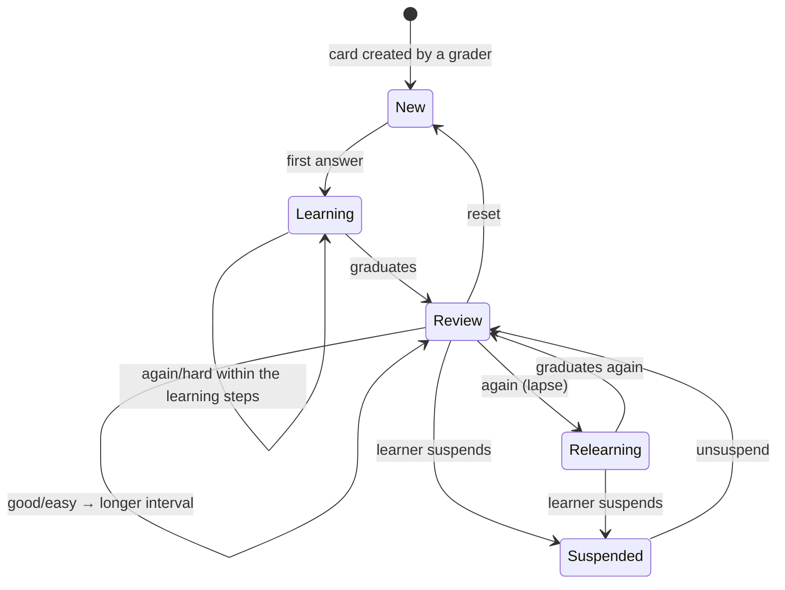

# srs — Flows

Sequence diagrams, state machines and business processes owned by this module.

<!-- BEGIN GENERATED: flows -->
## Review session

```mermaid
sequenceDiagram
    autonumber
    actor U as Learner
    participant S as srs
    participant C as Redis
    participant DB as PostgreSQL
    participant CO as content

    U->>S: GET /reviews/session?limit=20
    S->>DB: SELECT due cards ORDER BY due_at, id LIMIT 20
    S->>S: apply daily limits, interleave skills, avoid family clustering
    S->>CO: GetManyVersions (batched)
    S-->>U: cards with content and prefetch hints

    loop each card
        U->>S: POST /reviews/{card}/answer { grade, elapsed_ms }
        S->>S: FSRS: update stability, difficulty, next due
        S->>DB: BEGIN; UPDATE review_cards; INSERT review_logs
        S->>DB: INSERT outbox(review.card_answered); COMMIT
        S->>C: DEL due_count
        S-->>U: { next_due_at, interval_days }
    end

    U->>S: POST /reviews/session/complete
    S->>DB: INSERT outbox(review.session_completed)
    Note over DB: gamification awards XP and updates the streak
    S-->>U: { reviewed, accuracy, next_session_at }
```

<!-- END GENERATED: flows -->

<!-- BEGIN GENERATED: states -->
## State machine

FSRS card states. `Relearning` is the path back after a lapse — it is not the same as `Learning`, because prior stability is partially retained.



<!-- END GENERATED: states -->

## Failure paths

<!-- BEGIN GENERATED: failures -->
_None yet._
<!-- END GENERATED: failures -->
