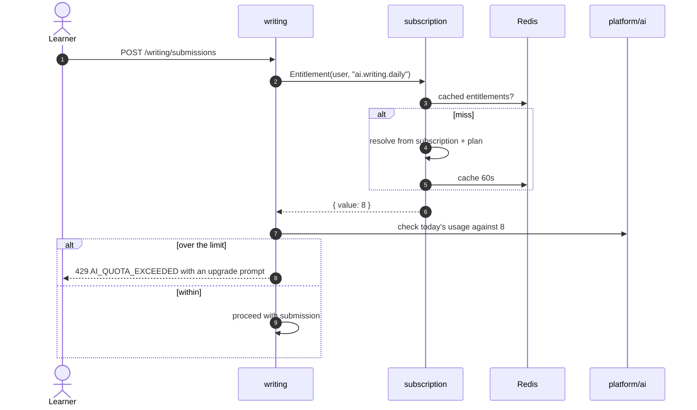
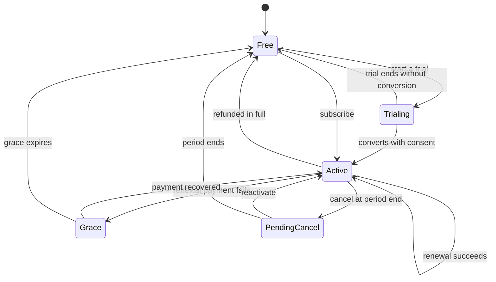

# subscription — Flows

Sequence diagrams, state machines and business processes owned by this module.

<!-- BEGIN GENERATED: flows -->
## Entitlement check on an AI feature

<!-- END GENERATED: flows -->

<!-- BEGIN GENERATED: states -->
## State machine

Grace exists so that a card expiring does not immediately take away a paying learner's access. Every transition writes a `subscription_events` row.

<!-- END GENERATED: states -->

## Failure paths

<!-- BEGIN GENERATED: failures -->
_None yet._
<!-- END GENERATED: failures -->
