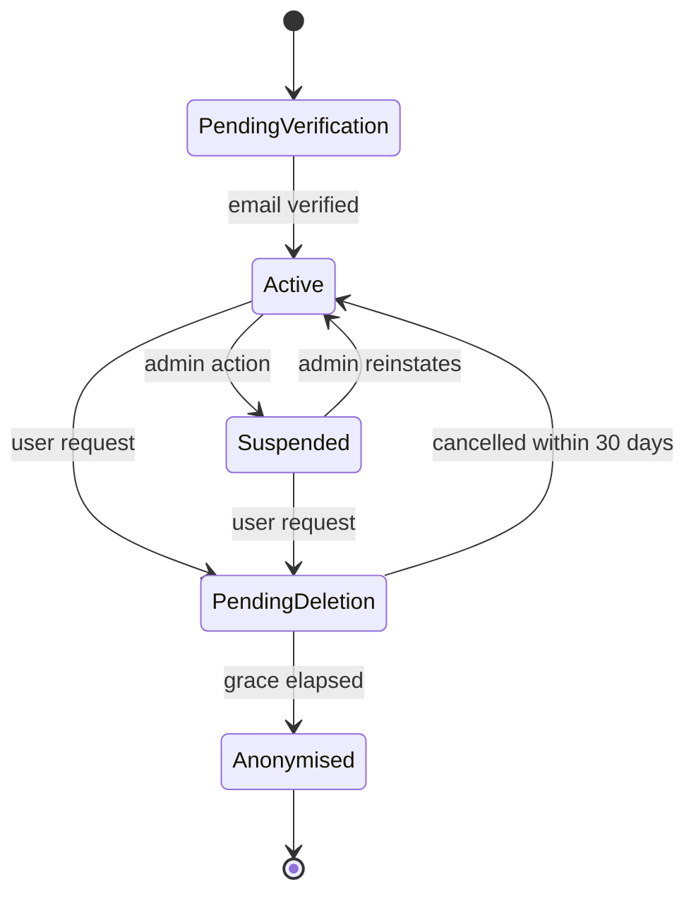

# user — Flows

Sequence diagrams, state machines and business processes owned by this module.

<!-- BEGIN GENERATED: flows -->
## Account deletion

Deletion fans out to every module holding personal data. Each module is responsible for its own erasure, driven by an event rather than a central script — that is what keeps the boundary intact.

```mermaid
sequenceDiagram
    autonumber
    actor U as User
    participant US as user
    participant A as auth
    participant J as job
    participant M as all modules

    U->>US: DELETE /me
    US->>US: INSERT deletion_request (execute_after = now + 30d)
    US->>US: users.status = pending_deletion
    US->>A: RevokeAllSessions(user_id)
    US->>US: publish user.deletion_requested
    US-->>U: 202 { execute_after }

    alt user cancels within 30 days
        U->>US: POST /me/deletion/cancel
        US->>US: status = active; cancel request
    else grace elapses
        J->>US: scheduled job picks up due requests
        US->>US: anonymise profile, hard-delete PII
        US->>M: publish user.deleted
        M->>M: each module purges or anonymises its own data
        US->>US: mark completed
    end
```

<!-- END GENERATED: flows -->

<!-- BEGIN GENERATED: states -->
## State machine

Account status. `auth` reads this on every login; a non-active status blocks authentication.



<!-- END GENERATED: states -->

## Failure paths

<!-- BEGIN GENERATED: failures -->
| Failure | Detected by | Behaviour |
|---|---|---|
| A module fails to purge on `user.deleted` | Erasure completeness job compares expected vs actual | Retries, then raises an alert — an incomplete erasure is a compliance incident |
| Export job exceeds its timeout on a very large account | Job timeout metric | Chunked export with resumable state; user notified when ready |
<!-- END GENERATED: failures -->
