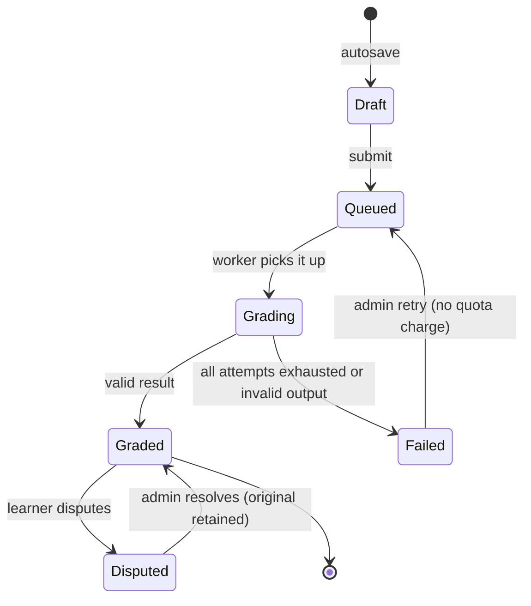

# writing — Flows

Sequence diagrams, state machines and business processes owned by this module.

<!-- BEGIN GENERATED: flows -->
## Submit and stream feedback


```mermaid
sequenceDiagram
    autonumber
    actor U as Learner
    participant W as writing
    participant DB as PostgreSQL
    participant K as worker
    participant AI as platform/ai

    U->>W: POST /writing/submissions (Idempotency-Key)
    W->>W: word bounds, task validity, quota, opt-out
    W->>DB: BEGIN; INSERT submission(status=queued)
    W->>DB: INSERT river_job(writing.grade); INSERT outbox(submission_created); COMMIT
    W-->>U: 202 { submission_id, stream_url }
    U->>W: GET /writing/submissions/{id}/stream (SSE)

    K->>AI: Run(writing.grade_essay, { essay, rubric, level, locale })
    AI-->>K: streamed chunks
    K->>DB: append partial feedback
    K-->>W: chunk (pg NOTIFY)
    W-->>U: SSE chunk
    AI-->>K: final structured result
    K->>K: validate schema, clamp bands, consistency check
    alt invalid
        K->>DB: status=failed; do not consume quota
        W-->>U: SSE error with a safe message
    else valid
        K->>DB: BEGIN; UPDATE submission(graded, bands); INSERT feedback
        K->>DB: consume quota; INSERT outbox(writing.graded); COMMIT
        W-->>U: SSE done
    end
```

<!-- END GENERATED: flows -->

<!-- BEGIN GENERATED: states -->
## State machine




<!-- END GENERATED: states -->

## Failure paths

<!-- BEGIN GENERATED: failures -->
| Failure | Detected by | Behaviour |
|---|---|---|
| All AI providers down | `AI_UNAVAILABLE` from the chain | Job retries with backoff for up to an hour; the learner sees "still grading"; no quota charged |
| Output fails schema after repair | `ai_schema_violation_total` | Job fails; alert if the rate exceeds 5 %; the prompt version is a suspect |
| Learner disconnects mid-stream | SSE connection closed | Grading continues; partials are persisted; the result is waiting when they return |
<!-- END GENERATED: failures -->
