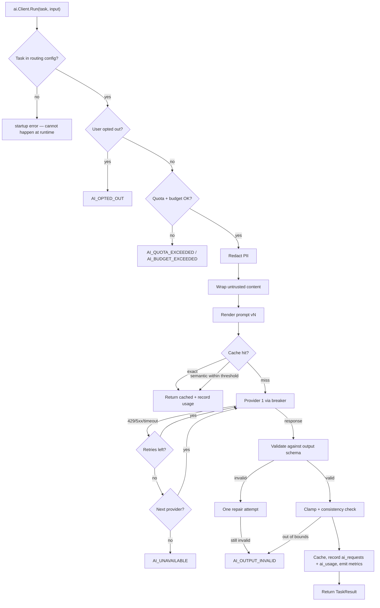
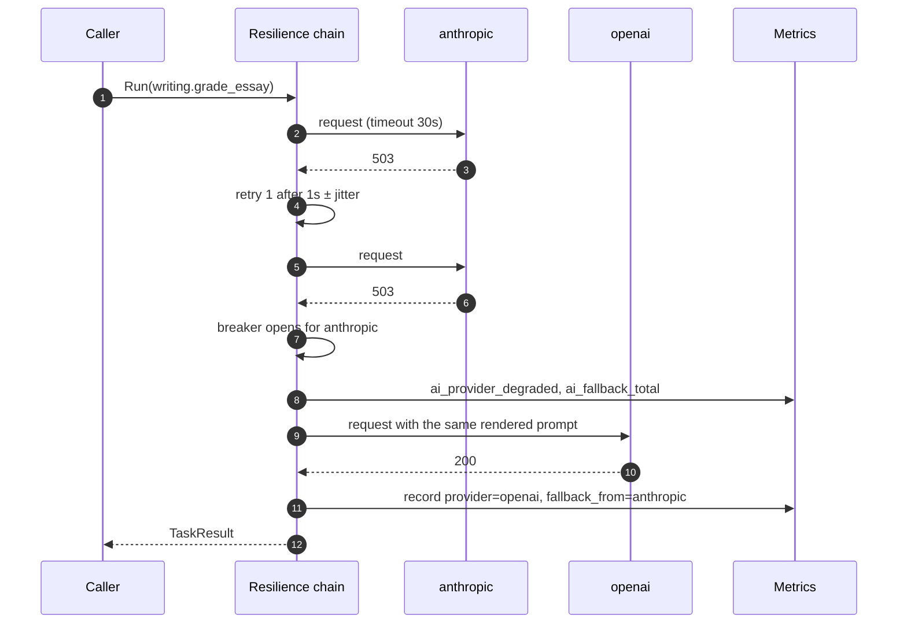
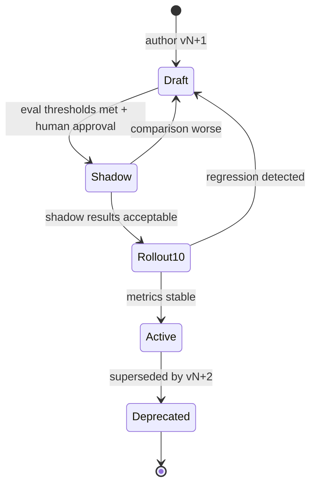

# ai — Flows

Sequence diagrams, state machines and business processes owned by this module.

<!-- BEGIN GENERATED: flows -->
## A task call, end to end

## Provider fallback

Fallback is per task, not global — a cheap task may have no fallback at all, while grading has two.

<!-- END GENERATED: flows -->

<!-- BEGIN GENERATED: states -->
## State machine

Prompt version lifecycle. A version never returns to an earlier state; rollback means activating the previous version, not editing this one.

<!-- END GENERATED: states -->

## Failure paths

<!-- BEGIN GENERATED: failures -->
| Failure | Detected by | Behaviour |
|---|---|---|
| All providers down | `ai_requests_total{result="unavailable"}` | Job retries with backoff; the learner sees "still grading", not an error; pages after 5 minutes |
| Provider silently changes a model behind an alias | Nightly eval score shift | Alert; models are pinned to exact IDs to make this rare |
| Schema violations spike after a prompt change | `ai_schema_violation_total` | Automatic rollback to the previous active version at > 5 % over 30 minutes |
| Cost spike | `ai_cost_usd_total` rate | 80 % budget alert; at 100 % non-critical tasks are shed while grading continues |
<!-- END GENERATED: failures -->
